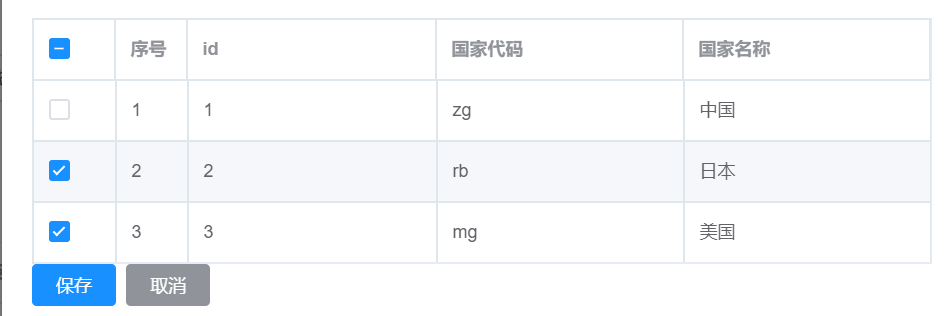

### Element-ui 单元格用 toggleRowSelection(row, true) 回显遇到的问题

问题1：

element-ui 单元格用 toggleRowSelection(row, true) 回显后台传入的数据时， row 必须返回当前列表渲染用的数据，自己后台存的数据是无效的，即使是key和value一模一样都不行，因为列表加载数据时还包含其他数据；因此若是后台传入的数据，那么就要将后台传入的数据和当前列表中的数据做比较，若对应的key一样，就当做是该列表中的该行数据被选中，代码如下


问题2：

**$nextTick 是在下次 DOM 更新循环结束之后执行延迟回调，**在修改数据之后使用$nestTick ，则可以在回调中获取更新后的 DOM

在我们用vue时，我们经常用到一个方法是this.$nextTick，相信你也用过。我常用的场景是在进行获取数据后，需要对新视图进行下一步操作或者其他操作时，发现获取不到dom。因为赋值操作只完成了数据模型的改变并没有完成视图更新

```js
      //打开弹窗按钮后触发的事件，rows是后台存储的选中的对象列表
      openNationSelect(rows){
        //显示选择列表的弹窗
        this.nationSelect=true

        //进行选中
        if (rows) {
          rows.forEach(row => {
            if (row.nationCode != "" && row.nationCode != null){
              //使用 this.$nextTick 避免出现 toggleRowSelection 为 undefined 情况；
              this.$nextTick(()=>{
                // nationList 是渲染表格时的数据
                this.nationList.forEach(_item=>{
                  // row 则是后端返回的数据，若对比一致，就表示选中表格中的该条数据
                  if (row.nationCode == _item.nationCode){
                    /** toggleRowSelection(row, true) 中的 row 必须要是当前表格中的数据；若不是后台返回的数据，就不用进行如此
                      复杂的对比，因为若是勾选的点击事件后获取到的数据，就是当前表格中的数据；**/
                    this.$refs.nationTable.toggleRowSelection(_item,true);
                  }
                })
              })
            }
          });
        }
      },
```


效果：

