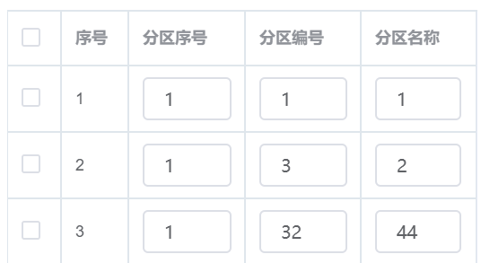

## element-ui 点击获取table的行索引


```js
// 表单代码
<el-table :data="list" v-loading.body="listLoading" element-loading-text="Loading..."  border fit
                  :row-class-name="tableRowClassName"
                 @row-click = "onRowClick"
                  highlight-current-row style="width: 100%">
                <el-table-column align="center" prop="passtime" label="Time" width="180">


// 方法代码
tableRowClassName ({row, rowIndex}) {
	//把每一行的索引放进row
	row.index = rowIndex;
},
onRowClick (row,column, cell, event) {
	// 打印每一行索引
	console.log(row.index)
}

```

 

示例如下：点击任意一行，获得当前行的序号

 