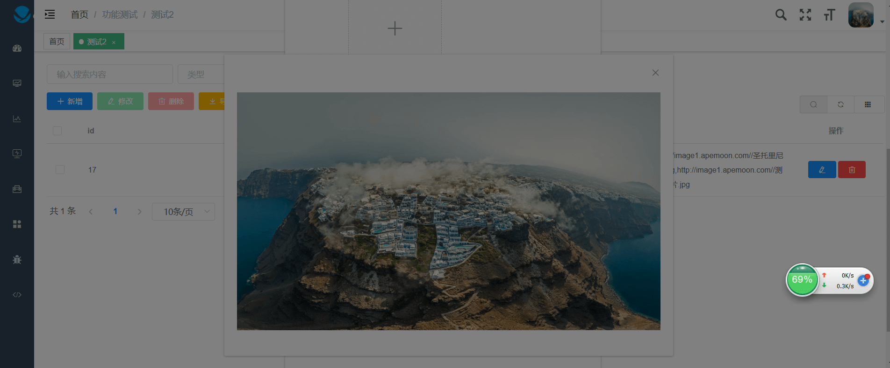
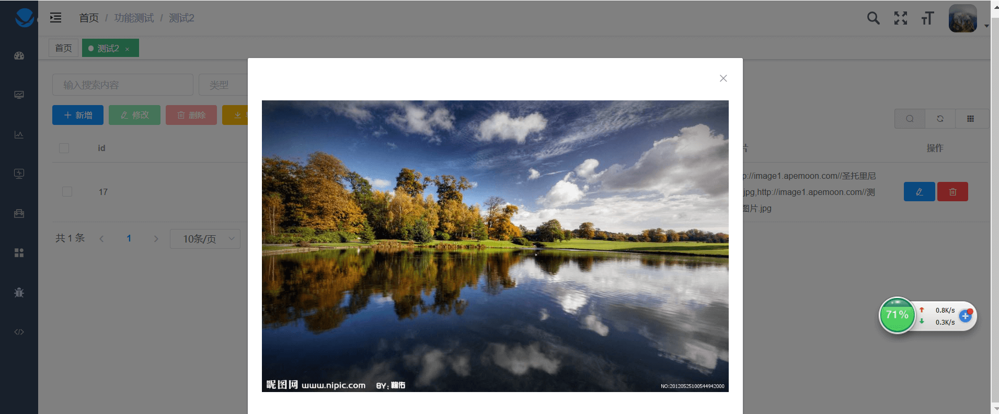
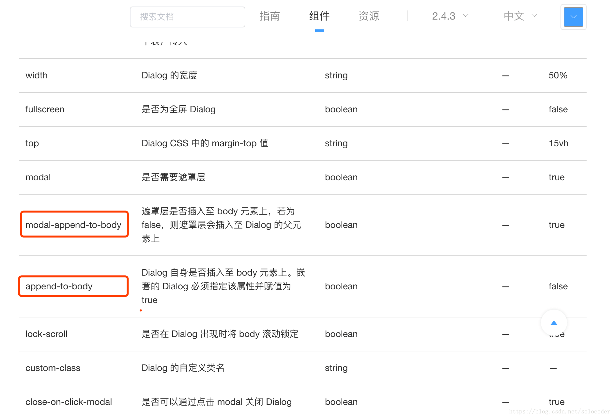

用 element-ui 时遇到一个问题，弹出的 dialog本来应该在半透明蒙板上层显示，但不知怎么跑到了蒙板下面，被遮住了。

如下图，文件预览时候，整个页面都被遮盖了，包括弹出框；但是事实上我们不想要遮盖弹出框



理想情况应该如下



查了一些资料，得知如果 Dialog 的外层布局的 position 值为 fixed, absolute, relative 三者之一时，就会出现被蒙板遮住的情况。

解决办法很简单，查看 element 的 官方文档



在 el-dialog 标签里添加下面两行代码的任意一行：

 :modal-append-to-body='false'  或   :append-to-body='true'

代码如下

```
<el-dialog :visible.sync="dialogVisible" :append-to-body='true'>
	
</el-dialog>
```


