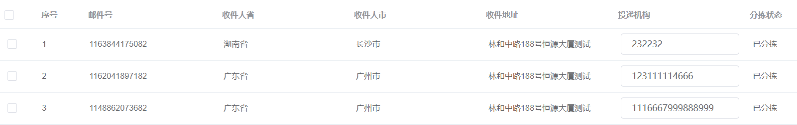

### 1、element元素嵌套

例子：表格 el-table-column标签 中嵌套一个 el-input 标签

```
//scope.row 是获得当前行的数据
<el-table-column prop="destOrgCode" label="投递机构">
    <template slot-scope="scope">
        <el-input v-model="scope.row.destOrgCode" ></el-input>
    </template>
</el-table-column>
```

效果：




### 2、通过 a 标签的 download属性直接下载网络文件

```
//
<el-button>
	<a href="http://14.23.151.106:8082/ftp/install_lodop64.exe" download="">打印控件下载 64位</a>
</el-button>
```


3、获取选中记录列表数据

