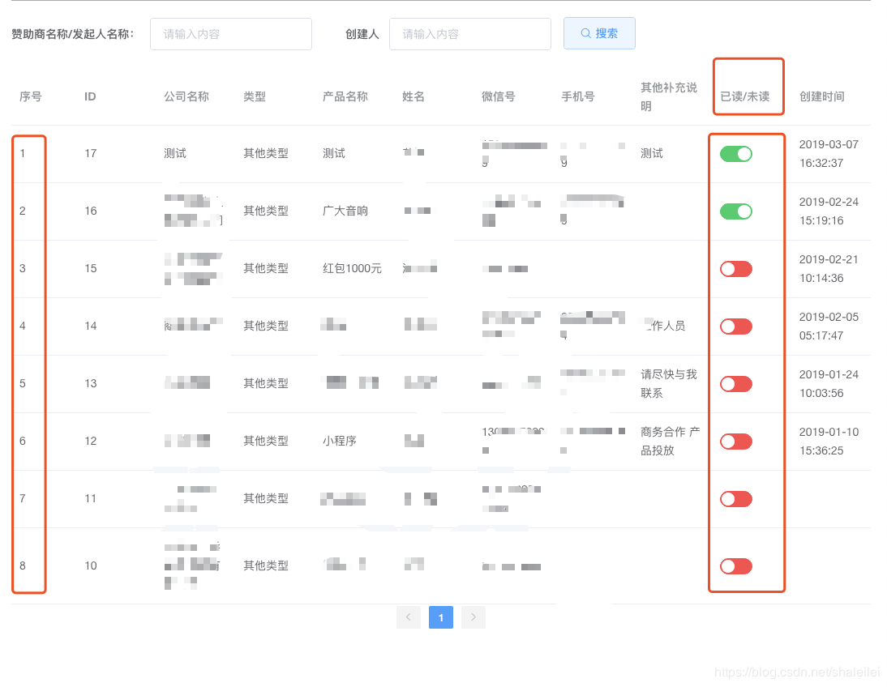
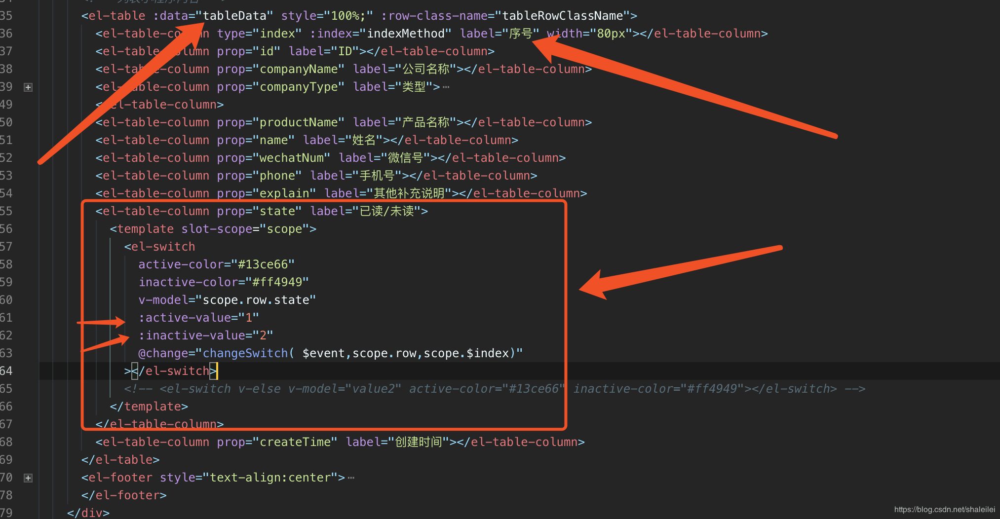
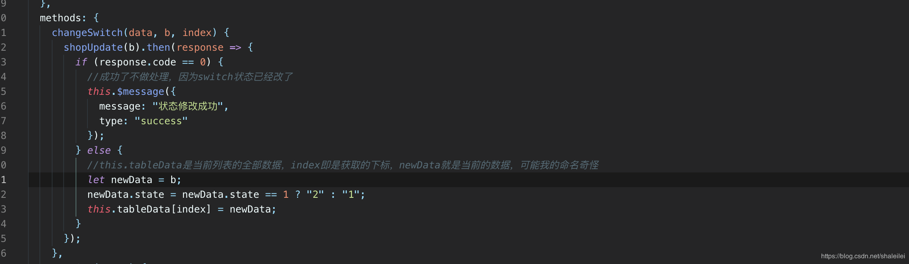

# 列表中el-switch 开关

需求说明
1、根据后台传值动态显示开关（0为关，1为开）
2、对开关进行操作时请求后台，需要传两个参数：ID，State

需求描述
我先说我的需求，我想在列表的每一条添加一个开关，可以改当前一条数据的状态，并发送到服务端，并根据服务端返回的结果局部刷新当前一条数据

期望结果
已读和未读是后端返回给我的状态，分别是1和2，我先点击switch发送给后端这条数据的id，然后修改这一条数据的状态，而不是重新拿这个列表，如果后端返回失败的情况这个switch不做改变

 


解决方法
Swich默认是boolean类型，而后台传值 为number类型，这个时候我们想用number来取代boolean类型；

```
<el-switch v-model="state"
   	 active-value="1"
     inactive-value="2">
</el-switch>
```


请注意以面的写法，active-value和inactive-value的值分别是字符串的1和2,如果你赋值为数字类型的 1 或 2是无法正常工作的，若赋值为数值类型，需这样写：

```
<el-switch v-model="state"
     :active-value="1"
     :inactive-value="2"
     @change=chang($event,state)>
</el-switch>
```

我们使用绑定的方式，同时@change可以传值$event就是switch的当条信息值，state为参数，还可以再添加index表示当前列表的序号

实战（上代码）

 


这里是方法引用和参数传递（参数包括：当前的状态 $event、当前数据的值对象scope.row、当前的序号scope.$index)

 

