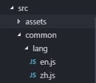

# vue-i18n，vue的前端国际化


用的国际化插件是 vue-i18n，附上 github 传送门：https://github.com/kazupon/vue-i18n

1，开发环境，用vue-cli 官方脚手架把开发环境给运行起来

2、安装 vue-i18n

```vue
$ npm install vue-i18n
```

3、注入 vue 实例中，实现调用 api 和 语法

先在 main.js 中引入 vue-i18n。

```vue
import VueI18n from 'vue-i18n'

Vue.use(VueI18n) // 通过插件的形式挂载

const i18n = new VueI18n({
    locale: 'zh-CN',    // 语言标识
    //this.$i18n.locale // 通过切换locale的值来实现语言切换
    messages: {
      'zh-CN': require('./common/lang/zh'),   // 中文语言包
      'en-US': require('./common/lang/en')    // 英文语言包
    }
})

/* eslint-disable no-new */
new Vue({
  el: '#app',
  i18n,  // 不要忘记
  store,
  router,
  template: '<App/>',
  components: { App }
})
```


上面的代码正式将 vue-i18n 引入 vue 项目中，创建一个 i18n 实例对象，方便全局调用。我们通过 `this.$i18n.locale` 来进行语言的切换，同样的我这边的例子里就是通过点击事件，点击‘’网易云音乐‘’，来触发事件，切换locale 的值。

4、ok, 引入的事情就是这样，那么既然实现国际化，这边简单的是中英文切换，那么自然我们需要中英文两套语言的文件，vue-i18n中相对简单，只需要两个 js 文件，通过 require 的形式引入到 main.js。



en.js 英文语言包：

```
export const m = { 
  music: 'Music',//网易云音乐
  findMusic: 'FIND MUSIC',//发现音乐
  myMusic: 'MY MUSIC',//我的音乐
  friend: 'FRIEND',//朋友
  musician: 'MUSICIAN',//音乐人
  download: 'DOWNLOAD'//下载客户端
}
```


zh.js中文语言包

```
export const m = {
  music: '网易云音乐',
  findMusic: '发现音乐',
  myMusic: '我的音乐',
  friend: '朋友',
  musician: '音乐人',
  download: '下载客户端'
}
```

最后我们只需要通过触发事件的形式，来控制 locale 的值，去调用对应的语言包就可以实现国际化啦。


5、组件中如何去切换 locale 的值，实现语言切换。

```
locale: 'zh-CN',    // 语言标识
    messages: {
      'zh-CN': require('./common/lang/zh'),   // 中文语言包
      'en-US': require('./common/lang/en')    // 英文语言包
    }
```

在 main.js 中的代码中，可以看到，当 locale 的值为‘zh-CN’时，版本为中文；当 locale 的值为‘en-US’,版本为英文。当然你也可以换成 zh 和 en，这个不固定，只需要对应上。

好了，现在来看一下，我组件中的一个点击事件中如何进行切换。

```
/**
 * 切换语言 
 */ 
 changeLangEvent() {
   this.$confirm('确定切换语言吗?', '提示', {
       confirmButtonText: '确定',
       cancelButtonText: '取消',
       type: 'warning'
    }).then(() => {
       if ( this.lang === 'zh-CN' ) {
          this.lang = 'en-US';
          this.$i18n.locale = this.lang;//关键语句
       }else {
          this.lang = 'zh-CN';
          this.$i18n.locale = this.lang;//关键语句
       }
    }).catch(() => {
       this.$message({
           type: 'info',
       });          
    });
}
```


这边的重点就是，点出的‘’关键语句‘’：`this.$i18n.locale`,当你赋值为‘zh-CN’时，导航栏就变成中文；当赋值为 ‘en-US’时，就变成英文。效果图就是文章前面的样子。

6、到这，前端 vue-i18n 国际化插件在 vue-cli 模块化环境中的开发实践就全部完成了。

 

### vue-i18n 数据渲染的模板语法

我们知道 vue 中对于文字数据的渲染，有以‘’{{}}‘’或者 v-text、v-html等的形式，同样的使用国际化后，依旧可以沿用，但需要一点修改。 
v-text:

`<span v-text="$t('m.music')"></span>`

{{}}:

`<span>{{$t('m.music')}}</span>`

 