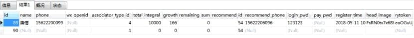

表结构：

 

 

查询我的二级下线的两种sql查询：

 

//联表查询

select u1.* from xt_user u1,(select * from xt_user where recommend_id=40) u2 where u1.recommend_id=u2.id  

 

//使用in关键字查询

select * FROM xt_user where recommend_id in(select id from xt_user where recommend_id=40)

 

结果：

 