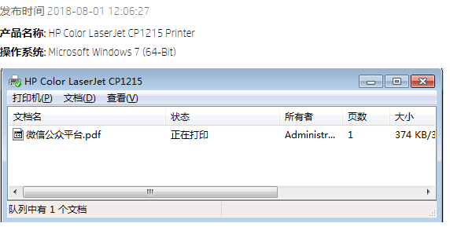
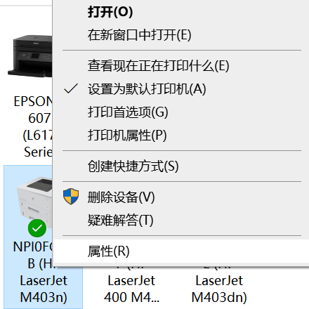
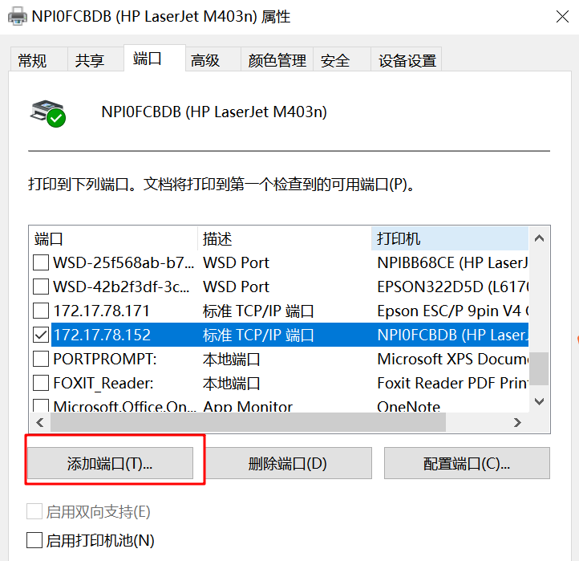
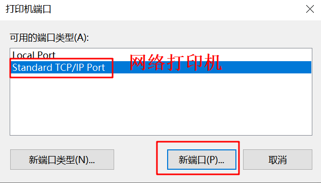
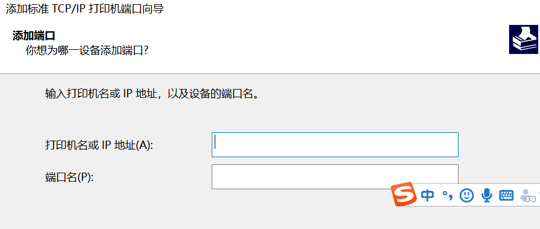

 

解决方式：

1 检查连接是否连接牢靠
2 检查打印机开机后，是否为就绪状态
3 检查电脑上驱动是否正确安装，打印机图标的状态是否为就绪，**端口**选择是否正确
4 确认windows测试页是否可以打印，之前打印的文档是否过大，是否过于复杂，更其它文档测试

实际情况一：端口配置有误，重新配置端口

—控制面板—》硬件和声音—》设备和打印机—》选中对应打印机—》右键选择打印机属性—》选择端口—》新建端口，然后填入正确的ip地址

 

 

 

 