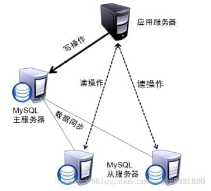
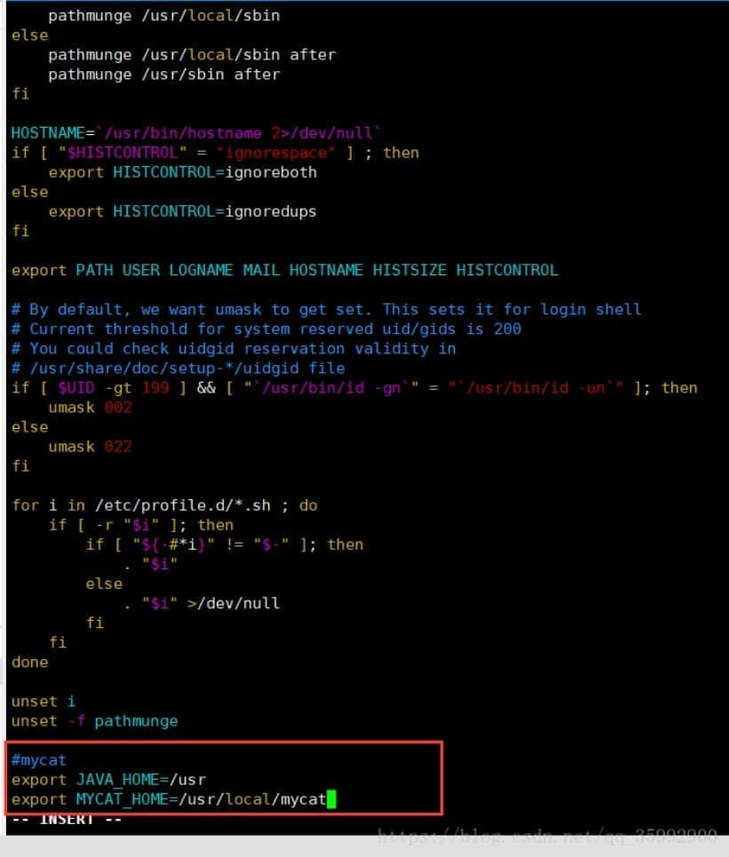
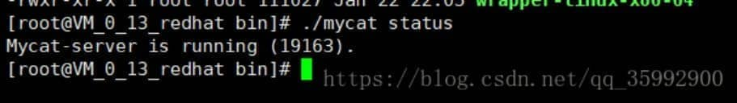
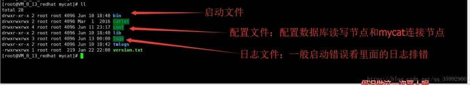
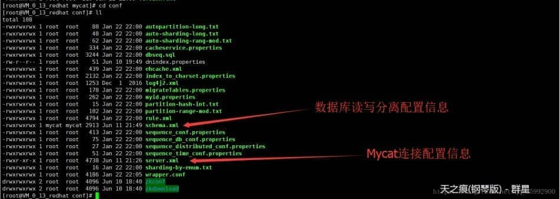
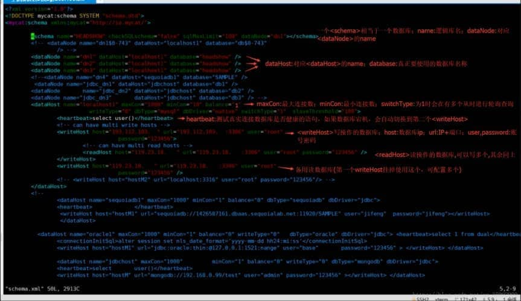
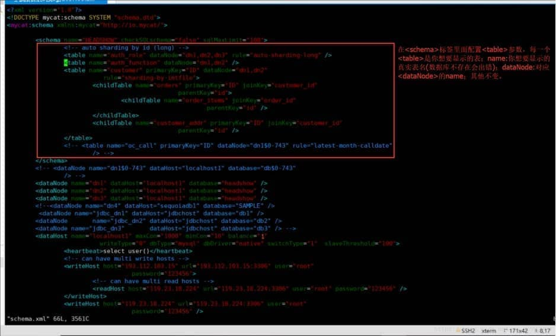
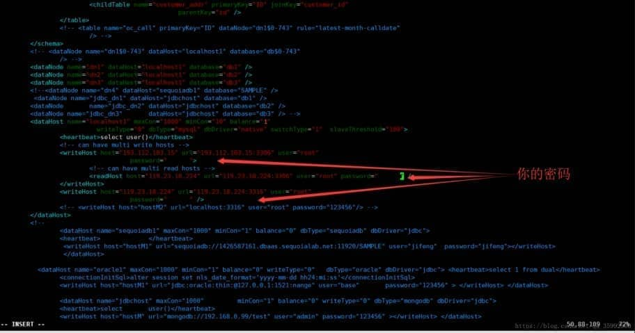
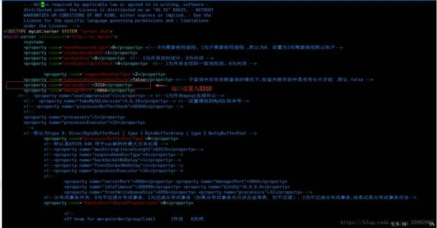
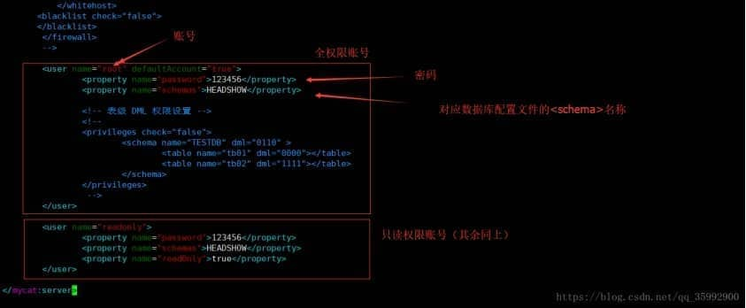

# **Linux 使用Mycat实现读写分离（基于Mysql的读写分离）**

# 1.读写分离的思路

## 1.1 原理

顾名思义，读写分离基本的原理是让主数据库处理事务性增、改、删操作，而从数据库处理查询操作。数据库复制被用来把事务性操作导致的变更同步到集群中的从数据库。 
 

## **1.2 实现方式**

实现方式有很多，但是不外乎分为内部配置和使用中间件，下面列举几个常用的方法： 
	1.**配置多个数据源，根据业务需求访问不同的数据，指定对应的策略**：增加，删除，修改操作访问对应数据，查询访问对应数据，不同数据库做好的数据一致性的处理。此方法相对易懂，简单，不做过多介绍。 

2. **动态切换数据源，根据配置的文件，业务动态切换访问的数据库**：此方案通过Spring的AOP，AspactJ来实现动态织入，通过编程继承实现Spring中的AbstractRoutingDataSource,来实现数据库访问的动态切换，不仅可以方便扩展，不影响现有程序，而且对于此功能的增删也比较容易。 

3. **通过mycat来实现读写分离**：使用mycat提供的读写分离功能，mycat连接多个数据库，数据源只需要连接mycat，对于开发人员而言他还是连接了一个数据库(实际是mysql的mycat中间件)，而且也不需要根据不同业务来选择不同的库，这样就不会有多余的代码产生。

 

​	总结：每个方法都有优缺点，我们选择对程序代码改动最小(只改数据源)的方法三，讲解mycat的配置和使用。

# **2.Mycat安装和配置**

## **2.1安装步骤**

```
#安装Java环境(mycat基于java)
yum install java-1.8.0-openjdk.x86_64

#安装wget
yum install wget 

# 下载mycat
wget http://dl.mycat.io/1.6.5/Mycat-server-1.6.5-release-20180122220033-linux.tar.gz

# 解压
tar -zxvf Mycat-server-1.6.5-release-20180122220033-linux.tar.gz

# 剪切到/usr/local下
mv mycat /usr/local/

# 创建专门运行mycat账号
adduser mycat

# 切换到mycat文件夹路径下
cd /usr/local

# 将文件权限赋给mycat账号
chown mycat:mycat -R mycat

#配置环境变量并添加 
export JAVA_HOME=/usr export MYCAT_HOME=/usr/local/mycat(如下图所示)

vim /etc/profile
```

 

按Esc，输入:wq保存退出

\# 刷新环境变量文件

source /etc/profile# 切换mycat用户

su mycat#切换目录

cd /usr/local/mycat/bin/#启动mycat

./mycat start

 

好了，mycat启动成功，我们来看一下读写分离的配置和mycat的连接配置!

# **3.配置Mycat的读写分离**

## **3.1 Mycat的目录结构**

根目录 

进到conf文件夹里面查看配置文件: 


## **3.2 配置读写分离信息**

\#进入配置文件

vi /usr/local/mycat/conf/schema.xml

以下是两种配置方式和配置说明 
\1. 提供一个数据库内所有表的权限： 
2. 只显示一个数据库的指定表: 


这样对于数据库的读写信息就配置完成了；一般刚开始做，先使用第一种方法。 


# **4.配置Mycat的连接信息(账号密码)**

\#进入配置文件

vi /usr/local/mycat/conf/server.xml

设置端口和mycat连接信息 


 

对于<dataHost>标签，它里面重要的参数列举如下:

balance指的负载均衡类型，目前的取值有4种： 

1. balance=”0”, 不开启读写分离机制，所有读操作都发送到当前可用的writeHost上。 
2. balance=”1”，全部的readHost与stand bywriteHost参与select语句的负载均衡，简单的说，当双主双从模式(M1->S1，M2->S2，并且M1与 M2互为主备)，正常情况下，M2,S1,S2都参与select语句的负载均衡。 
3. balance=”2”，所有读操作都随机的在writeHost、readhost上分发。 
4. balance=”3”，所有读请求随机的分发到wiriterHost对应的readhost执行，writerHost不负担读压力 

注意：balance=3只在1.4及其以后版本有，1.3没有。

 

writeType属性： 
1.writeType=”0”,所有写操作发送到配置的第一个writeHost,第一个挂了切到还生存的第二个writeHost,重新启动后以切换后的为准，切换记录在配置文件中:dnindex.properties. 
2.writeType=”1”,所有写操作都随机地发送到配置的writeHost,1.5以后废弃不推荐。

 

switchType指的是切换的模式，目前的取值也有4种： 

1. switchType=’-1’ 表示不自动切换 
2. switchType=’1’ 默认值，表示自动切换 
3. switchType=’2’ 基于MySQL主从同步的状态决定是否切换,心跳语句为 show slave status 
4. switchType=’3’基于MySQLgalary cluster的切换机制（适合集群）（1.4.1），心跳语句为 show status like ‘wsrep%’。

注意：估计Mycat1.4才开始支持switchType。1.3版本配置该属性的话，日志里会报错：org.xml.sax.SAXParseException;lineNumber: 61; columnNumber: 86; Attribute “switchType” must bedeclared for element type “dataHost”。 
MyCAT心跳检查询句配置为 show slave status ，dataHost 上定义两个新属性： switchType=”2” 与slaveThreshold=”100”，此时意味着开启MySQL主从复制状态绑定的读写分离与切换机制，Mycat心跳机制通过检测 show slave status 中的 “Seconds_Behind_Master”,”Slave_IO_Running”,”Slave_SQL_Running”三个字段来确定当前主从同步的状态及Seconds_Behind_Master主从复制时延，当Seconds_Behind_Master>slaveThreshold时，读写分离筛选器会过滤掉此Slave机器，防止读到很久以前的旧数据，当主节点宕机后，切换逻辑会检查Slave上的Seconds_Behind_Master是否为0，为0时则表示主仅同步，可安全切换，否则不会切换。

Mycat的配置到这里就算完成了，现在我们重启Mycat并连接测试

\#切换路径

cd /usr/local/mycat/bin#重启

./mycat restart

测试连接: 
 
项目开发中，我们只需要将mysql的连接地址换成mycat的地址即可，无需任何其余操作，更不会造成多余的业务逻辑，好了，mycat的简单配置和使用就介绍到这里了！

 

注意事项:

1、若连接不上首先要考虑是否是防火墙的问题（下面为cenos7操作防火墙）

查看防火墙状态：firewall-cmd --state

停止firewall：systemctl stop firewalld.service

启动firewall：systemctl start firewalld.service

禁止firewall开机启动：systemctl disable firewalld.service 

 

2、schema.xml 和 server.xml示例

```xml
schema.xml
<?xml version="1.0"?>
<!DOCTYPE mycat:schema SYSTEM "schema.dtd">
<mycat:schema xmlns:mycat="http://io.mycat/"> 

   <!-- mycat配置详解，请参照 https://www.cnblogs.com/fxwl/p/7990906.html-->
   <schema name="TESTDB" checkSQLschema="false" sqlMaxLimit="100" dataNode="database1">

         <!-- 设置表的存储方式.schema name="TESTDB" 与 server.xml中的 TESTDB 设置一致  --> 
         <!--
          <table name="user_mycat" primaryKey="id"  dataNode="dn1" />
         <table name="item_mycat" primaryKey="id" dataNode="dn2,dn3" rule="rule1" >
         </table>
         -->
   </schema>

    <!-- 设置dataNode对应的数据库,及mycat 连接的地址localhost,连接的主库中的数据库名字为test（即test为主库中的需要连接的那个数据库的名字） -->
    <dataNode name="database1" dataHost="localhost1" database="test" />

   <!-- mycat 逻辑主机dataHost对应的物理主机.其中也设置对应的mysql登陆信息 -->
   <!--
   1:balance:负载均称类型；
      1）0：不开启读写分离机制，所有读操作都发送到当前可用的writeHost上
      2）1：全部的readHost与stand by writeHost参与select语句的负载均衡，简单的说，开启读写分离
         比如我们配置了1主3从的MySQL主从环境，并把第一个从节点MySQL配置为dataHost中的第二个writeHost，以便主节点宕机后，
         Mycat自动切换到这个writeHost上来执行写操作，此时balance=1就意味着第一个writeHost不参与读SQL的负载均衡，其他3个都参与
      3）2：所有读操作都随机的在writeHost、readHost上分发
      4）3：所有读请求随机的分发到writeHst对应的readHost执行，writeHost不负担读写压力。（1.4之后版本有）
   2：writeType：负载均衡类型
      1）0：所有写操作发送到配置的第一个 writeHost，第一个挂了切到还生存的第二个writeHost，重新启动后已切换后的为准，切换记录在配置文件中:dnindex.properties .
      2）1：所有写操作都随机的发送到配置的 writeHost。1.5以后版本废弃不推荐。
      3）-1：不自动切换
         注：默认值自1动切换，基于MySql主从同步的状态决定是否切换心跳语句为 show slave status，
            基于mysql galary cluster 的切换机制（适合集群）1.4.1 心跳语句为 show status like 'wsrep%'
   3：dbType：指定后端链接的数据库类型目前支持二进制的mysql协议，还有其他使用jdbc链接的数据库，例如：mongodb，oracle，spark等
   4：dbDriver：指定连接后段数据库使用的driver，目前可选的值有native和JDBC。使用native的话，因为这个值执行的是二进制的mysql协议，所以可以使用mysql和maridb，其他类型的则需要使用JDBC驱动来支持。
      如果使用JDBC的话需要符合JDBC4标准的驱动jar 放到mycat\lib目录下，并检查驱动jar包中包括如下目录结构文件 META-INF\services\java.sql.Driver。
      在这个文件写上具体的driver类名，例如com.mysql.jdbc.Driver。writeHost readHost指定后端数据库的相关配置给mycat，用于实例化后端连接池。
   5：switchType：
      1）-1：不自动切换
      2）1：默认值自动切换
      3）2：基于MySQL主从同步的状态决定是否切换
      注：“Mycat心跳检查语句配置为 show slave status ，dataHost 上定义两个新属性： switchType=”2” 与slaveThreshold=”100”，
         此时意味着开启MySQL主从复制状态绑定的读写分离与切换机制。Mycat心跳机制通过检测 show slave status 中的 “Seconds_Behind_Master”,
         “Slave_IO_Running”, “Slave_SQL_Running” 三个字段来确定当前主从同步的状态以及Seconds_Behind_Master主从复制时延。“
   -->
    <dataHost name="localhost1" maxCon="1000" minCon="10"  balance="1" writeType="0" dbType="mysql" dbDriver="native" switchType="2"  slaveThreshold="100">
            <heartbeat>show slave status</heartbeat>
         <!-- 3307主库-->
         <writeHost host="cluster1" url="127.0.0.1:3307" user="root" password="root123">
                        <readHost host="slave1" url="127.0.0.1:3308" user="root" password="root123" />
         </writeHost>
         <!-- 3307从库-->
         <writeHost host="cluster2" url="127.0.0.1:3308" user="root" password="root123"></writeHost>
    </dataHost> 
</mycat:schema>

server.xml
<?xml version="1.0" encoding="UTF-8"?>
<!DOCTYPE mycat:server SYSTEM "server.dtd">
<mycat:server xmlns:mycat="http://io.mycat/">
   <system>
   <property name="useSqlStat">0</property>  <!-- 1为开启实时统计、0为关闭 -->
   <property name="useGlobleTableCheck">0</property>  <!-- 1为开启全加班一致性检测、0为关闭 -->

      <property name="sequnceHandlerType">2</property>
      <!--默认为type 0: DirectByteBufferPool | type 1 ByteBufferArena-->
      <property name="processorBufferPoolType">0</property>
      <!--分布式事务开关，0为不过滤分布式事务，1为过滤分布式事务（如果分布式事务内只涉及全局表，则不过滤），
      2为不过滤分布式事务,但是记录分布式事务日志-->
      <property name="handleDistributedTransactions">0</property>
      
      <!-- off heap for merge/order/group/limit      1开启   0关闭 -->
      <property name="useOffHeapForMerge">1</property>

      <!-- 单位为m -->
      <property name="memoryPageSize">1m</property>
      <!-- 单位为k -->
      <property name="spillsFileBufferSize">1k</property>

      <property name="useStreamOutput">0</property>

      <!-- 单位为m -->
      <property name="systemReserveMemorySize">384m</property>

      <!--是否采用zookeeper协调切换  -->
      <property name="useZKSwitch">true</property>

       <property name="defaultSqlParser">druidparser</property>  
      <property name="mutiNodeLimitType">1</property>
      <!--访问mycat的端口号-->
      <property name="serverPort">8066</property>  
      <property name="managerPort">9066</property>   

   </system>
   
   <!-- 全局SQL防火墙设置 -->
   <user name="root">
      <property name="password">123456</property>
      <property name="schemas">TESTDB</property>
   </user>

   <user name="user">
      <property name="password">user</property>
      <property name="schemas">TESTDB</property>
      <property name="readOnly">true</property>
   </user>

</mycat:server>
```

