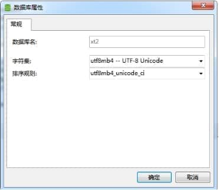
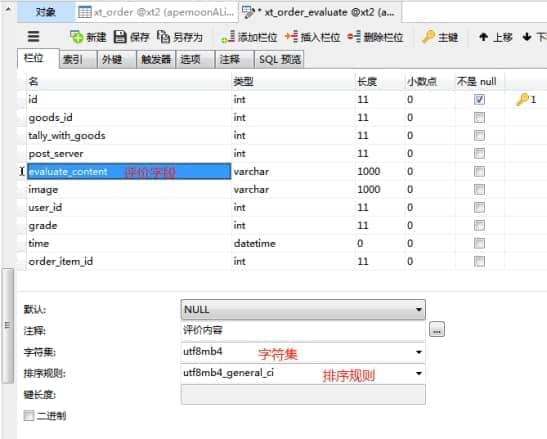

# 出现场景

今天读取solr里面的数据，往**mysql插入时报错**， Incorrect string value: '\xF0\x9F\x93\x8D\xE8\x88...' for column 'title' at row 1 

原因是标题有Emoj表情相关字符，该种字符串为Emoj表情内容，每个字符占用4个字节，在Mysql中默认最大支持3个字节，即utf8，超长了，所以报错了。需要修改为 **utf8mb4**

 

# 解决方法

1.建表的时候添加如下限制：ENGINE=InnoDB DEFAULT CHARSET=**utf8mb4** COLLATE=**utf8mb4_bin**;

2.在my.cnf上修改如下：

------------------my.cnf------------------------------------------------------

\# For advice on how to change settings please see

\# http://dev.mysql.com/doc/refman/5.6/en/server-configuration-defaults.html

[client]

default-character-set=***\*utf8mb4\****

[mysql]

default-character-set = ***\*utf8mb4\****

\# Remove leading # and set to the amount of RAM for the most important data

\# cache in MySQL. Start at 70% of total RAM for dedicated server, else 10%.

\# innodb_buffer_pool_size = 128M

 

\# Remove leading # to turn on a very important data integrity option: logging

\# changes to the binary log between backups.

\# log_bin

\# These are commonly set, remove the # and set as required.

\# basedir = .....

\# datadir = .....

\# port = .....

\# server_id = .....

\# socket = .....

 

\# Remove leading # to set options mainly useful for reporting servers.

\# The server defaults are faster for transactions and fast SELECTs.

\# Adjust sizes as needed, experiment to find the optimal values.

\# join_buffer_size = 128M

\# sort_buffer_size = 2M

\# read_rnd_buffer_size = 2M

 

sql_mode=NO_ENGINE_SUBSTITUTION,STRICT_TRANS_TABLES

log-error=/var/log/mysqld.log

long_query_time=3

 

[mysqld]

character-set-client-handshake = FALSE

character-set-server = ***\*utf8mb4\****

collation-server = ***\*utf8mb4_unicode_ci\****

init_connect='SET NAMES ***\*utf8mb4\****'

 

\#log-slow-queries= /usr/local/mysql/log/slowquery.log

 \------------------------------------------------------------------------

重启mysql服务，service mysql stop；  service mysql start；问题解决。

造成这个问题的原因（网上找的）：

mysql中规定utf8字符的最大字节数是3，但是某些unicode字符转成utf8编码之后有4个字节，导致出错。

 

同时，数据库的字符编码和表表中对应字段的字符编码也需要改变，如下：

 

对应数据库字符编码为：

 

 

表字段编码：

 

 