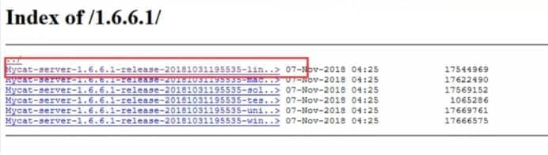
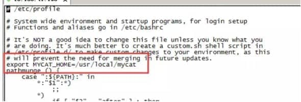
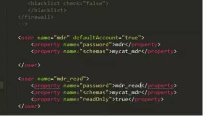
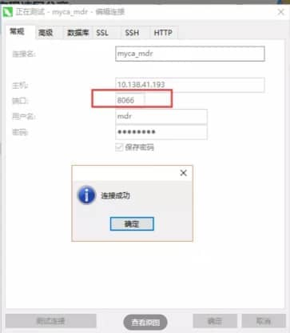
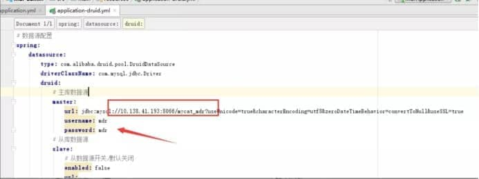
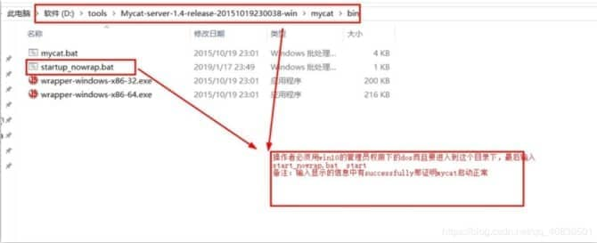
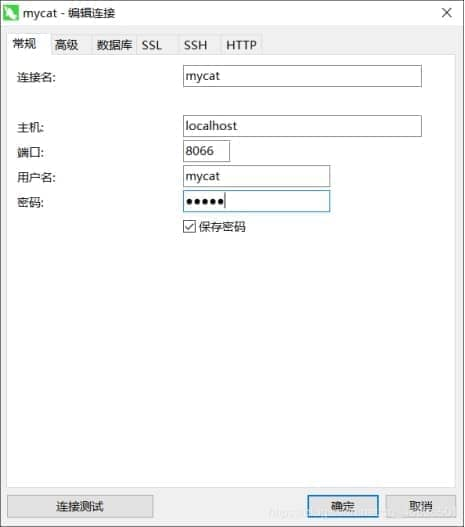

# **mysql通过mycat实现读写分离**

目前MyCat配置Mysql 读写分离的文章虽然很多，但是看起来比较杂乱，造成很多困扰，所以自己根据实践并采用新的Mycat 版本将搭建步骤自始至终重写一遍。

 

在根据本文档操作前，已假设服务器的环境已经配置了Mysql 的 主从复制模式，若没有配置请参考以下文章
https://www.cnblogs.com/beamzhang/p/5454047.html

### **1.环境介绍**

操作系统：  CentOS 7.5

数据库：MySQL 5.7.23

openjdk version "1.8.0_131"

mycat：1.6.6.1

服务器：10.138.41.193（Mysql 主）、10.138.41.234（Mysql 从）

 

### **2.Mycat下载与上传**

#### 下载

进入网址 http://www.mycat.io/，下载Mycat 最新版
因为服务器版本是linux 所以选用**红色框标记**的版本

 

 

#### 上传与解压

1. 将下载下来的mycat上传到linux指定目录，这边我放在了/software目录下面

2. 执行如下命令，解压并移动到/usr/local 目录下面
   解压命令如下，解压后会在当前目录下生成mycat 目录文件夹

   ```
   tar -xvzf Mycat-server-1.6.6.1-release-20181031195535-linux.tar.gz
   ```

   移动命令：

   ```
   mv mycat /usr/local/
   ```

   

### **3.安装JDK与配置环境变量**

安装JDK的命令这边不做赘述，只介绍配置MyCAT的环境变量
执行命令如下：vi /etc/profile
添加如下内容：
export MYCAT_HOME=/usr/local/mycat
并在文件末尾加上如下配置：
export PATH=$MYCAT_HOME/bin:$PATH
如图：

 


添加完成后保存并退出
执行如下命令使配置文件立马生效
source /etc/profile

### **4.修改配置文件server.xml 和scheme.xml**

修改scheme.xml

默认的scheme.xml 带有很多演示用的配置，这里我们读写分离大部分不需要！精简后的配置如下：

```xml
<?xml version="1.0"?><!DOCTYPE mycat:schema SYSTEM "schema.dtd"><mycat:schema xmlns:mycat="http://io.mycat/">

  <!-- 定义虚拟数据库名称 -->
  <schema name="mycat_mdr" checkSQLschema="false" sqlMaxLimit="100" dataNode="dn1" >
    <!-- 这里配置分库分表，因只做读写分离所以这里暂不配置 -->
  </schema>

  <dataNode name="dn1" dataHost="localhost" database="mdr" /> 
  <!-- 上述这里三个参数分别是定义dataNode的别名、数据库的IP或局域网服务器的别名在hosts中配置、数据库名 -->
  <!-- 将balance设置为3表示开启读写分离 -->
  <dataHost name="localhost" maxCon="1000" minCon="10" balance="3"
       writeType="0" dbType="mysql" dbDriver="native" switchType="1" slaveThreshold="100">
    
      <!-- 定时执行SQL保持心跳 -->
    <heartbeat>select user()</heartbeat>
    
      <!-- 添加写入库配置 -->
    <writeHost host="hostM1" url="localhost:3306" user="mdr" password="mdr">
      <!-- 添加只读库配置-->
      <readHost host="hostS1" url="10.138.41.234:3306" user="mdr" password="mdr" />
    </writeHost>
  </dataHost>
  </mycat:schema>
```

修改server.xml

server.xml主要配置两个用户，将鼠标移至文件末尾处，配置如下：其中schemas指向schema.xml中配置的名称！

 

### **5.启动mycat**

因为前期配置了mycat的环境变量，所以启动命令和停止命令可在任何路径下执行

启动命令
mycat start

停止命令
mycat stop

### **6.访问验证**

经过前面的配置已经产生了两个用户 mdr 和mdr_read 密码与用户名一致，下面可以用navicat等mysql客户端进行验证配置结果，mycat端口号为8066，点击：测试连接，若出现如图情况，表示mycat配置完成。


**注意：若连接失败，表示mycat配置存在问题，需要查看日志解决，日志目录为logs/wrapper.log，解决后重新验证**

 

### **7.项目上使用**

 

 

 

### 8.myCat的详解

什么时候要读写分离
数据库不一定要读写分离，如果程序使用的数据库比较多时，而跟新少，查询多的情况下会考虑使用，利用数据库 主从同步。可以减少数据库压力，提高性能。

什么是mycat？
mycat是一个开源的分布式数据库系统，经常被称之为数据库中间件，可以通过他实现读写分离和分库表的管理
mycat发展到目前的版本，已经不是一个单纯的mysql代理了，他的后端可以支持MYSQL，SQL Server，Oracle，DB2，PostgreSQL等主流数据库，也会支持MongoDB这种新型NoSQL方式的存储

**简而言之：就是阿里巴巴出产的开源免费的一款数据库中间件(就是后台程序与数据库之间的一个软件产品)**

mycat目录


#### mycat实现读写分离

1）编辑mycat配置文件server.xml

```xml
<user name="test">
    <property name="password">test</property>
    <property name="schemas">TESTDB</property></user><user name="user">
    <property name="password">user</property>
    <property name="schemas">TESTDB</property>
    <property name="readOnly">true</property>
</user>
```

 

2)编辑mycat配置文件schema.xml

***

 **当schema节点没有子节点table的时候，一定要有dataNode属性存在（指向mysql真实数据库），**

```xml
<schema name="TESTDB" checkSQLschema="false" sqlMaxLimit="100" dataNode="dn1"></schema>
<dataNode name="dn1" dataHost="192.168.0.4" database="db1" />****<dataHost name="192.168.0.4" maxCon="1000" minCon="10" balance="3" writeType="0" dbType="mysql" dbDriver="native" switchType="1" slaveThreshold="100">

    <heartbeat>select user()</heartbeat>
    <writeHost host="hostM1" url="192.168.0.4:3306" user="root" password="admin">
	     <readHost host="hostS2" url="192.168.0.5:3306" user="root" password="admin" />
    </writeHost>
</dataHost>
```

注意 dataHost节点的下面三个属性

**balance， switchType， writeType**

**balance=“0”,** 不开启读写分离机制，所有读操作都发送到当前可用的writeHost上。

**balance=“1”**，全部的readHost与stand by writeHost参与select语句的负载均衡，简单的说，当双主双从模式(M1->S1，M2->S2，并且M1与M2互为主备)，正常情况下，M2,S1,S2都参与select语句的负载均衡。

**balance=“2”**，所有读操作都随机的在writeHost、readhost上分发。

**balance=“3”**，所有读请求随机的分发到writeHost下的readhost执行，writeHost不负担读压力

writeType表示写模式

**writeType=“0”**，所有的操作发送到配置的第一个writehost

**writeType=“1”**，随机发送到配置的所有writehost

**writeType=“2”**，不执行写操作

switchType指的是切换的模式，目前的取值也有4种：

**switchType=‘-1‘** 表示不自动切换

**switchType=‘1‘** 默认值，表示自动切换

**switchType=‘2‘** 基于MySQL主从同步的状态决定是否切换,心跳语句为show slave status

**switchType=‘3‘** 基于MySQL galary cluster的切换机制（适合集群）（1.4.1），心跳语句为show status like ‘wsrep%‘。

3）进入到bin目录下以管理员权限dos启动mycat: startup_nowrap.bat


 