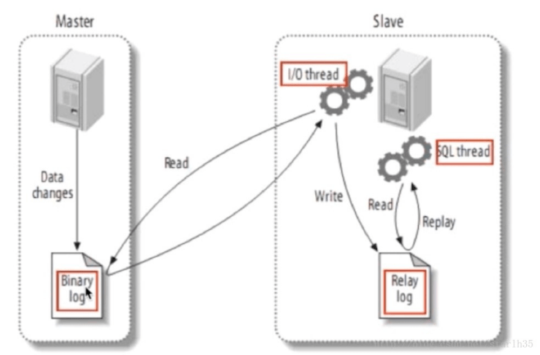
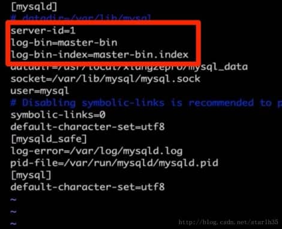
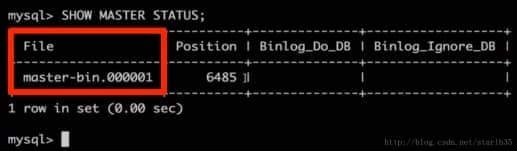
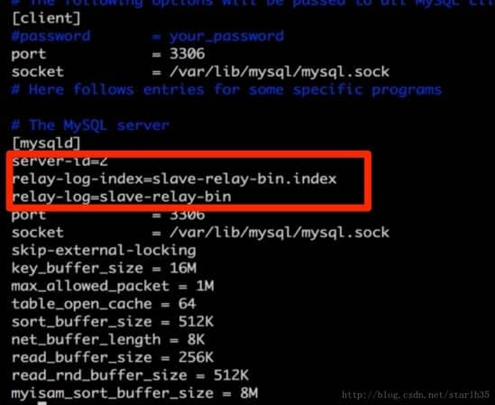
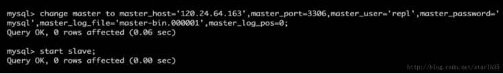
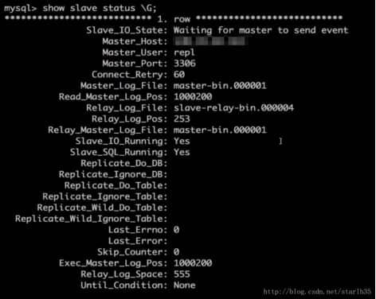

# **数据库读写分离，主从同步实现方法**

本文链接：https://blog.csdn.net/starlh35/article/details/78735510

### **前言**

众所周知，随着用户量的增多，数据库操作往往会成为一个系统的瓶颈所在，而且一般的系统“读”的压力远远大于“写”，因此我们可以通过实现数据库的读写分离来提高系统的性能。

### **实现思路**

通过设置主从数据库实现读写分离，主数据库负责“写操作”，从数据库负责“读操作”，根据压力情况，从数据库可以部署多个提高“读”的速度，借此来提高系统总体的性能。

### **基础知识**

要实现读写分离，就要解决主从数据库数据同步的问题,在主数据库写入数据后要保证从数据库的数据也要更新。

主从数据库同步的实现思路如图： 


主服务器master记录数据库操作日志到Binary log，从服务器开启i/o线程将二进制日志记录的操作同步到relay log（存在从服务器的缓存中），另外sql线程将relay log日志记录的操作在从服务器执行。 
记住这张图，接下来基于这个图实际设置主从数据库。

### **主从数据库设置的具体步骤**

首先要有两个数据库服务器master、slave（也可以用一个服务器安装两套数据库环境运行在不同端口，slave也可以举一反三设置多个），我们穷人就买虚拟云服务器玩玩就行 0.0。以下操作假设你的两台服务器上都已经安装好了mysql服务。

#### **1.打开mysql数据库配置文件**

vim /etc/my.cnf

#### **2.在主服务器master上配置开启Binary log，主要是在[mysqld]下面添加：**

server-id=1log-bin=master-binlog-bin-index=master-bin.index

如图： 


#### **3.重启mysql服务**

service mysql restart

ps：重启方式随意

#### **.检查配置效果，进入主数据库并执行**

mysql> SHOW MASTER STATUS;

可以看到下图表示配置没问题,这里面的File名:master-bin.000001 我们接下来在从数据库的配置会使用：

#### **5.配置从服务器的 my.cnf**

在[mysqld]节点下面添加： 


server-id=2

relay-log-index=slave-relay-bin.index

relay-log=slave-relay-bin

这里面的server-id 一定要和主库的不同，如图： 

配置完成后同样重启从数据库一下

service mysql restart

#### **6.接下来配置两个数据库的关联**

首先我们先建立一个操作主从同步的数据库用户，切换到主数据库执行：

```mysql
mysql> create user repl;
mysql> GRANT REPLICATION SLAVE ON *.* TO 'repl'@'从xxx.xxx.xxx.xx' IDENTIFIED BY 'mysql';
mysql> flush privileges;
```

这个配置的含义就是创建了一个数据库用户repl，密码是mysql, 在从服务器使用repl这个账号和主服务器连接的时候，就赋予其REPLICATION SLAVE的权限， *.* 表面这个权限是针对主库的所有表的，其中xxx就是从服务器的ip地址。 
进入从数据库后执行：

mysql> change master to master_host='主xxx.xxx.xxx.xx',master_port=3306,master_user='repl',master_password='mysql',master_log_file='master-bin.000001',master_log_pos=0;

这里面的xxx是主服务器ip，同时配置端口，repl代表访问主数据库的用户，上述步骤执行完毕后执行start slave启动配置：

mysql> start slave;


停止主从同步的命令为：

mysql> stop slave;

查看状态命令,\G表示换行查看

mysql> show slave status \G; 

可以看到状态如下： 

这里看到从数据库已经在等待主库的消息了，接下来在主库的操作，在从库都会执行了。我们可以主库负责写，从库负责读（不要在从库进行写操作），达到读写分离的效果。

#### **我们可以简单测试：**

在主数据库中创建一个新的数据库：

mysql> create database testsplit;

在从数据库查看数据库：

mysql> show databases;

可以看到从数据库也有testsplit这张表了，这里就不上图了，亲测可用。在主数据库插入数据，从数据库也可以查到。 
至此已经实现了数据库主从同步

### **代码层面实现读写分离**

上面我们已经有了两个数据库而且已经实现了主从数据库同步，接下来的问题就是在我们的业务代码里面实现读写分离，假设我们使用的是主流的ssm的框架开发的web项目，这里面我们需要多个数据源。

在此之前，我们在项目中一般会使用一个数据库用户远程操作数据库（避免直接使用root用户），因此我们需要在主从数据库里面都创建一个用户mysqluser，赋予其增删改查的权限：

mysql> GRANT select,insert,update,delete ON *.* TO 'mysqluser'@'%' IDENTIFIED BY 'mysqlpassword' WITH GRANT OPTION;

然后我们的程序里就用mysqluser这个用户操作数据库：

#### **1.编写jdbc.propreties**

```properties
\#mysql驱动
jdbc.driver=com.mysql.jdbc.Driver#主数据库地址
jdbc.master.url=jdbc:mysql://xxx.xxx.xxx.xx:3306/testsplit?useUnicode=true&characterEncoding=utf8#从数据库地址
jdbc.slave.url=jdbc:mysql://xxx.xxx.xxx.xx:3306/testsplit?useUnicode=true&characterEncoding=utf8#数据库账号
jdbc.username=mysqluser
jdbc.password=mysqlpassword
```

这里我们指定了两个数据库地址，其中的xxx分别是我们的主从数据库的ip地址，端口都是使用默认的3306

#### **2.配置数据源**

在spring-dao.xml中配置数据源（这里就不累赘介绍spring的配置了，假设大家都已经配置好运行环境），配置如下：

```xml
<?xml version="1.0" encoding="UTF-8"?><beans xmlns="http://www.springframework.org/schema/beans"
  xmlns:xsi="http://www.w3.org/2001/XMLSchema-instance" xmlns:context="http://www.springframework.org/schema/context"
  xsi:schemaLocation="http://www.springframework.org/schema/beans
  http://www.springframework.org/schema/beans/spring-beans.xsd">
    
  <!-- 配置整合mybatis过程 -->
  <!-- 1.配置数据库相关参数properties的属性：${url} -->
  <context:property-placeholder location="classpath:jdbc.properties" />
  <!-- 扫描dao包下所有使用注解的类型 -->
  <context:component-scan base-package="c n.xzchain.testsplit.dao" />
    
  <!-- 2.数据库连接池 -->
  <bean id="abstractDataSource" abstract="true" class="com.mchange.v2.c3p0.ComboPooledDataSource"
  destroy-method="close">
    <!-- c3p0连接池的私有属性 -->
    <property name="maxPoolSize" value="30" />
    <property name="minPoolSize" value="10" />
    <!-- 关闭连接后不自动commit -->
    <property name="autoCommitOnClose" value="false" />
    <!-- 获取连接超时时间 -->
    <property name="checkoutTimeout" value="10000" />
    <!-- 当获取连接失败重试次数 -->
    <property name="acquireRetryAttempts" value="2" />
  </bean>

  <!--主库配置-->

  <bean id="master" parent="abstractDataSource">
    <!-- 配置连接池属性 -->
    <property name="driverClass" value="${jdbc.driver}" />
    <property name="jdbcUrl" value="${jdbc.master.url}" />
    <property name="user" value="${jdbc.username}" />
    <property name="password" value="${jdbc.password}" />
  </bean>

  <!--从库配置-->
  <bean id="slave" parent="abstractDataSource">
    <!-- 配置连接池属性 -->
    <property name="driverClass" value="${jdbc.driver}" />
    <property name="jdbcUrl" value="${jdbc.slave.url}" />
    <property name="user" value="${jdbc.username}" />
    <property name="password" value="${jdbc.password}" />
  </bean>

  <!--配置动态数据源，这里的targetDataSource就是路由数据源所对应的名称-->
  <bean id="dataSourceSelector" class="cn.xzchain.testsplit.dao.split.DataSourceSelector">
    <property name="targetDataSources">
      <map>
        <entry value-ref="master" key="master"></entry>
        <entry value-ref="slave" key="slave"></entry>
      </map>
    </property>
  </bean>

  <!--配置数据源懒加载-->
  <bean id="dataSource" class="org.springframework.jdbc.datasource.LazyConnectionDataSourceProxy">
    <property name="targetDataSource">
      <ref bean="dataSourceSelector"></ref>
    </property>
  </bean>

  <!-- 3.配置SqlSessionFactory对象 -->
  <bean id="sqlSessionFactory" class="org.mybatis.spring.SqlSessionFactoryBean">
    <!-- 注入数据库连接池 -->
    <property name="dataSource" ref="dataSource" />
    <!-- 配置MyBaties全局配置文件:mybatis-config.xml -->
    <property name="configLocation" value="classpath:mybatis-config.xml" />
    <!-- 扫描entity包 使用别名 -->
    <property name="typeAliasesPackage" value="cn.xzchain.testsplit.entity" />
    <!-- 扫描sql配置文件:mapper需要的xml文件 -->
    <property name="mapperLocations" value="classpath:mapper/*.xml" />
  </bean>

  <!-- 4.配置扫描Dao接口包，动态实现Dao接口，注入到spring容器中 -->
  <bean class="org.mybatis.spring.mapper.MapperScannerConfigurer">
    <!-- 注入sqlSessionFactory -->
    <property name="sqlSessionFactoryBeanName" value="sqlSessionFactory" />
    <!-- 给出需要扫描Dao接口包 -->
    <property name="basePackage" value="cn.xzchain.testsplit.dao" />
  </bean></beans>
```

说明： 
首先读取配置文件jdbc.properties，然后在我们定义了一个基于c3p0连接池的父类“抽象”数据源，然后配置了两个具体的数据源master、slave，继承了abstractDataSource，这里面就配置了数据库连接的具体属性，然后我们配置了动态数据源，他将决定使用哪个具体的数据源，这里面的关键就是DataSourceSelector，接下来我们会实现这个bean。下一步设置了数据源的懒加载，保证在数据源加载的时候其他依赖的bean已经加载好了。接着就是常规的配置了，我们的mybatis全局配置文件如下

#### **3.mybatis全局配置文件**

```xml
<?xml version="1.0" encoding="UTF-8" ?><!DOCTYPE configuration
 PUBLIC "-//mybatis.org//DTD Config 3.0//EN"
 "http://mybatis.org/dtd/mybatis-3-config.dtd"><configuration>

  <!-- 配置全局属性 -->
  <settings>
    <!-- 使用jdbc的getGeneratedKeys获取数据库自增主键值 -->
    <setting name="useGeneratedKeys" value="true" />
    <!-- 使用列别名替换列名 默认:true -->
    <setting name="useColumnLabel" value="true" />
    <!-- 开启驼峰命名转换:Table{create_time} -> Entity{createTime} -->
    <setting name="mapUnderscoreToCamelCase" value="true" />
    <!-- 打印查询语句 -->
    <setting name="logImpl" value="STDOUT_LOGGING" />
  </settings>
     
  <plugins>
    <plugin interceptor="cn.xzchain.testsplit.dao.split.DateSourceSelectInterceptor"></plugin>
  </plugins></configuration>
```

这里面的关键就是DateSourceSelectInterceptor这个拦截器，它会拦截所有的数据库操作，然后分析sql语句判断是“读”操作还是“写”操作，我们接下来就来实现上述的DataSourceSelector和DateSourceSelectInterceptor

#### **4.编写DataSourceSelector**

DataSourceSelector就是我们在spring-dao.xml配置的，用于动态配置数据源。代码如下：

```java
import org.springframework.jdbc.datasource.lookup.AbstractRoutingDataSource;

/**
 * @author lihang
 * @date 2017/12/6.
 * @description 继承了AbstractRoutingDataSource，动态选择数据源
 */
public class DataSourceSelector extends AbstractRoutingDataSource {

  @Override
  protected Object determineCurrentLookupKey() {
    return DynamicDataSourceHolder.getDataSourceType();
  }
}
```

 

我们只要继承AbstractRoutingDataSource并且重写determineCurrentLookupKey()方法就可以动态配置我们的数据源。 
编写DynamicDataSourceHolder，代码如下：

```java
/**
 * @author lihang
 * @date 2017/12/6.
 * @description
 */
public class DynamicDataSourceHolder {

  /**用来存取key，ThreadLocal保证了线程安全*/
  private static ThreadLocal<String> contextHolder = new ThreadLocal<String>();
  /**主库*/
  public static final String DB_MASTER = "master";
  /**从库*/
  public static final String DB_SLAVE = "slave";

 

  /**
   * 获取线程的数据源
   * @return
   */
  public static String getDataSourceType() {
    String db = contextHolder.get();
    if (db == null){
      //如果db为空则默认使用主库（因为主库支持读和写）
      db = DB_MASTER;
    }
    return db;
  }

  /**
   * 设置线程的数据源
   * @param s
   */
  public static void setDataSourceType(String s) {
    contextHolder.set(s);
  }

  /**
   * 清理连接类型
   */
  public static void clearDataSource(){
    contextHolder.remove();
  }
}
```

这个类决定返回的数据源是master还是slave，这个类的初始化我们就需要借助DateSourceSelectInterceptor了，我们拦截所有的数据库操作请求，通过分析sql语句来判断是读还是写操作，读操作就给DynamicDataSourceHolder设置slave源，写操作就给其设置master源，代码如下：

```java
import org.apache.ibatis.executor.Executor;
import org.apache.ibatis.executor.keygen.SelectKeyGenerator;
import org.apache.ibatis.mapping.BoundSql;
import org.apache.ibatis.mapping.MappedStatement;
import org.apache.ibatis.mapping.SqlCommandType;
import org.apache.ibatis.plugin.*;
import org.apache.ibatis.session.ResultHandler;
import org.apache.ibatis.session.RowBounds;
import org.springframework.transaction.support.TransactionSynchronizationManager;
import java.util.Locale;import java.util.Properties;

/**
 * @author lihang
 * @date 2017/12/6.
 * @description 拦截数据库操作，根据sql判断是读还是写，选择不同的数据源
 */
@Intercepts(
    {@Signature(type = Executor.class,method = "update",args = {MappedStatement.class,Object.class}), 			@Signature(type = Executor.class,method = "query",args = {MappedStatement.class,Object.class, RowBounds.class, ResultHandler.class})})
public class DateSourceSelectInterceptor implements Interceptor{

  /**正则匹配 insert、delete、update操作*/
  private static final String REGEX = ".*insert\\\\u0020.*|.*delete\\\\u0020.*|.*update\\\\u0020.*";

  @Override
  public Object intercept(Invocation invocation) throws Throwable {
​    //判断当前操作是否有事务
​    boolean synchonizationActive = TransactionSynchronizationManager.isSynchronizationActive();
​    //获取执行参数
​    Object[] objects = invocation.getArgs();
​    MappedStatement ms = (MappedStatement) objects[0];
​    //默认设置使用主库
​    String lookupKey = DynamicDataSourceHolder.DB_MASTER;;
​    if (!synchonizationActive){
​      //读方法
​      if (ms.getSqlCommandType().equals(SqlCommandType.SELECT)){
​        //selectKey为自增主键（SELECT LAST_INSERT_ID()）方法,使用主库
​        if (ms.getId().contains(SelectKeyGenerator.SELECT_KEY_SUFFIX)){
​          lookupKey = DynamicDataSourceHolder.DB_MASTER;
​        }else {
​          BoundSql boundSql = ms.getSqlSource().getBoundSql(objects[1]);
​          String sql = boundSql.getSql().toLowerCase(Locale.CHINA).replace("[\\t\\n\\r]"," ");
​          //如果是insert、delete、update操作 使用主库
​          if (sql.matches(REGEX)){
​            lookupKey = DynamicDataSourceHolder.DB_MASTER;
​          }else {
​            //使用从库
​            lookupKey = DynamicDataSourceHolder.DB_SLAVE;
​          }
​        }
​      }
​    }else {
​      //一般使用事务的都是写操作，直接使用主库
​      lookupKey = DynamicDataSourceHolder.DB_MASTER;
​    }
​    //设置数据源
​    DynamicDataSourceHolder.setDataSourceType(lookupKey);
​    return invocation.proceed();
  }

  @Override
  public Object plugin(Object target) {
​    if (target instanceof Executor){
​      //如果是Executor（执行增删改查操作），则拦截下来
​      return Plugin.wrap(target,this);
​    }else {
​      return target;
​    }
  }

  @Override
  public void setProperties(Properties properties) {
  }
}
```

 

通过这个拦截器，所有的insert、delete、update操作设置使用master源，select会使用slave源。

接下来就是测试了，我这是生产环境的代码，直接打印日志，小伙伴可以加上日志后测试使用的是哪个数据源，结果和预期一样，这样我们就实现了读写分离～

ps：我们可以配置多个slave用于负载均衡，只需要在spring-dao.xml中添加slave1、slave2、slave3……然后修改dataSourceSelector这个bean，

```xml
<bean id="dataSourceSelector" class="cn.xzchain.o2o.dao.split.DataSourceSelector">
​    <property name="targetDataSources">
​      <map>
​        <entry value-ref="master" key="master"></entry>
​        <entry value-ref="slave1" key="slave1"></entry>
​        <entry value-ref="slave2" key="slave2"></entry>
​        <entry value-ref="slave3" key="slave3"></entry>
​      </map>
​    </property>
```

在map标签中添加slave1、slave2、slave3……即可，具体的负载均衡策略我们在DynamicDataSourceHolder、DateSourceSelectInterceptor中实现即可。

最后整理一下整个流程： 
1.项目启动后，在依赖的bean加载完成后，我们的数据源通过LazyConnectionDataSourceProxy开始加载，他会引用dataSourceSelector加载数据源。 
2.DataSourceSelector会选择一个数据源，我们在代码里设置了默认数据源为master，在初始化的时候我们就默认使用master源。 
3.在数据库操作执行时，DateSourceSelectInterceptor拦截器拦截了请求，通过分析sql决定使用哪个数据源，“读操作”使用slave源，“写操作”使用master源。

 