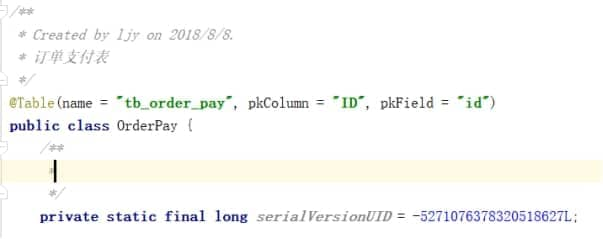

## **核心组件dexcoder-dal使用说明**

如果你不喜欢用Hibernate、Mybaits这类ORM框架，喜欢JdbcTemplate或DbUtils，那么可以试试这个封装的通用dal，这可能是目前封装的最方便易用的通用dal层了。

**dexcoder-dal的一些特性**

1、一个dao即可以搞定所有的实体类，不必再一个个建立跟实体对应的继承于类似BaseDao这类“通用dao”了。

2、各类方法参数除了Entity外，支持更强大的Criteria方式。

3、sql的where条件支持一些复杂的条件，如等于、不等于、or、in、not in甚至是执行函数。

4、允许在查询时指定使用哪个字段进行排序，可以指定多个进行组合升降序自由排序。

5、支持在查询时指定返回字段的白名单和黑名单，可以指定只返回某些字段或不返回某些字段。

6、select查询时支持函数，count()、max()、to_char()、甚至是distinct,理论上都可以支持。

7、方便强大的分页功能，无须额外操作，二三行代码搞定分页，自动判断数据库，无须指定。

8、可以使用{}和[]完成一些特殊的操作，{}中的代码将原生执行，[]中的代码会进行命名转换，一般fieldName转columnName。

9、支持执行自定义sql。

10、支持使用类似mybatis的方式执行自定义sql。

11、支持读写分离和动态数据源。

 

**命名规范****，典型****约定**

1、表名约定USER_INFO表实体类名为UserInfo。

2、字段名约定USER_NAME实体类中属性名为userName。

3、主键名约定USER_INFO表主键名为USER_INFO_ID，同理实体类中属性名为userInfoId。

但是可以通过注解指定某个字段充当id主键

 

4、Oracle序列名约定USER_INFO表对应的主键序列名为SEQ_USER_INFO

5、当然，这些你可以在扩展中改变它，但不建议这么做，这本身就是一个良好的规范。

 

**使用步骤**

1、在pom.xml中添加依赖：

```
<dependency>
    <groupId>com.dexcoder</groupId>
    <artifactId>dexcoder-dal-spring</artifactId>
	<version>2.2.0-beta1</version>
</dependency>
```

 

2、在spring的配置文件中声明如下bean：

```
<bean id="jdbcDao" class="com.dexcoder.dal.spring.JdbcDaoImpl"><property name="jdbcTemplate" ref="jdbcTemplate"/></bean>
<!--需要分页时声明-->
<bean id="pageControl" class="com.dexcoder.dal.spring.page.PageControl"></bean>
```

 

3、接下来就可以注入到您的Service或者其它类中使用了。

**常用方法示例**

这里的Entity对象为User，对于任何的Entity都是一样的.

先来看一下User对象及它继承的Pageable

```
public class User extends Pageable {
    private Long              userId;
    private String            loginName;
    private String            password;
    private Integer           userAge;
    private String            userType;
    private String            email;
    private Date              gmtCreate;
    //......
}
```

Pageable对象，用来保存页码、每页条数信息以支持分页

```
public class Pageable implements Serializable {

    /** 每页显示条数 */
    protected int itemsPerPage = 20;
    
    /** 当前页码 */
    protected int curPage = 1;
    //......
}
```

都是普通的JavaBean对象，下面来看看如何进行具体的增删改查，每种操作都演示了Entity和Criteria两种方式。

#### **insert操作（处理主键，即自动生成主键）**

```
public void insert() {

    User user = new User();
    user.setLoginName("selfly_a");
    user.setPassword("123456");
    user.setEmail("javaer@live.com");
    user.setUserAge(18);
    user.setUserType("1");
    user.setGmtCreate(new Date());
    Long id = jdbcDao.insert(user);
    System.out.println("insert:" + id);
}

public void insert2() {
    Criteria criteria = Criteria.insert(User.class).into("loginName", "selfly_b").into("password", "12345678")
        .into("email", "selflly@foxmail.com").into("userAge", 22).into("userType", "2").into("gmtCreate", new Date());
    Long id = jdbcDao.insert(criteria);
    System.out.println("insert:" + id);
}
```

 

#### **save操作，和insert的区别在于不处理主键，由调用者指定**

```
public void save() {

    User user = new User();
    user.setUserId(-1L);
    user.setLoginName("selfly-1");
    user.setPassword("123456");
    user.setEmail("javaer@live.com");
    user.setUserAge(18);
    user.setUserType("1");
    user.setGmtCreate(new Date());
    jdbcDao.save(user);
}

public void save2() {
    Criteria criteria = Criteria.insert(User.class).into("userId", -2L).into("loginName", "selfly-2")
        .into("password", "12345678").into("email", "selflly@foxmail.com").into("userAge", 22).into("userType", "2")
        .into("gmtCreate", new Date());
    jdbcDao.save(criteria);
}
```

 

#### **update操作**

```
public void update() {

    User user = new User();
    user.setUserId(57L);
    user.setPassword("abcdef");
    user.setGmtModify(new Date());
    jdbcDao.update(user);
}

public void update2() {
    Criteria criteria = Criteria.update(User.class).set("password", "update222")
        .where("userId", new Object[] { 56L, -1L, -2L });
    jdbcDao.update(criteria);
}

user.setPassword("abcdef");

//方式一 为null的属性值将被忽略
jdbcDao.update(user);

//方式二 为null的属性值将更新到数据库
jdbcDao.update(user,false);

//方式三 criteria 这里的email设为null也将被更新
Criteria criteria = Criteria.update(User.class).set("password", "update222").set("email",null)
    .where("userId", new Object[] { 56L, 57L, 58L });
jdbcDao.update(criteria);
```

 

#### **get操作**

```
public void get1() {

    User u = jdbcDao.get(User.class, 63L);
    Assert.assertNotNull(u);
    System.out.println(u.getUserId() + " " + u.getLoginName() + " " + u.getUserType());
}

public void get2() {

    //criteria，主要用来指定字段白名单、黑名单等
    Criteria criteria = Criteria.select(User.class).include("loginName");
    User u = jdbcDao.get(criteria, 73L);
    Assert.assertNotNull(u);
    System.out.println(u.getUserId() + " " + u.getLoginName() + " " + u.getUserType());
}
```

 

#### **delete操作**

```
public void delete() {

    //会把不为空的属性做为where条件
    User u = new User();
    u.setLoginName("selfly-1");
    u.setUserType("1");
    jdbcDao.delete(u);
}

public void delete2() {
    //where条件使用了or
    Criteria criteria = Criteria.delete(User.class).where("loginName", new Object[] { "liyd2" })
        .or("userAge", new Object[]{64});
    jdbcDao.delete(criteria);
}

public void delete3() {
    //根据主键
    jdbcDao.delete(User.class, 57L);
}
```

 

#### **列表查询操作**

```
public void queryList() {
    //所有结果
     List<User> users = jdbcDao.queryList(User.class);
}

public void queryList1() {

    //以不为空的属性作为查询条件
     User u = new User();
    u.setUserType("1");
    List<User> users = jdbcDao.queryList(u);
}

public void queryList2() {

    //Criteria方式
    Criteria criteria = Criteria.select(User.class).exclude("userId").where("loginName", new Object[]{"liyd"});
    List<User> users = jdbcDao.queryList(criteria);
}

public void queryList3() {

    //使用了like，可以换成!=、in、not in等
    Criteria criteria = Criteria.select(User.class).where("loginName", "like",new Object[] { "%liyd%" });
    user.setUserAge(16);
    //这里entity跟criteria方式混合使用了，建议少用
    List<User> users = jdbcDao.queryList(user, criteria.include("userId"));
}
```

 

#### **count记录数查询，除了返回值不一样外，其它和列表查询一致**

```
public void queryCount() {
    user.setUserName("liyd");
    int count = jdbcDao.queryCount(user);
}

public void queryCount2() {
    Criteria criteria = Criteria.select(User.class).where("loginName", new Object[] { "liyd" })
        .or("userAge", new Object[]{27});
    int count = jdbcDao.queryCount(criteria);
}
```

 

#### **查询单个结果**

```
public void querySingleResult() {
    user = jdbcDao.querySingleResult(user);
}

public void querySingleResult2() {
    Criteria criteria = Criteria.select(User.class).where("loginName", new Object[] { "liyd" })
        .and("userId", new Object[]{23L});
    User u = jdbcDao.querySingleResult(criteria);
}
```

 

#### **指定字段白名单，在任何查询方法中都可以使用**

```
public void get(){
    //将只返回userName
    Criteria criteria = Criteria.select(User.class).include("loginName");
    User u = jdbcDao.get(criteria, 23L);
}
```

 

#### **指定字段黑名单，在任何查询方法中都可以使用**

```
public void get4(){
    //将不返回loginName
    Criteria criteria = Criteria.select(User.class).exclude("loginName");
    User u = jdbcDao.get(criteria, 23L);
}
```

 

#### **指定排序**

```
public void queryList() {

    //指定多个排序字段，asc、desc
    Criteria criteria = Criteria.select(User.class).exclude("userId")
        .where("loginName", new Object[]{"liyd"}).asc("userId").desc("userAge");
    List<User> users = jdbcDao.queryList(criteria);
}
```

 

#### **分页**

```
public void queryList1() {

    //进行分页
    PageControl.performPage(user);
    
    //分页后该方法即返回null，由PageControl中获取
    jdbcDao.queryList(user);
    Pager pager = PageControl.getPager();

    //列表
    List<User> users = pager.getList(User.class);

    //总记录数
    int itemsTotal = pager.getItemsTotal();
}

public void queryList2() {

    //直接传入页码和每页条数
    PageControl.performPage(1, 10);

    //使用Criteria方式，并指定排序字段方式为asc
    Criteria criteria = Criteria.select(User.class).include("loginName", "userId")
        .where("loginName", new Object[]{"liyd"}).asc("userId");
    jdbcDao.queryList(criteria);
    Pager pager = PageControl.getPager();
}
```

 

#### **不同的属性在括号内or的情况：**

```
Criteria criteria = Criteria.select(User.class)
        .where("userType", new Object[] { "1" }).begin()
        .and("loginName", new Object[] { "selfly" })
        .or("email", new Object[] { "javaer@live.com" }).end()
        .and("password", new Object[] { "123456" });
    User user = jdbcDao.querySingleResult(criteria);
```

 

#### **执行函数**

```
//max()
Criteria criteria = Criteria.select(User.class).addSelectFunc("max([userId])");
Long userId = jdbcDao.queryForObject(criteria);

//count()
Criteria criteria = Criteria.select(User.class).addSelectFunc("count(*)");
Long count = jdbcDao.queryForObject(criteria);
 
//distinct
Criteria criteria = Criteria.select(User.class).addSelectFunc("distinct [loginName]");
List<Map<String, Object>> mapList = jdbcDao.queryForList(criteria);
```

 

**默认情况下，addSelectFunc方法返回结果和表字段互斥，并且没有排序，如果需要和表其它字段一起返回并使用排序，可以使用如下代码：**

```
Criteria criteria = Criteria.select(User.class).addSelectFunc("DATE_FORMAT(gmt_create,'%Y-%m-%d %h:%i:%s') date",false,true);

List<Map<String, Object>> mapList = jdbcDao.queryForList(criteria);
```

 

**这是在select中执行函数，那怎么在update和where条件中执行函数呢？前面提到的{}和[]就可以起到作用了。看下面代码：**

```
Criteria criteria = Criteria.update(User.class).set("[userAge]", "[userAge]+1")
    .where("userId", new Object[] { 56L });

jdbcDao.update(criteria);
```

 

**以上代码将执行sql：UPDATE USER SET USER_AGE = USER_AGE+1  WHERE USER_ID =  ?，[]中的fieldName被转换成了columnName,**

**也可以使用{}直接写columnName，因为在{}中的内容都是不做任何操作原生执行的，下面代码效果是一样的：**

```
Criteria criteria = Criteria.update(User.class).set("{USER_AGE}", "{USER_AGE + 1}")
    .where("userId", new Object[] { 56L });
    
jdbcDao.update(criteria);
```

 

**同理，在where中也可以使用该方式来执行函数：**

```
Criteria criteria = Criteria.select(User.class).where("[gmtCreate]", ">",
    new Object[] { "str_to_date('2015-10-1','%Y-%m-%d')" });

List<User> userList = jdbcDao.queryList(criteria);
```

 

#### **表别名支持**

有些时候，就算单表操作也必须用到表别名，例如oracle中的xmltype类型。可以在Criteria中设置表别名：

```
Criteria criteria = Criteria.select(Table.class).tableAlias("t").addSelectFunc("[xmlFile].getclobval() xmlFile")
        .where("tableId", new Object[]{10000002L});

Object obj = jdbcDao.queryForObject(criteria);
//对应的sqlselect t.XML_FILE.getclobval() xmlFile from TABLE t where t.TABLE_ID = ?
```

 

#### **执行自定义sql**

在实际的应用中，一些复杂的查询如联表查询、子查询等是省不了的。鉴于这类sql的复杂性和所需要的各类优化，通用dao并没有直接封装而是提供了执行自定义sql的接口。执行自定义sql支持两种方式：直接传sql执行和mybatis方式执行。

 

**直接传sql执行**

该方式可能会让除了dao层之外的业务层出现sql代码，因此是不推荐的，它适合一些不在项目中的情况。

何为不在项目中的情况？例如做一个开发自用的小工具，临时处理一批业务数据等这类后期不需要维护的代码。

要执行自定义sql首先需要在jdbcDao中注入sqlFactory，这里使用SimpleSqlFactory：

```
<bean id="jdbcDao" class="com.dexcoder.dal.spring.JdbcDaoImpl">
    <property name="jdbcTemplate" ref="jdbcTemplate"/>
    <property name="sqlFactory" ref="sqlFactory"/></bean><bean id="sqlFactory" class="com.dexcoder.dal.SimpleSqlFactory"></bean>
```

 

然后就可以直接传入sql执行了：

```
List<Map<String, Object>> list = jdbcDao.queryForSql("select * from USER where login_name = ?",new Object[] { "selfly_a99" });
```

 

这个实现比较简单，参数Object数组中不支持复杂的自定义对象。


**mybatis方式执行**

采用了插件式实现，使用该方式首先添加依赖：

```
<dependency>
    <groupId>com.dexcoder</groupId>
    <artifactId>dexcoder-dal-batis</artifactId>
	<version>2.2.0-beta1</version>
</dependency>
```

 

之后同样注入sqlFactory，把上面的SimpleSqlFactory替换成BatisSqlFactoryBean：

```
<bean id="jdbcDao" class="com.dexcoder.dal.spring.JdbcDaoImpl">
    <property name="jdbcTemplate" ref="jdbcTemplate"/>
	<property name="sqlFactory" ref="sqlFactory"/>
</bean>

<bean id="sqlFactory" class="com.dexcoder.dal.batis.BatisSqlFactoryBean">
	<property name="sqlLocation" value="user-sql.xml"/>
</bean>
```

 

BatisSqlFactoryBean有一个sqlLocation属性，指定自定义的sql文件，因为使用了spring的解析方式，所以可以和指定spring配置文件时一样使用各类通配符。

```
user-sql.xml是一个和mybatis的mapper类似的xml文件：

<?xml version="1.0" encoding="UTF-8" ?><!DOCTYPE mapper
        PUBLIC "-//dexcoder.com//DTD Mapper 2.0//EN"
        "http://www.dexcoder.com/dtd/batis-mapper.dtd"><mapper namespace="User">
        
    <sql id="columns">
        user_id,login_name,password,user_age,user_type
    </sql>

    <select id="getUser">
        select
        <include refid="columns"/>
        from user
        <where>
            <if test="params[0] != null">
                user_type = #{params[0].userType}
            </if>
            <if test="params[1] != null">
                and login_name in
                <foreach collection="params[1]" index="index" item="item" separator="," open="(" close=")">
                    #{item}
                </foreach>
            </if>
        </where>
    </select></mapper>
```

 

然后使用代码调用：

```
User user = new User();
user.setUserType("1");Object[] names = new Object[] { "selfly_a93", "selfly_a94", "selfly_a95" };

List<Map<String, Object>> mapList = jdbcDao.queryForSql("User.getUser", "params", new Object[] { user, names });for (Map<String, Object> map : mapList) {
    System.out.println(map.get("userId"));
    System.out.println(map.get("loginName"));
}
```

 

我们调用queryForSql方法时传入了三个参数：

1、User.getUser 具体的sql全id，namespace+id。

2、params 自定义sql中访问参数的key，如果不传入默认为item。

3、Object[] sql中用到的参数。访问具体参数时可以使用item[0],item[1]对应里面相应的元素，支持复杂对象。

可以看到这里支持复杂参数，第一个是Userbean对象，第二个是Object数组，至于获取方式可以看上面的xml代码。

除了传入的参数为Object数组并使用item[0]这种方式访问相应的元素外，其它的和mybatis可以说是一样的，mybatis支持的动态sql方式这里也可以支持,因为他本身就是来源于mybatis。

另外返回结果中map的key做了LOGIN_NAME到骆驼命名法loginName的转换。

#### **一些说明**

BatisSqlFactory方式由分析了mybatis源码后，提取使用了大量mybatis的代码。

JdbcDao在声明时可以根据需要注入其它几个参数：

```
<bean id="jdbcDao" class="com.dexcoder.dal.spring.JdbcDaoImpl">
    <property name="jdbcTemplate" ref="jdbcTemplate"/>
    <property name="sqlFactory" ref="..."/>
    <property name="nameHandler" ref="..."/>
    <property name="rowMapperClass" value="..."/>
    <property name="dialect" value="..."/></bean>
```

1、nameHandler 默认使用DefaultNameHandler，即遵守上面的约定优于配置，如果需要自定义可以实现该接口。

2、sqlFactory 执行自定义sql时注入相应的sqlFactory。

3、rowMapperClass 默认使用了spring的BeanPropertyRowMapper.newInstance(clazz),需要自定义可以自行实现，标准spring的RowMapper实现即可。

4、dialect 数据库方言，为空会自动判断，一般不需要注入。

 