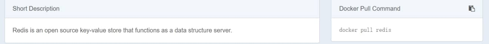

# [使用docker安装redis](https://www.cnblogs.com/lysongbo/p/9506782.html)

### **1.安装docker**

```
1、检查内核版本，必须是3.10及以上 
[root@localhost ~]# uname -r 

2、安装docker 
[root@localhost ~]# yum install docker 

3、启动docker
[root@localhost ~]# systemctl start docker 

4、查看版本
[root@localhost ~]# docker -v  
Docker version 1.12.6, build 3e8e77d/1.12.6

5、开机启动docker 
[root@localhost ~]# systemctl enable docker 

6、停止docker 
[root@localhost ~]# systemctl stop docker
```


### **2.安装redis**

访问：<https://hub.docker.com/>

搜索redis 我们可以看到

 

下载：

```
[root@VM_0_4_centos ~]# docker pull redis
```


#### **下载完成后查看镜像： docker images**

```
[root@VM_0_4_centos ~]# docker images
REPOSITORY                              TAG      IMAGE ID            CREATED             SIZE
registry.docker-cn.com/library/redis   latest    4e8db158f18d        2 weeks ago         83.4 MB
```


#### **启动redis**

```
 docker run -d -p 6379:6379 --name myredis 镜像id
```


#### **查看redis**

```
[root@VM_0_4_centos ~]# docker ps
 
CONTAINER ID    IMAGE  COMMAND     CREATED    STATUS     PORTS         NAMES
7512230290be registry.docker-cn.com/library/redis   "docker-entrypoint..."   22 hours ago        Up 22 hours     <br>0.0.0.0:6379->6379/tcp   myredis
```

　

 

 

 

 

 