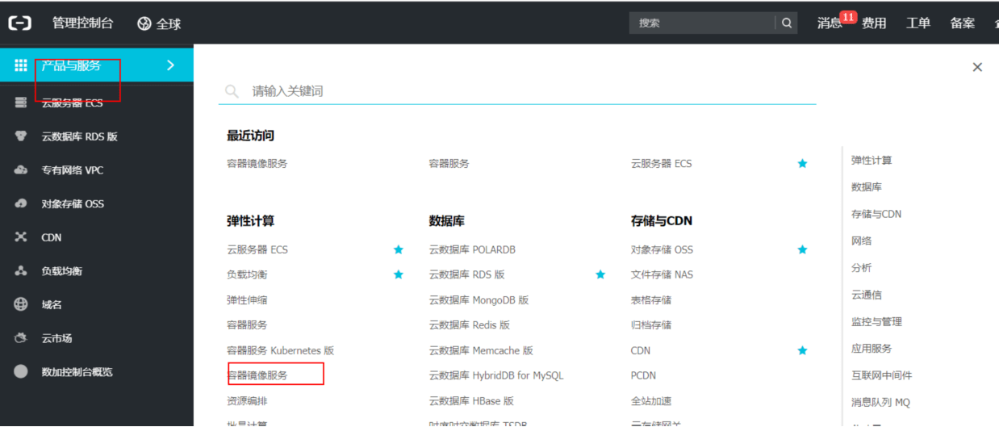
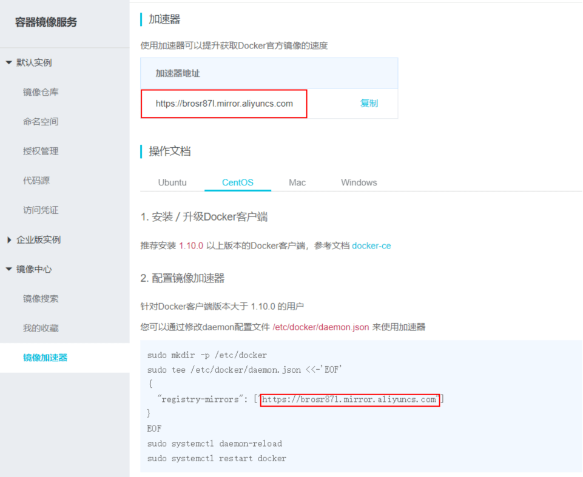

首先使用自己的淘宝账号登录阿里云，并进入一下页面

 

 

**注意：**

contOS 7以下，docker的配置文件为/etc/sysconfig/docker;

contOS7及以上的就是/etc/docker/daemon.json

 

若是cenos7以上版本，直接复制方式二中的代码直接在命令行运行就行，就会生成**daemon.json文件，在/ect/docker/目录下**

 

 

 