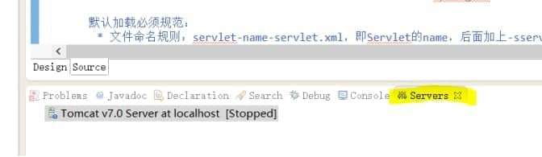
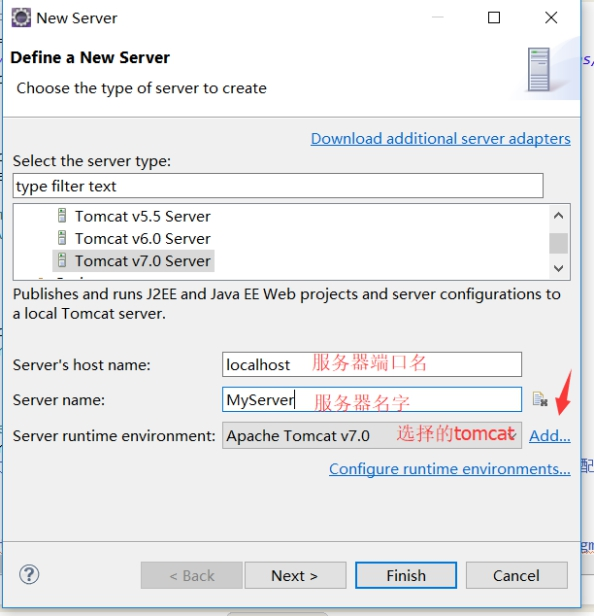
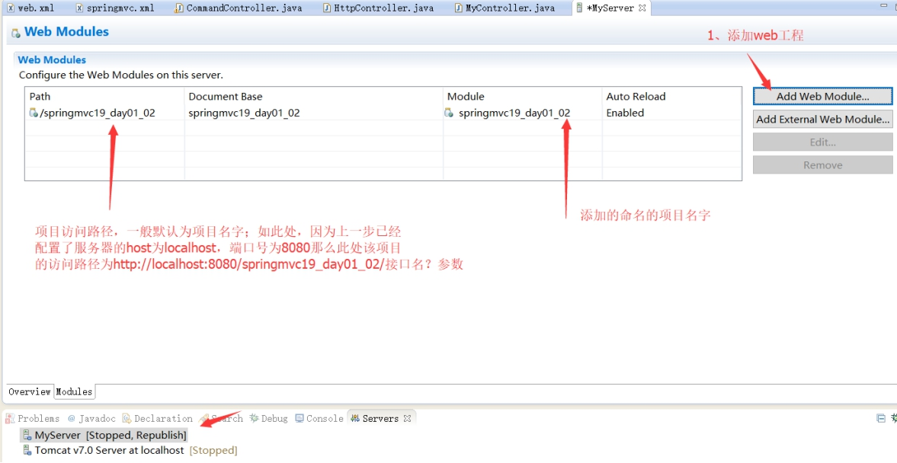

1、在eclipse上新建server

(1) 如下，点击选中图中黄色标注的server，然后在server下边的空白处右键，选择new 》Server

​     

 

(2) 设置服务器信息，设置完成后按finish结束

 

 

(3) 配置服务器信息

 

 

(4) 配置项目访问路径，配置完成之后就可以右键MyServer启动服务器，从而加载我们刚刚配置的项目

 

 