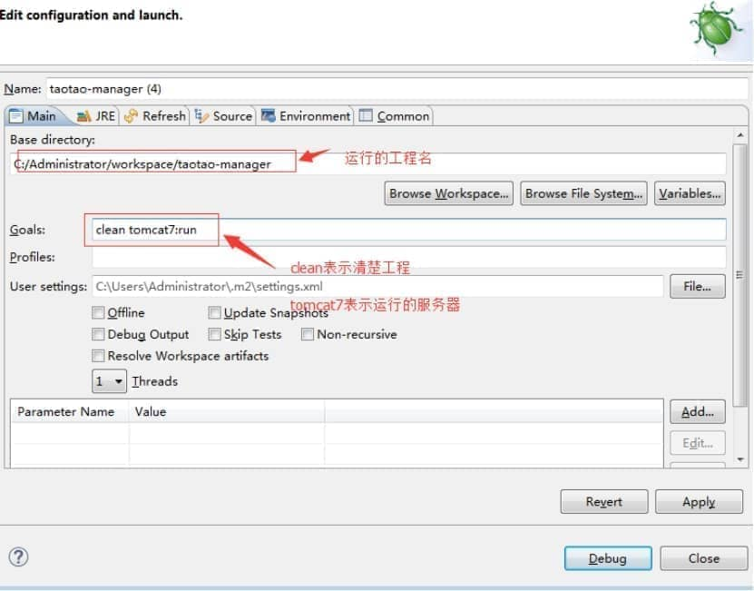
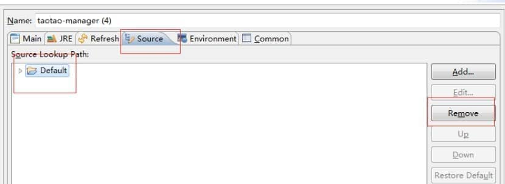

1、  若是maven工程，若在工程中设置断点后，运行debug，进不到debug，就可能是没有在source中关联工程。

 

2、在maven工程中debug的配置（若是第一次debug该运行工程）：

a) 首先右键工程----debug  As-----Maven build

 

 

b) 设置好上面的之后，切换到source，关联工程；先先删除默认的

 

 

c)   接着添加要关联的工程，第一步点击add，第二步java project，第三步选择需要关联的工程，然后一步一步确定好就行，最后run

 