# **如何将idea项目上传到Git**

# **一、准备工作**

## **1、Git下载及安装**

<https://jingyan.baidu.com/article/7f766dafba84f04101e1d0b0.html>

## **2、GitHub注册账号**

<https://github.com/>

## **3、idea上创建java项目**

# **二、配置idea项目**

## **1、配置idea**

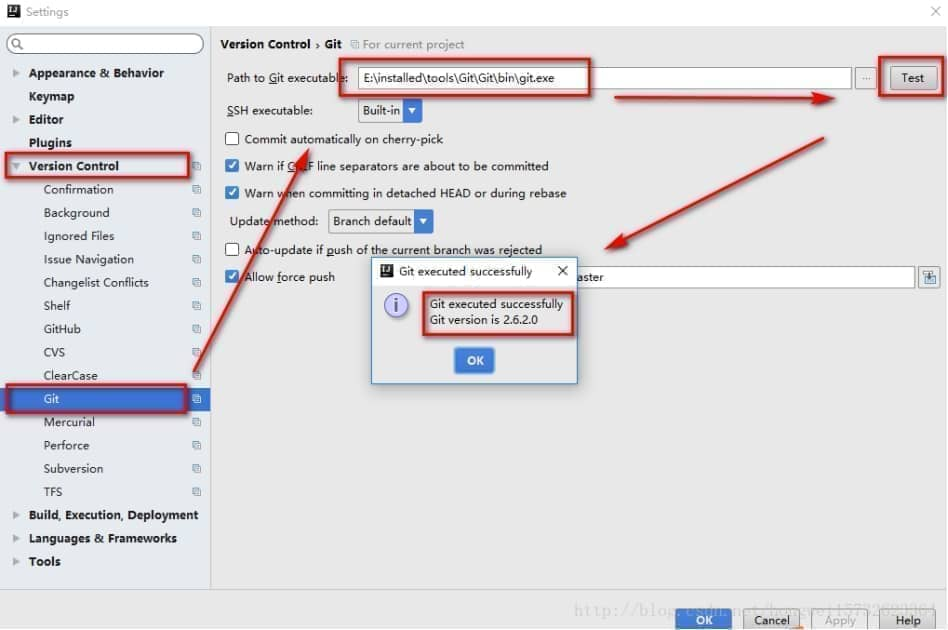 

## **2、idea上创建本地仓库**

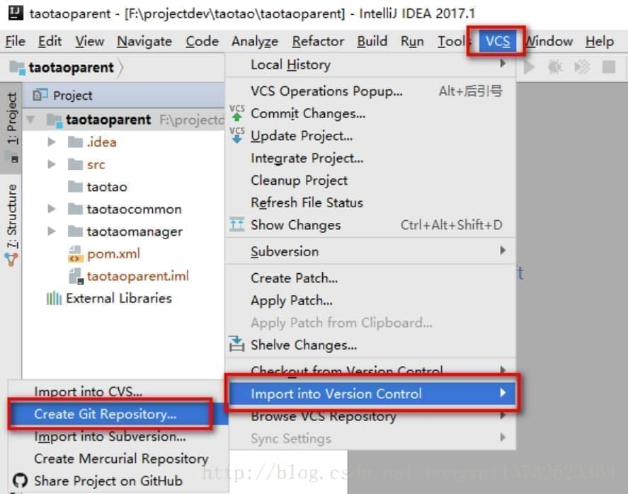 

## **3、项目变红，然后Git–>Add**

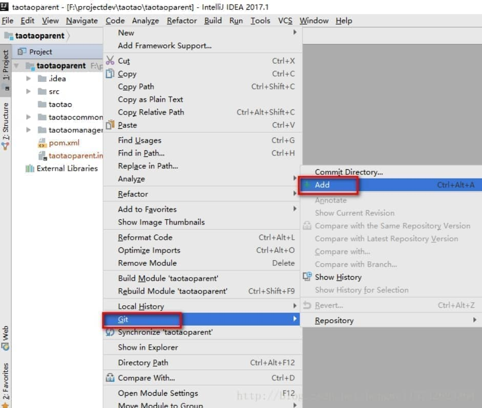 

add后变绿 
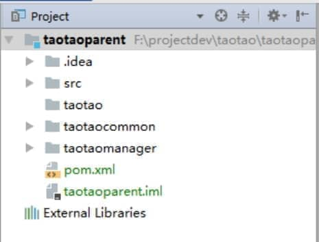

## **4、提交到本地**

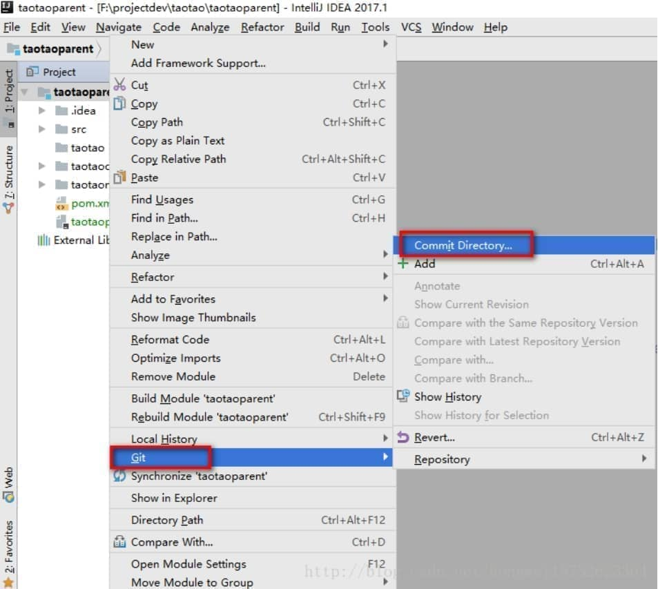 

绑定远端服务器

略

 

 

# **三、配置Git**

## **1、生成密钥：**

右键–>Git Bash Here：先输入ssh-keygen –t rsa –C “邮箱地址”,注意ssh-keygen之间是没有空格的,其他的之间是有空格的，邮箱地址是咱们在注册GitHub的时候用的邮箱。 
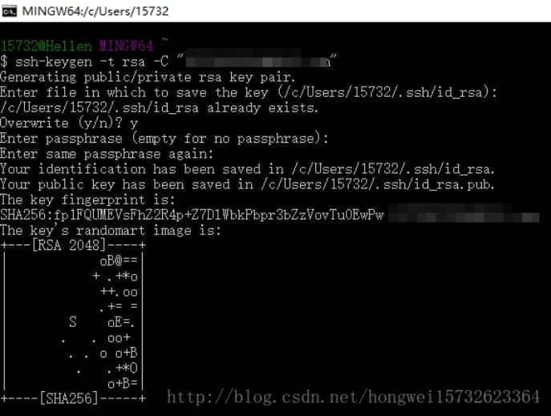 
生成的密钥在这里： 
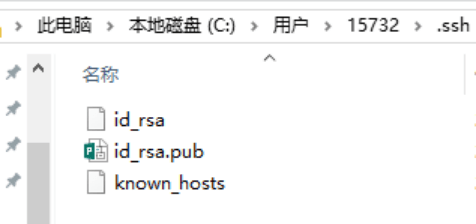

## **2、将id_rsa.pub用记事本打开，复制里面全部的内容，放在GitHub的SSH Keys上：**

 

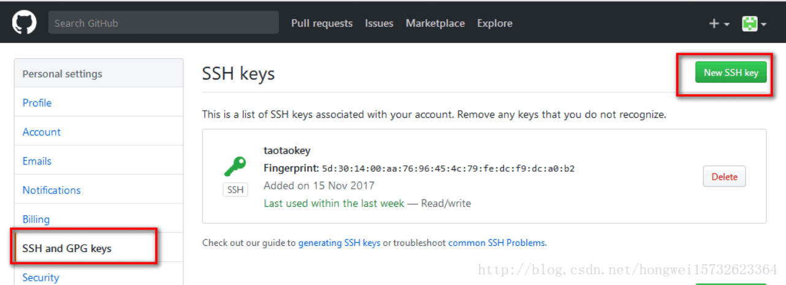 

## **3、ssh –T git@github.com 验证设置是否成功：**

 

## **4、设置用户名，邮箱：**

git config –global user.name “用户名” 
git config –global user.email “邮箱” 

## **5、GitHub上创建一个仓库：**

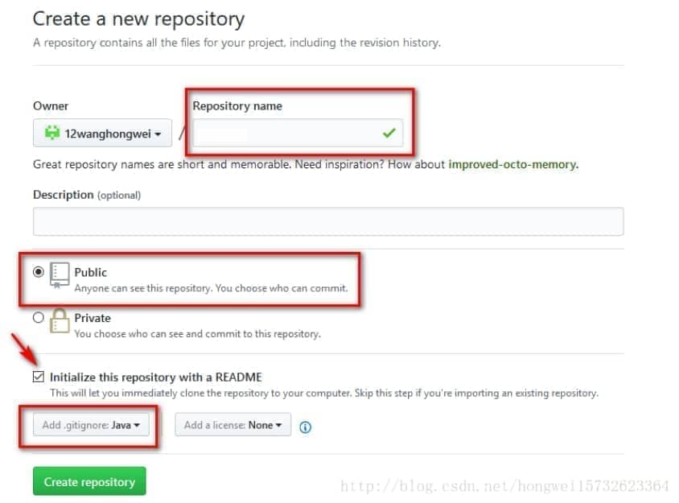 

## **6、将本地git项目上传到github上事先新建好的repository中：**

进入工程文件夹所在目录，右键Git Init Here，出现.git文件，是有关配置等功能的，不用管。然后到git bash here，依次输入以下命令：

git remote add origin git@github.com:{github用户名}/{repository名}.git

git pull git@github.com:{github用户名}/{repository名}.git

## **7、add commit push：**

add： 
输入命令：add . 
add后面加了一个点，是想要提交所有文件，如果想提交指定的文件，可以写文件名，执行完增加命令后，要执行提交命令，如下：

commit： 
输入命令：git commit –m “taotao_v1.0版本”

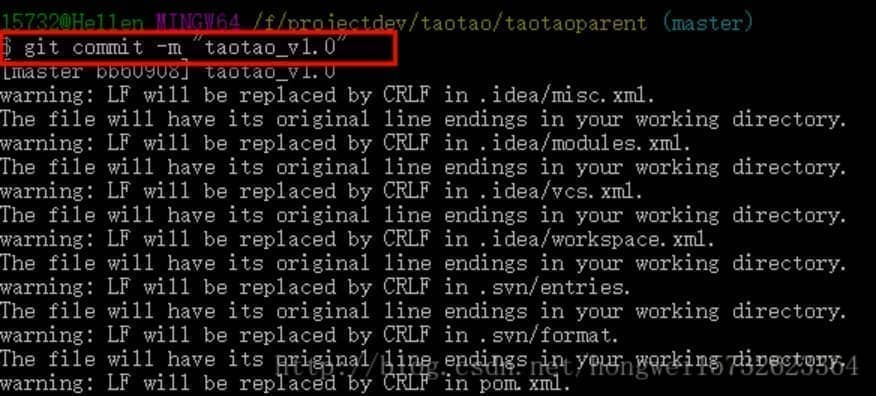 

push： 
输入命令：git push git@github.com:12wanghongwei/taotao.git

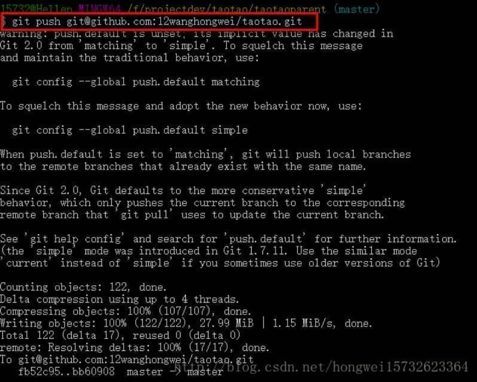 

## **配置到此完成。**

之后再修改了代码，直接在idea中commit and push。

 