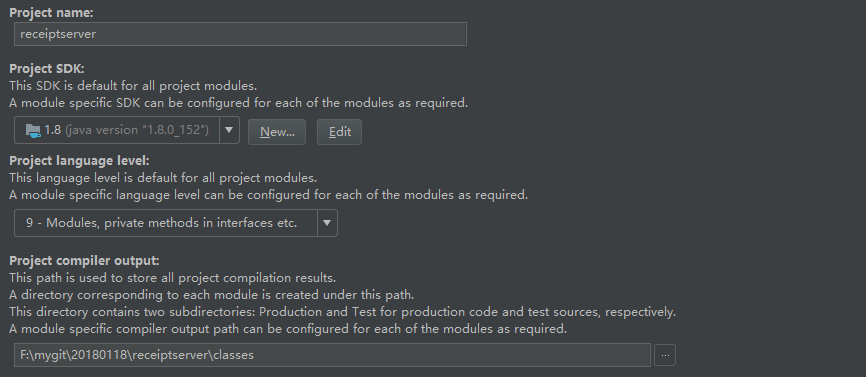
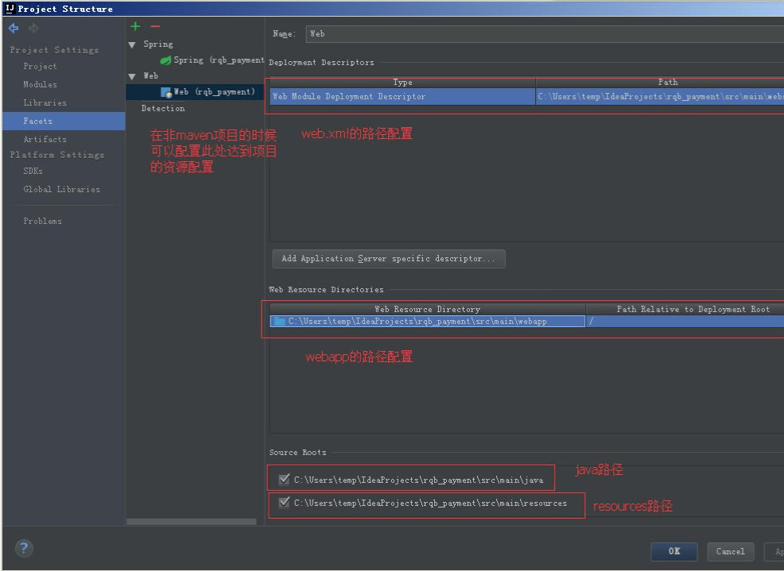

# Project Structure

“ 项目结构”对话框允许您管理项目和IDE级别的元素，例如Modules，Facets，Libraries， Artifacts和SDK。

在大多数情况下，左边部分有两个窗格实现了两级选择器。唯一的例外是当你选择项目，在这种情况下只有一个选择器窗格。 

打开方式有两种：

\1. 通过工具栏

2.通过快捷键

 Ctrl+Shift+Alt+S 

 

## Project

指定项目名称，SDK，语言级别和编译器输出路径。

 

- Project name：项目名，使用此字段编辑项目名称。

- Project SDK：项目SDK，选择项目SDK。如果所需SDK不在列表中，请单击“ New”，然后选择所需的SDK类型。然后，在打开的对话框中，选择SDK主目录，然后单击确定。要查看或编辑所选SDK的名称和内容，请单击"Edit"。（SDK页面将打开。）

- Project language level：选择要支持的Java语言级别。选定的级别将被用作项目默认值。

  可用选项对应于JDK版本：
  1.3 - 普通的旧Java
  1.4 - “断言”关键字
  5.0 - 'enum'关键字，自动装箱等
  6.0 - @Override在接口
  7.0 - 钻石，ARM，多捕获等
  8.0 - Lambda支持，类型注释等
  可以为您的任何模块设置单独的语言级别 。
  请注意，如果目标级别没有明确定义（编译器选项-target），则认为它与源语言级别相同。
  因此，如果-target没有明确定义，它将与语言水平同步。

- Project compiler output：项目编译器输出，指定IntelliJ IDEA将存储编译结果的路径。单击选择路径对话框中browseButton 的目录。 

  指定目录中的两个子目录将被创建：
  production 为生产代码。
  test 为测试来源。
  在这些子目录中，将为每个模块创建单独的输出目录。输出路径可以在模块级重新定义。

 

## Modules 

指定项目名称，SDK，语言级别和编译器输出路径。在“ Project Structure”对话框中的类别中，现有groups, modules, facets以及Flash模块的build configurations显示在元素选择器窗格中。（Facets and build configurations显示为模块元素。）

- Name：项目名称
- Souces：这里对Module的开发目录进行文件夹分类，就是说这个module里有什么内容，说明了不同性质的内容放在哪里。
  注意，这些不同内容的标记代表了一个标准Java工程的各项内容，IntelliJ就是根据这些标记来识别一个Java工程的各项内容的，比如，它会用javac去编译标记为Sources的源码，打包的时候会把标记为Resources的资源拷贝到jar包中，并且忽略标记为Exluded的内容。左边显示的是在选中内容的预览。
- Paths：为模块配置编译器输出路径，还可以指定与模块关联的外部JavaDocs和外部注释的位置。
- Dependencies：在此选项卡上，您可以定义模块SDK并形成模块依赖关系列表。

### Sources

对module的开发目录进行文件夹分类，以让idea明白怎么去对待他们，明确哪些是存放源代码的文件夹，哪些是存放静态文件的文件夹，哪些是存放测试代码的文件夹，哪些是被排除编译的文件夹。

Language level：语言级别列表，使用此列表为模块选择Java语言级别。可用选项对应于JDK版本。

Sources：源代码存放的文件，蓝色。

Tests：设置测试代码存放的文件件，绿色。

Resources：一般对应着Sources文件，一般放配置文件，如：log4j.properties，application.yml。

Test Resources：这个对应着Tests文件夹，存放着Tests代码的配置文件。

Excluded：设置配出编译检查的文件，例如我们在project模块设置的out文件夹。

 

### Paths

 

- Compiler output：编译输出路径。

​    \1. Inherit project compile output path：继承项目编译输出路径 选择此选项以使用为项目指定的路径。即上面在Project选项中设置的out文件路径。

​    \2. Use module compile output path:使用模块编译输出路径。

​      Output path：编译输出路径。

​      Test output path：测试代码编译输出路径。

​      Exclude output paths： 排除输出路径，选中此复选框可以排除输出目录。

- JavaDoc：使用可用控件组合与模块关联的外部JavaDocs存储位置的列表。
- External Annotations：外部注释。使用 和 管理与模块关联的外部注释的位置（目录）列表。

 

### Dependencies

在此选项卡上，您可以定义模块SDK并形成模块依赖关系列表。

- Module SDK：模块SDK，选择模块SDK。

  （要将项目SDK与模块相关联，请选择Project SDK。请注意，如果稍后更改了项目SDK，模块SDK将相应更改。
  如果所需SDK不在列表中，请单击“ 新建”，然后选择所需的SDK类型。然后，在打开的对话框中，选择SDK主目录，然后单击确定。
  要查看或编辑所选SDK的名称和内容，请单击编辑。（SDK页面将打开。）

- 依赖列表

- 相关性存储格式，选择用于存储依赖关系的格式（作为IntelliJ IDEA模块或Eclipse项目）。该选项对使用不同开发工具的团队有帮助。

 

## Libraries

 在此选项卡上，您可以定义模块SDK并形成模块依赖关系列表。

 

 首先，可以创建一个新的项目库，可以设置分类。

 

可以添加本地jar包，网络来源的jar包，排除jar包，删除jar包。

 

## Facets

表示这个 module 有什么特征，比如 Web，Spring 和 Hibernate 等； 

 

## Artifacts

Artifact 是 maven 中的一个概念，表示某个 module 要如何打包，例如 war exploded、war、jar、ear 等等这种打包形式；
一个 module 有了 Artifacts 就可以部署到应用服务器中了！
在给项目配置 Artifacts 的时候有好多个 type 的选项，exploed 是什么意思？
explode 在这里你可以理解为展开，不压缩的意思。也就是 war、jar 等产出物没压缩前的目录结构。建议在开发的时候使用这种模式，便于修改了文件的效果立刻显现出来。默认情况下，IDEA 的 Modules 和 Artifacts 的 output 目录 已经设置好了，不需要更改，
打成 war 包 的时候会自动在 WEB-INF 目录 下生产 classes 目录 ，然后把编译后的文件放进去。

 

## SDKS

系统开发工具 ，全局 SDK 配置 。

## Global libraries 

全局类库，可以配置一些常用的类库。

 

## Problems

问题，在项目异常的时候很有用，可以根据提示进行项目修复（FIXED）。 

 