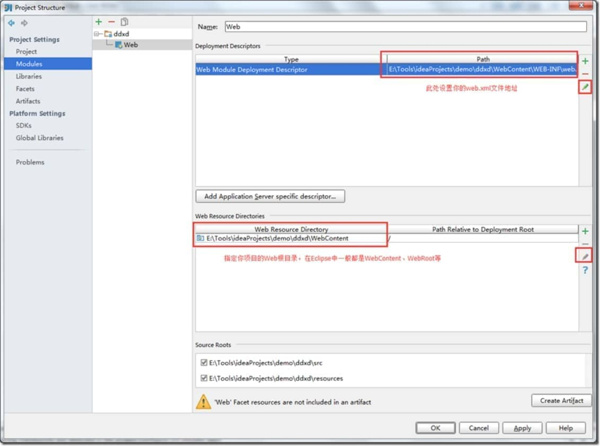

# 【Intellij IDEA】eclipse 非maven项目导入

### 一、导入Eclipse项目至idea

File – New – Module from Existing Sources… 选择你的eclipse项目

[

此步比较关键，选择Eclipse，往后直接next next finish 就可以了。

 

目前为止，项目基本导入成功了，但是想在idea的Tomcat中运行起来还需一些jar和项目相关的配置。

 

### 二、依赖（jar包）配置

打开Project Structure（ctrl + alt + shift + s），选择Modules节点进行项目配置

选择你的项目，打开Dependencies选型卡

将红色字体的包删除，直接多选点击右边的减号删除即可

 

 

添加自己项目中的依赖，点击右边的加号，选择jars or directories… 选择eclipse lib下所有的jar

至此，所有依赖关系添加完成了。idea不会自动帮你导入新添加的jar包，如果你需要添加jar包都需要到Dependencies重新导入依赖。

 

### 三、框架配置

还是在Moduls操作，在中间区域的项目上右键添加相应程序框架的配置。

[

比较重要的就是Web这个选项了，如果开发Web项目必须要添加此配置，对我们的Web.xml和Web根目录做一个配置

使用idea的提示功能是不是很过瘾？但过瘾的基础是在你完善的配置上体现的，所以在此处尽量完善你的相关配置（如：Spring文件）[

完成以上步骤后，细心的同学可能发现了上图底部的“Web”Facet resources are not included in an artifact

这里有些同学不知道artifact是什么东西，其实你只要把它理解成“生成的东西”，主要就是将你的项目中各项配置生成出一个”产物”供Tomcat发布使用。

直接点击Create Artifact，idea会自动给你生成一个基础的artifact。

 

上图就是idea自动给我生成的artifact，注意看底部告诉我缺少ueditor.jar，这是因为我们没有将右边的jar包引入到artifact中，直接在右侧的ddxd项目上右键选择put into output root

 

导入成功后（没有错误提示，没有波浪线，右侧没有jar），看这时的artifact是不是和我们在Tomcat中发布的结构完全一样，这样就可以添加到Tomcat启动运行。

 

### 四、Tomcat启动

在主界面的工具栏中找这个图标，这个图标是你所有的运行环境，在这里添加一个Tomcat。

   

我这里实现已经有Tomcat了，所以不需要选择Tomcat路径，如果没有的话第一个红色框应该没有内容，直接选择你自己的Tomcat路径就好。提示：最好给idea提供一个全新的Tomcat，idea不会将自己程序发布到Tomcat中的webapps目录中。

 

下面提示当前Tomcat中没有任何的artifact，只要点击Fix（多个会提示选择、单个直接添加）会提示让你选择artifact的，选择我们刚才配置的artifact即可。[

Application context：是你的项目访问路径，idea此处默认是空，如果是空的你访问地址：http://localhost:8080/index.jsp，我这里是带着项目名称访问：

http://localhost:8080/ddxd/index.jsp

OK，以上就是基本的eclipse项目导入idea，启动你的Tomcat尽情享受吧！

 