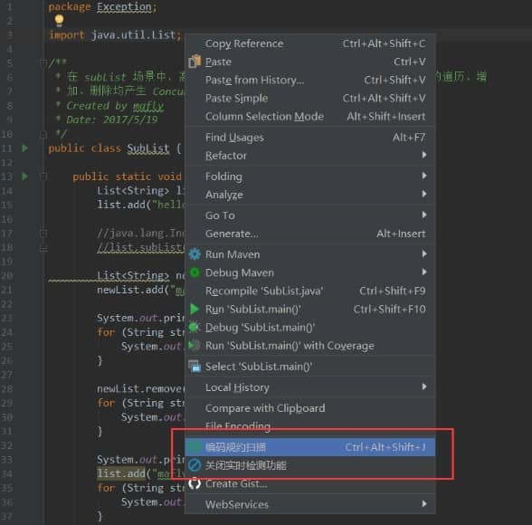
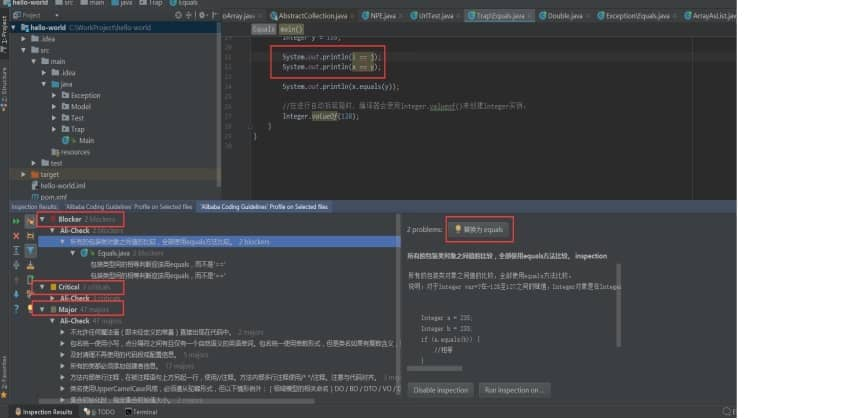

1、代码检查

(1) 名称：Alibaba Java Coding Guidelines

(2) 使用方式

选中某一个类，或者在这个类里边右键也可以 3.扫描出坏代码 扫描代码后，将不符合规约的代码按 Blocker/Critical/Major 三个等级显示在下方，双击可以定位至代码处，右侧窗口还有针对代码的批量修复功能。 解释下Blocker/Critical/Major三个等级，在 Snoar 中对代码规则有五个级别，这是前三个：崩溃/严重/重要 ，也就是说前两级别是必须要处理掉的。

 