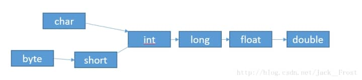

 

# 基本数据类型及其包装类

 

## 一、基本数据类型的系统描述

 

总述：Java基本数据类型分为两大类：boolean类型和数值类型。数值类型可分为整数类型和浮点类型，而其中字符类型可单独对待。所以Java只包含8种基本数据类型。！注意！字符串不是基本数据类型，字符串是一个类，是一个引用类型。这个在下一篇我们会仔细讨论它！

 

boolean 数值只有true和false，不能用0代替。其他数值类型不能转换成boolean。包装类Boolean

byte 内存8位，无符号位时最大存储255，表数范围：-128~127。包装类Byte

short 内存16位，无符号位时最大存储65536，表数范围：-32768~32767。包装类Short

int 内存32位，无符号位时最大存储2的32次方减1，表数范围：负的2的31次方到正的2的31次方减1。包装类Integer。

long 内存64位，无符号位时最大存储2的64次方减1，表数范围：负的2的63次方到正的2的63次方减1。包装类Long。

float 内存32位，数据范围在3.4e-45~1.4e38，直接赋值时必须在数字后加上f或F。包装类Float。

double 内存64位，数据范围在4.9e-324~1.8e308，赋值时可以加d或D也可以不加。包装类Double。

char：16位，存储Unicode字符集，用单引号赋值。可以参与加减乘除运算的，也可以比较大小的！！包装类Character。

 

## 二、数据类型的包装类理解（含部分源码解析）

 首先要知道为什么Java会为每一个基础数据类型都提供一个相应包装类的目的，在于将Java的所有东西都抽象成对象，可以更方便的控制和使用。这就是面向对象！

然后对于包装类，主要作用是：1.作为和基本数据类型对应的类类型存在，方便涉及到对象的操作。2.包含每种基本数据类型的相关属性如最大值、最小值等，以及相关的操作方法。

下面我们将一起讨论下包装类中的重要源码！！

 

### 1.深入boolean基本类型、Boolean类以及细节点

```java
//看接口是可序列化，是一个final修饰的类
public final class Boolean implements java.io.Serializable,Comparable<Boolean>{
     //看这两个对应的原始对象。享元模式的使用，达到多个对象都使用一份内存。至于什么是享元，以及它与单例的区别，这里就不多说了。
     public static final Boolean TRUE = new Boolean(true);
     public static final Boolean FALSE = new Boolean(false);
     private final boolean value;
     //两个构造器，可见它是可以为null的啦，使用Boolean这个类的话
     public Boolean(boolean value) {
        this.value = value;
    }
     public Boolean(String s) {
        this(parseBoolean(s));
    }
     public static boolean parseBoolean(String s) {
        return ((s != null) && s.equalsIgnoreCase("true"));
    }
    //jdk文档建议用valueOf代替new方式来创建Boolean类对象。new创建的Boolean对象是不断的新创建一个实例对象，而valueOf则是返回Boolean类里的静态成员变量,也就是使用享元模式的那个对象。
    public static Boolean valueOf(String s) {
        return parseBoolean(s) ? TRUE : FALSE;
    }

    //下面是令人困惑的设计了，我也是看了下stackoverflow里面讨论才有点懂。
    //原汁原味链接：http://stackoverflow.com/questions/3912303/boolean-hashcode
    //1. 使用质素是因为假如要把Boolean指插入到hashtable中，如果不是质素的话可能会比较容易造成哈希冲突。符合对象计算hashcode的时候通常会把各个属性的hashcode相加然后再做hash,如果是比较小的质素，容易造成hash分布不均匀。
    //2. Maps是可以包裹Boolean的，而如果map除了包含Boolean对象，还包含其他对象，那么如果不适当处理，就很容易有冲突了
     public static int hashCode(boolean value) {
        return value ? 1231 : 1237;
    }
    //好恐怖和缜密的源码设计。
}
```

总括下：1.boolean是基础数据类型，而Boolean是一个类。2.boolean一般存在于桟空间中，而Boolean对象存在堆空间中。3.boolean有true和false俩种值，Boolean除了true和false外，还有null。

下面我们看份代码：（解析在代码中）

```java
public class Main {
  public static void main (String []args){
    //这里均使用valueof创建对象，new创建的Boolean对象是不断的新创建一个实例对象，而valueOf则是返回Boolean类里的静态成员变量
    Boolean bool1 = Boolean.valueOf(true); 
      
    //这里上一句代码验证使用String变量作为参数时，不区分大小写的。
    Boolean bool2 = Boolean.valueOf("True");  
    Boolean bool3 = Boolean.valueOf("ASD");
    boolean x1 = bool1.booleanValue();
    boolean x2 = bool2.booleanValue();
    System.out.println("bool1:" + x1 + ",bool2:" + x2 + ",bool3:" + bool3);

    boolean x3 = bool1.equals(bool2);    //这个就是验证享元模式，使用的是同一个对象
    boolean x4 = bool1.equals(bool3);    //肯定不是同一对象啦。
    System.out.println("bool1.equals(bool2):" + x3 + ",bool1.equals(bool3):" + x4);

    String str1 = Boolean.toString(bool1);    //可见Boolean对象是可以转换成字符的
    String str2 = Boolean.toString(false);    
    String str3 = bool3.toString();
    System.out.println("bool1:" + str1 + ",str2:" + str2 + ",bool3:" + str3);

    boolean x5 = Boolean.parseBoolean("ASD");     //源码是直接判断然后与true对比，因此打印为false
    System.out.println(x5);
  }
}
```


### 2.深入byte基本类型

先来份Byte源码

```java
//也可以看到是一个final修饰的类，只能用，不能被继承咯public final class Byte extends Number implements Comparable<Byte>{
    public static final int SIZE = 8;   //只能是一个字节咯
    //两个构造器
    public Byte(byte value) {
        this.value = value;   //传入的要为Byte类型的值
    }
    public Byte(String s) throws NumberFormatException {
        this.value = parseByte(s, 10);  //传入的要求是可转换成Byte的字符串
    }
    //这个Byte做了缓存
    private static class ByteCache {
        private ByteCache(){}

        static final Byte cache[] = new Byte[-(-128) + 127 + 1];//声明缓存数组的长度为256

        static {
            for(int i = 0; i < cache.length; i++)
                cache[i] = new Byte((byte)(i - 128));//然后将-128~127进行缓存
        }
    }
    //两个解析字符串方法
    public static byte parseByte(String s, int radix)
        throws NumberFormatException {
        //radix是解析字符串时候的基数，在此方法下有个解析基数的含义。
        //解析字符串并返回，所以s必须是-128~127的字符，至于为什么用这个方法int的包装类方法来解析，一会我们会谈到。
        int i = Integer.parseInt(s, radix);
        if (i < MIN_VALUE || i > MAX_VALUE)
            throw new NumberFormatException( "Value out of range. Value:\"" + s + "\" Radix:" + radix);
        	return (byte)i;
    	}

    //也是解码转码方法，将String转为Byte
    public static Byte decode(String nm) throws NumberFormatException {
        int i = Integer.decode(nm);//一会重点讲解Integer的系列方法
        if (i < MIN_VALUE || i > MAX_VALUE)
            throw new NumberFormatException(
                    "Value " + i + " out of range from input " + nm);
        return valueOf((byte)i);
    }
}
```

解释radix的作用

b[0] = Byte.parseByte(“11”, 2) = 3

表示 字符串11以2为基数表示为10进制的byte值是 3 ，这里的11表示的是一个2进制数

b[0] = Byte.parseByte(“11”, 3) = 4

表示 字符串11以3为基数表示为10进制的byte值是 4 ，这里的11表示的是一个3进制数

**//另外这样使用byte是不会报错的：byte=55;//因为会自动把56当成byte类型去处理的了。**


### 3.就是重点的int与Integer啦

　先吃份源码Integer解析套餐

```java
public final class Integer extends Number implements Comparable<Integer> {

//原始类型int的Class实例。
public static final Class<Integer>  TYPE = (Class<Integer>) Class.getPrimitiveClass("int");
     //所有可能的将数字表示为字符串的字符集合做缓存。
     final static char[] digits = {
        '0' , '1' , '2' , '3' , '4' , '5' ,
        '6' , '7' , '8' , '9' , 'a' , 'b' ,
        'c' , 'd' , 'e' , 'f' , 'g' , 'h' ,
        'i' , 'j' , 'k' , 'l' , 'm' , 'n' ,
        'o' , 'p' , 'q' , 'r' , 's' , 't' ,
        'u' , 'v' , 'w' , 'x' , 'y' , 'z'
    };
    //两个构造器
     public Integer(int value) {
        this.value = value;
    }
    public Integer(String s) throws NumberFormatException {
        this.value = parseInt(s, 10);//涉及了String转换成int，一会仔细讨论这个。
    }
    //像上面Byte类型中解释的那样的方法，返回第二个参数所指定的进制数的第一个参数的字符串表示形式。处理各种进制的Integer.
    public static String toString(int i, int radix) {
        if (radix < Character.MIN_RADIX || radix > Character.MAX_RADIX)             
        radix = 10;//默认为10进制 
        /* Use the faster version */         
        if (radix == 10) {             
            return toString(i);         
        }
        char buf[] = new char[33];         
        boolean negative = (i < 0);         
        int charPos = 32;
        //统一转为负数去处理
        if (!negative) {             
            i = -i;         
        }
        while (i <= -radix) {             
            buf[charPos--] = digits[-(i % radix)];             
            i = i / radix;         
        }         
        buf[charPos] = digits[-i];
        if (negative) {             
            buf[--charPos] = '-';         
        }
        return new String(buf, charPos, (33 - charPos));     
    }
    //一会有事例代码演示这个，这个其实就是把int型包装成Integer然后再转化成String字符串
     public static String toString(int i) {
        if (i == Integer.MIN_VALUE)
            return "-2147483648";
        int size = (i < 0) ? stringSize(-i) + 1 : stringSize(i);
        char[] buf = new char[size];
        getChars(i, size, buf);
        return new String(buf, true);
    }
    //与toString组合形成一方法去转换成字符串咯
    static void getChars(int i, int index, char[] buf) {
        int q, r;
        int charPos = index;
        char sign = 0;

        if (i < 0) { //如果i为负数，则设置i的符号字符为'-'。
            sign = '-';  //确定正负数
            i = -i;  //将负数转化为正数处理，提高效率 
        }

        // Generate two digits per iteration
        while (i >= 65536) { //如果i大于65536，则每一次都获取十位和个位上的数字对应的字符。将值判断大小后取每个数字，较大的数字一次取两位（大数字运算消耗大）
            q = i / 100;
        // really: r = i - (q * 100);
            r = i - ((q << 6) + (q << 5) + (q << 2)); //利用位运算，每次获得i的最后两位数，不断循环提取处理
            i = q;//重新赋值，准备下一次循环 
            buf [--charPos] = DigitOnes[r]; //存储r中在个位数集合中对应的字符
            buf [--charPos] = DigitTens[r]; //存储r中在十位数集合中对应的字符
        }

        // Fall thru to fast mode for smaller numbers
        // assert(i <= 65536, i);
        for (;;) { //i<65536的情况，小数字运算消耗较小，故一次只取一位
            q = (i * 52429) >>> (16+3);//52429/(2*19)约等于1，此处这样设计是为了提高精度
            r = i - ((q << 3) + (q << 1));  // r = i-(q*10) ... //每次获得i的最后两位数
            buf [--charPos] = digits [r];//取最后一位的数字  
            i = q;//重新赋值，准备下一次循环  
            if (i == 0) break;
        }
        if (sign != 0) {
            buf [--charPos] = sign; //设置符号
        }
    }
    //下面两个是用来确定字符串长度的。
    //定义sizeTable表示int中每个位数中最大的数，用于简便确定int数的长度。
    final static int [] sizeTable = { 9, 99, 999, 9999, 99999, 999999, 9999999,
                                      99999999, 999999999, Integer.MAX_VALUE };
    //使用上面的sizeTable定义来确定int数的字符串表示长度。           
    static int stringSize(int x) {
        for (int i=0; ; i++)
            if (x <= sizeTable[i])
                return i+1;
    }
    //炒鸡重要的方法啦！！parseInt(String s,int radix)使用第二个参数指定的基数，将字符串参数解析为有符号的整数。 parseInt(String s)只能将数字字符串转化十进制数
     public static int parseInt(String s, int radix)
                throws NumberFormatException
    {
        /*
         * WARNING: This method may be invoked early during VM initialization
         * before IntegerCache is initialized. Care must be taken to not use
         * the valueOf method.
         */

        if (s == null) {//参数检验，调用方法前检查参数的正确性。
            throw new NumberFormatException("null");
        }

        if (radix < Character.MIN_RADIX) {
            throw new NumberFormatException("radix " + radix +
                                            " less than Character.MIN_RADIX");
        }

        if (radix > Character.MAX_RADIX) {
            throw new NumberFormatException("radix " + radix +
                                            " greater than Character.MAX_RADIX");
        }

        int result = 0;
        boolean negative = false;
        int i = 0, len = s.length();//i表示当前遍历的s的位数
        int limit = -Integer.MAX_VALUE;//设置最小值为负的Integer的最大值
        int multmin;
        int digit;

        if (len > 0) {//如果字符串长度大于0，则进行转换
            char firstChar = s.charAt(0);//获取第一位字符
            if (firstChar < '0') { // Possible leading "+" or "-"
                if (firstChar == '-') {//判断是否为负数 
                    negative = true; 
                    limit = Integer.MIN_VALUE;//将限制转换为Integer的最小值，不能小于Integer的最小值  
                } else if (firstChar != '+')
                    throw NumberFormatException.forInputString(s);//第一个char不为+也不为-，则抛出异常  

                if (len == 1) // Cannot have lone "+" or "-"
                    throw NumberFormatException.forInputString(s);//若只有一个符号，则抛出异常
                i++;
            }
            multmin = limit / radix;//设定不同进制下的极限值  
            while (i < len) {//进行进制的转换
                // Accumulating negatively avoids surprises near MAX_VALUE
                digit = Character.digit(s.charAt(i++),radix);//将数字字符串转换成要求的进制数，使用工具类，每次遍历对一个字符进行操作转换  
                if (digit < 0) {
                    throw NumberFormatException.forInputString(s);
                }
                if (result < multmin) {
                    throw NumberFormatException.forInputString(s);
                }
                result *= radix;
                if (result < limit + digit) {
                    throw NumberFormatException.forInputString(s);
                }
                result -= digit;
            }
        } else {
            throw NumberFormatException.forInputString(s);
        }
        return negative ? result : -result;//根据符号返回正数还是负数
    }
    //看吧，我们经常用的parseInt只是个帮我们制定好10进制规则的静态方法
    public static int parseInt(String s) throws NumberFormatException {
        return parseInt(s,10);
    }
    //强大的内部类缓存机制吗，内部字符缓存类
    private static class IntegerCache {
        //缓存的下界，-128，不可变  
        static final int low = -128;
         //缓存上界，暂为null
        static final int high;
        static final Integer cache[];//利用数组来缓存
        //原理：初始化数组将一定范围的整数放到cache数组中，然后在调valueOf方法的时候首先判断范围然后从缓存数组中去抓取数据

        static {
            // high value may be configured by property
            // 缓存上届，可以通过JVM属性来配置
            int h = 127;
            String integerCacheHighPropValue =
                sun.misc.VM.getSavedProperty("java.lang.Integer.IntegerCache.high");
            //获取,得到上界
            if (integerCacheHighPropValue != null) {
                try {
                    int i = parseInt(integerCacheHighPropValue);
                    i = Math.max(i, 127);
                    // Maximum array size is Integer.MAX_VALUE
                    h = Math.min(i, Integer.MAX_VALUE - (-low) -1);
                } catch( NumberFormatException nfe) {
                    // If the property cannot be parsed into an int, ignore it.
                }
            }
            high = h;
            //获取Integer中所有能保存的数据，初始化缓存数组
            cache = new Integer[(high - low) + 1];
            int j = low;
            //缓存所有Integer的数据
            for(int k = 0; k < cache.length; k++)
                cache[k] = new Integer(j++);

            // range [-128, 127] must be interned (JLS7 5.1.7)
            assert IntegerCache.high >= 127;
        }

        private IntegerCache() {}
    }
    //还有这个我们经常用的，官方也推荐使用这个方法去创建对象的
       public static Integer valueOf(int i) {
       //如果i在Integer缓存中，则直接取出
        if (i >= IntegerCache.low && i <= IntegerCache.high)
            return IntegerCache.cache[i + (-IntegerCache.low)];
       //否则，直接创建一个实例
        return new Integer(i);
    }
}
```

使用Integer事例代码：

```java
 //会打印出10这个字符串
    public static void main (String []args) {
        Integer i =null;
        i = Integer.valueOf(10);
        System.out.println(">>>>"+i.toString());
    }

public static void main(String[] args) {
        Integer a1 = 1;
        Integer a2 = 1;

        Integer b1 = 200;
        Integer b2 = 200;

        Integer c1 = Integer.valueOf(1);
//        Integer c2 = new Integer(1);      官方不推荐这种建对象的方法喔
        Integer c2 = Integer.valueOf(1);

        Integer d1 = Integer.valueOf(200);
        Integer d2 = Integer.valueOf(200);


        System.out.println("a1==a2?" + (a1 == a2));
        System.out.println("b1==b2?" + (b1 == b2));
        System.out.println("c1==c2?" + (c1 == c2));
        System.out.println("d1==d2?" + (d1 == d2));
    }
```

上面一段代码的运行结果就是我们要深思的东西啦，也是结合源码要懂的东西。

```java
a1==a2? true b1==b2? false c1==c2? false d1==d2? false
```

第一个为什么是true呢，因为Integer的缓存机制嘛，刚刚我们看到的，缓存了[-128,127]，这些可以直接取出。而剩余的为什么是false，因为他们都超过了缓存的那个范围，就建了个新对象咯。

至于short、float、double这类的包装类设计原理有的跟Integer差不多，但是比如Double，很难去阅读，感觉自己程度还不够，以后会补上。而Character这个包装类，，源码8000多行，我们就讨论它的一些基本知识吧。

4.Character的基本了解：

Character 类在对象中包装一个基本类型 char 的值。Character 类型的对象包含类型为 char 的单个字段。该类提供了几种方法，以确定字符的类别（小写字母，数字，等等），并将字符从大写转换成小写，从小写转换成大写。Character 类的方法和数据是通过 UnicodeData 文件中的信息定义的。至于Unicode 大家就百度了解下就好。

### 5.还有一份挺重要的源码，就是Long类

```java
public final class Long extends Number implements Comparable<Long> {
    @Native public static final long MIN_VALUE = 0x8000000000000000L;//最小值为2的63次方-1 
    @Native public static final long MAX_VALUE = 0x7fffffffffffffffL;//最大值为-2的63次方 
    public static final Class<Long>     TYPE = (Class<Long>) Class.getPrimitiveClass("long");
    //toString方法与Integer中的toString实现原理一样的。

    //转换成对应的进制的字符串表示
    public static String toUnsignedString(long i, int radix) {
        if (i >= 0)
            return toString(i, radix);
        else {
            switch (radix) {
            case 2:
                return toBinaryString(i);//将Long转为2进制  

            case 4:
                return toUnsignedString0(i, 2);//将Long转为4进制  

            case 8:
                return toOctalString(i);//将Long转为8进制  

            case 10:
                /*
                 * We can get the effect of an unsigned division by 10
                 * on a long value by first shifting right, yielding a
                 * positive value, and then dividing by 5.  This
                 * allows the last digit and preceding digits to be
                 * isolated more quickly than by an initial conversion
                 * to BigInteger.
                 */
                long quot = (i >>> 1) / 5;、//十进制嘛
                long rem = i - quot * 10;
                return toString(quot) + rem;

            case 16:
                return toHexString(i);

            case 32:
                return toUnsignedString0(i, 5);

            default:
                return toUnsignedBigInteger(i).toString(radix);
            }
        }
    }
    //返回一个BigInteger等于参数的无符号值
     private static BigInteger toUnsignedBigInteger(long i) {
        if (i >= 0L)
            return BigInteger.valueOf(i);
        else {
            int upper = (int) (i >>> 32);
            int lower = (int) i;

            // return (upper << 32) + lower
            return (BigInteger.valueOf(Integer.toUnsignedLong(upper))).shiftLeft(32).
                add(BigInteger.valueOf(Integer.toUnsignedLong(lower)));
        }
    }
    public static String toHexString(long i) {//将Long转为16进制  
        return toUnsignedString(i, 4);  
    }  
    public static String toOctalString(long i) {//将Long转为8进制  
        return toUnsignedString(i, 3);  
    }  
    public static String toBinaryString(long i) {//将Long转为2进制  
        return toUnsignedString(i, 1);  
    static int stringSize(long x) {//展示Long的字符串长度  
        long p = 10;  
        for (int i=1; i<19; i++) {//每次乘十进行比较  
            if (x < p)  
                return i;  
            p = 10*p;  
        }  
        return 19;  
    }  
    //这个也跟Integer的实现差不多。将字符串参数解析为有符号的整数。
    public static long parseLong(String s, int radix)
              throws NumberFormatException
    {
        if (s == null) {//参数检验
            throw new NumberFormatException("null");
        }

        if (radix < Character.MIN_RADIX) {
            throw new NumberFormatException("radix " + radix +
                                            " less than Character.MIN_RADIX");
        }
        if (radix > Character.MAX_RADIX) {
            throw new NumberFormatException("radix " + radix +
                                            " greater than Character.MAX_RADIX");
        }

        long result = 0;
        boolean negative = false;//这，，跟Integer基本一样的呀
        int i = 0, len = s.length();
        long limit = -Long.MAX_VALUE;
        long multmin;
        int digit;

        if (len > 0) {
            char firstChar = s.charAt(0);
            if (firstChar < '0') { // Possible leading "+" or "-"
                if (firstChar == '-') {
                    negative = true;
                    limit = Long.MIN_VALUE;
                } else if (firstChar != '+')
                    throw NumberFormatException.forInputString(s);

                if (len == 1) // Cannot have lone "+" or "-"
                    throw NumberFormatException.forInputString(s);
                i++;
            }
            multmin = limit / radix;
            while (i < len) {
                // Accumulating negatively avoids surprises near MAX_VALUE
                digit = Character.digit(s.charAt(i++),radix);
                if (digit < 0) {
                    throw NumberFormatException.forInputString(s);
                }
                if (result < multmin) {
                    throw NumberFormatException.forInputString(s);//转化为了负数进行计算，所以要用<号  
                }
                result *= radix;
                if (result < limit + digit) {
                    throw NumberFormatException.forInputString(s);
                }
                result -= digit;
            }
        } else {
            throw NumberFormatException.forInputString(s);
        }
        return negative ? result : -result;
    }
    public static long parseLong(String s) throws NumberFormatException {//默认转成10进制  
        return parseLong(s, 10);  
    }  
    //官方推荐的创建Long对象的方法啦
    public static Long valueOf(String s, int radix) throws NumberFormatException {  
        return Long.valueOf(parseLong(s, radix));  
    }  
    public static Long valueOf(String s) throws NumberFormatException  
    {  
        return Long.valueOf(parseLong(s, 10));  
    }
    //Long的默认缓存，-128~127，缓存模块与Integer相同  
     private static class LongCache {
        private LongCache(){}

        static final Long cache[] = new Long[-(-128) + 127 + 1];

        static {
            for(int i = 0; i < cache.length; i++)
                cache[i] = new Long(i - 128);
        }
    }
    public static Long valueOf(long l) {
        final int offset = 128;
        //在缓存范围内则直接使用咯
        if (l >= -128 && l <= 127) { // will cache
            return LongCache.cache[(int)l + offset];
        }
        return new Long(l);
    }
    public int hashCode() {//重写hashcode()方法，无符号右移32位后乘value本身  
        return (int)(value ^ (value >>> 32));  
    }  
    public boolean equals(Object obj) {  
        if (obj instanceof Long) {  
            return value == ((Long)obj).longValue();//比较的是value的地址值，所以在缓存范围内的相等，缓存范围外的不等（两个对象指向同一个Long除外）  
        }  
        return false;  
    }    
}
```


###  

### 6.列出一下包装类的共性

**（1）带有基本值参数并创建包装类对象的构造函数.如可以利用Integer包装类创建对象,Integer obj=new Integer(145)**

​		  Integer obj=new Integer(145);

**（2）带有字符串参数并创建包装类对象的构造函数.如new Integer(“-45.36”);**

**（3）可生成对象基本值的typeValue方法,如obj.intValue();**

​		  int num=obj.intValue();

**（4）将字符串转换为基本值的 parseType方法,如Integer.parseInt(args[0]);**

**（5）因为有装进Map的几率，所以java设计了包装类里的哈希值，生成哈稀表代码的hashCode方法,如obj.hasCode();**

**（6）对同一个类的两个对象进行比较的equals()方法,如obj1.eauqls(obj2);**

**（7）生成字符串表示法的toString()方法,如obj.toString().**

**（8）自动装包/拆包大大方便了基本类型数据和它们包装类地使用。**

​			自动装包：基本类型自动转为包装类。例如(int >> Integer)

​			自动拆包：包装类自动转为基本类型。例如(Integer >> int)

 

## 三、数据类型转换、装包拆包等一些小坑。

#### （1）.类型转换：

基础：1.自动类型转换-系统支持把某种基本类型的值直接赋给另一种基本类型的变量。

规则：如下图，从左到右自动转换。

2.强制类型转换-视图把表数范围大的类型转换为表数范围小的类型时，容器引起信息丢失。另：字符串不能直接转换为基本类型，但可通过基本类型对应的包装类实现转换成基本类型。如以下代码：

String a = "45";int value=Integer.parseInt(a);


3.自动提升规则：当一个算术表达式中包含多个基本类型的值时，所有的byte类、short和char类型会被提示到int类型


#### （2）自动装包与拆包：自动装包/拆包大大方便了基本类型数据和它们包装类地使用。

自动装包：基本类型自动转为包装类.(int　>>　Integer)

自动拆包：包装类自动转为基本类型.(Integer　>>　int)

使用装包后，我们就可以用集合去存放基本类型啦。比如：Integer先自动转换为int进行加法运算，然后int再次转换为Integer。

```java
int　a　=　3;
Collection　c　=　new　ArrayList();
c.add(a);//自动转换成Integer.自动装包Integer　b　=　new　Integer(2);
c.add(b　+　2);
```

 