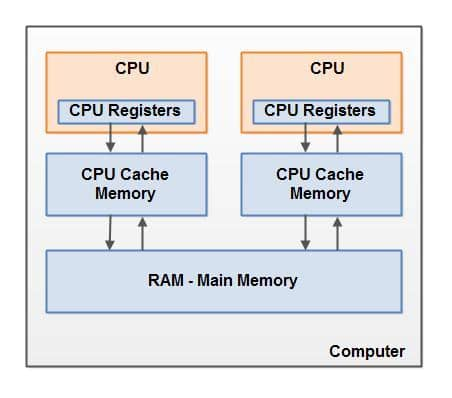

# Java 内存模型和 JVM 内存结构的区别

这两个概念估计有不少人会混淆，它们都可以说是 JVM 规范的一部分，但真不是一回事！它们描述和解决的是不同问题，简单来说，

- **Java 内存模型**，描述的是多线程允许的行为
- **JVM 内存结构**，描述的是线程运行所设计的内存空间

JVM 是什么呢？它屏蔽了底层架构的差异性，是 Java 跨平台的依据，也是每个 Java 程序员必须了解的一部分。

# JVM 体系结构

Java Virtual Machine(JVM) 是一种抽象的计算机，基于堆栈架构，它有自己的指令集和内存管理。它加载 class 文件，分析、解释并执行字节码。基本结构如下：

如上图所示，JVM 主要分为三个子系统：**类加载器**、**运行时数据区**和**执行引擎**。

## 类加载器子系统

它主要功能是处理类的**动态加载**，还有**链接**，并且在第一次引用类时进行**初始化**。

**Loading - 加载**，顾名思义，用于加载类，它有三种类加载器，根据双亲委托模型，从不同路径进行加载：

- Bootstrap ClassLoader - 加载 rt.jar 核心类库，是优先级最高的加载器
- Extension ClassLoader - 负责加载 jre\lib\ext 文件夹中的类
- Application ClassLoader -负责加载 CLASSPATH 指定的类库

**Linking - 链接**，动态链接到运行时所需的资源，分为三步：

- Verify - 验证：验证生成的字节码是否正确
- Prepare - 准备：为所有静态变量，分配内存并赋予默认值
- Resolve - 解析：将 class 文件常量池中所有对内存的符号引用，替换成到**方法区**的直接引用

**Initialization - 类初始化**，类加载的最后阶段，这里对静态变量进行赋值，并执行**静态块**。（注意区分**对象初始化**）

## 运行时数据区

它约定了在运行时程序代码的数据比如变量、参数等等的存储位置，主要包含以下几部分：

- **PC 寄存器（程序计数器）**：保存正在执行的字节码指令的地址

- 栈

  ：在方法调用时，创建一个叫

  栈帧

  的数据结构，用于存储局部变量和部分过程的结果，

  栈帧

  由以下几部分组成：

  - **局部变量表**：存储方法调用时传递的**参数**，从0开始存储this、方法参数、局部变量
  - **操作数栈**：执行中间操作，存储从局部变量表或对象实例字段**复制**的常量或变量值，以及操作结果，另外，还用来准备被调用方法的参数和接受方法调用的返回结果
  - **动态链接**：一个指向运行时常量池的引用，将 class 文件中的符号引用（描述一个方法调用了其他方法或访问成员变量）转为直接引用
  - **方法返回地址**：方法正常退出或抛出异常退出，返回方法被调用的位置

- **堆**：存储类实例对象和数组对象，垃圾回收的主要区域

- **方法区**：也被称为**元空间**，还有个别名 **non-heap（非堆）**，使用本地内存存储 class meta-data 元数据（运行时常量池，字段和方法的数据，构造函数和方法的字节码等），在 **JDK 8** 中，把 interned String 和类静态变量移动到了 Java 堆

- **运行时常量池**：存储类或接口中的**数值字面量**，**字符串字面量**以及所有方法或字段的**引用**，基本上涉及到方法或字段，JVM 就会在运行时常量池中搜索其具体的内存地址

- **本地方法栈**：与 JVM 栈类似，只不过服务于 Native 方法

## 执行引擎

运行时数据区存储着要执行的字节码，执行引擎将会读取并逐个执行。

**Interpreter - 解释器**，它对字节码的解释很快，但执行慢，有个缺点是，当方法被多次调用时，每次都需要重新解释。

**JIT Compiler- JIT编译器**， 解决了解释器的缺点，仍使用解释器来转换字节代码，但发现有代码重复执行时，会使用 JIT 编译器，将整个字节码编译成本地代码，将本地代码用于重复调用，从而提高系统的性能，有以下几部分组成：

- 中间代码生成器 - 生成中间代码
- 代码优化器 - 负责优化上面生成的中间代码
- 目标代码生成器 - 负责生成机器代码或本地代码
- Profiler - 一个特殊组件，负责查找热点，判断该方法是否被多次调用

**Garbage Collector- 垃圾收集器**，收集和删除未引用的对象。

另外，还包括执行引擎所需的本地库*(Native Method Libraries)*和与其交互的 JNI 接口*(Java Native Interface)*。

现在来看下 Java 内存模型和 JVM 内存结构有何不同。

# JVM 内存结构

常说的 **JVM 内存结构**指的就是上文提交到**运行时数据区**，其中*堆*、*方法区*被**线程共享**，*程序计数器*、*栈*、*运行时常量池*被**线程独享**。

它描述的是，在运行时，字节码和代码数据存储的位置。

# 内存模型

先抛开 Java 不说，先来看下内存模型是什么？维基百科中的定义：

> In computing, a memory model describes the interactions of threads through memory and their shared use of the data.

意思就是，在计算中，内存模型描述了**多线程**如何正确的通过内存进行交互和使用共享数据。换句话说，内存模型**约束了**处理器对内存的读写。

CPU 和内存之间通常会存在一层或多层**高速缓存**，这对单处理器可能没问题，但在多处理器系统中，可能就会出现**缓存一致性**问题，也就是当两个处理器（线程）同时读取相同内存位置会发生什么？什么情况下会看到相同的值？

**缓存一致性**问题，在并发编程中，又被称作**可见性**问题。**内存模型**在**处理器级别**，为处理器彼此之间对内存写入结果的可见性，定义了充分必要条件：

- **强内存模型**，一般说的是**顺序一致性**，所有内存操作存在一个全序关系，每个操作都是原子的且立即对所有处理器可见
- **弱内存模型**，不限制处理器的内存操作顺序，而使用**特殊指令**刷新或者使本地缓存失效，以便看到其他处理器的写入，或使此处理器的写入对其他处理器可见，这些特殊指令被称为**内存屏障**

大多数处理器不会限制内存操作的顺序，多线程在执行时可能会出现让人困惑和违背直觉的结果。这是因为 CPU 为了充分利用不同类型存储器（寄存器、高速缓存、主存）的总线带宽，会将**内存操作**重新排序，以**无序执行**，这个动作称为**内存排序**或**指令重排序**。

重排序，也被称为编译器优化和处理器优化，因为它既可以发生在**编译期间**，也可以发生在 **CPU 运行时**。为了保证多线程的有序性，需要使用内存屏障**禁止重排序**。

所以说，**内存模型**就是在硬件层面描述了使用**内存屏障**（刷新缓存或禁用指令重排序）解决多线程编程中的**可见性**和**有序性**的问题。

# Java 内存模型

**Java 内存模型**（下文简称 **JMM**）就是在底层处理器内存模型的基础上，定义自己的多线程语义。它明确指定了一组排序规则，来保证线程间的可见性。

这一组规则被称为 **Happens-Before**, JMM 规定，要想保证 B 操作能够看到 A 操作的结果（无论它们是否在同一个线程），那么 A 和 B 之间必须满足 **Happens-Before 关系**：

- **单线程规则**：一个线程中的每个动作都 happens-before 该线程中后续的每个动作
- **监视器锁定规则**：监听器的**解锁**动作 happens-before 后续对这个监听器的**锁定**动作
- **volatile 变量规则**：对 volatile 字段的写入动作 happens-before 后续对这个字段的每个读取动作
- **线程 start 规则**：线程 **start()** 方法的执行 happens-before 一个启动线程内的任意动作
- **线程 join 规则**：一个线程内的所有动作 happens-before 任意其他线程在该线程 **join()** 成功返回之前
- **传递性**：如果 A happens-before B, 且 B happens-before C, 那么 A happens-before C

怎么理解 happens-before 呢？如果按字面意思，比如第二个规则，线程（不管是不是同一个）的解锁动作发生在锁定之前？这明显不对。happens-before 也是为了保证可见性，比如那个解锁和加锁的动作，可以这样理解，线程1释放锁退出同步块，线程2加锁进入同步块，那么线程2就能看见线程1对共享对象修改的结果。

Java 提供了几种语言结构，包括 *volatile*, *final* 和 *synchronized*, 它们旨在帮助程序员向**编译器**描述程序的并发要求，其中：

- **volatile** - 保证**可见性**和**有序性**
- **synchronized** - 保证**可见性**和**有序性**; 通过**管程（Monitor）**保证一组动作的**原子性**
- **final** - 通过禁止**在构造函数初始化**和**给 final 字段赋值**这两个动作的重排序，保证**可见性**（如果 **this 引用逃逸**就不好说可见性了）

编译器在遇到这些关键字时，会插入相应的内存屏障，保证语义的正确性。

有一点需要**注意**的是，**synchronized** **不保证**同步块内的代码禁止重排序，因为它通过锁保证同一时刻只有**一个线程**访问同步块（或临界区），也就是说同步块的代码只需满足 **as-if-serial** 语义 - 只要单线程的执行结果不改变，可以进行重排序。

所以说，Java 内存模型描述的是多线程对共享内存修改后彼此之间的可见性，另外，还确保正确同步的 Java 代码可以在不同体系结构的处理器上正确运行。

# 小结

它们之间的关系可以这样来个总结，实现一个 JVM 要满足**内存结构**描述的组成部分，设计如何执行多个线程的时候，要满足**Java 内存模型**约定的多线程语义。