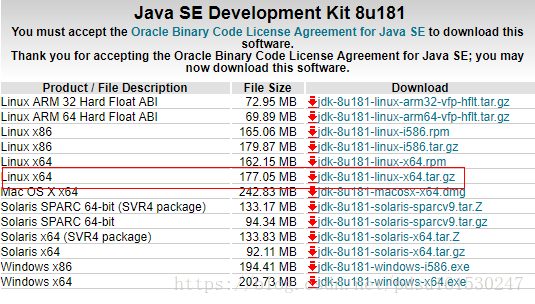
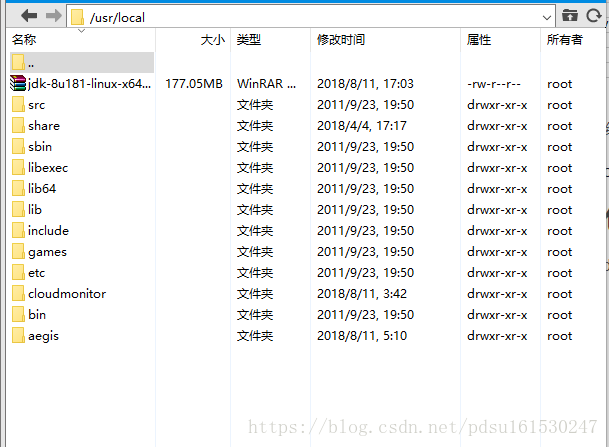
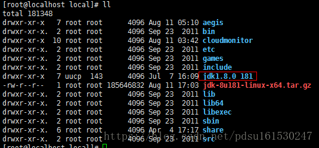
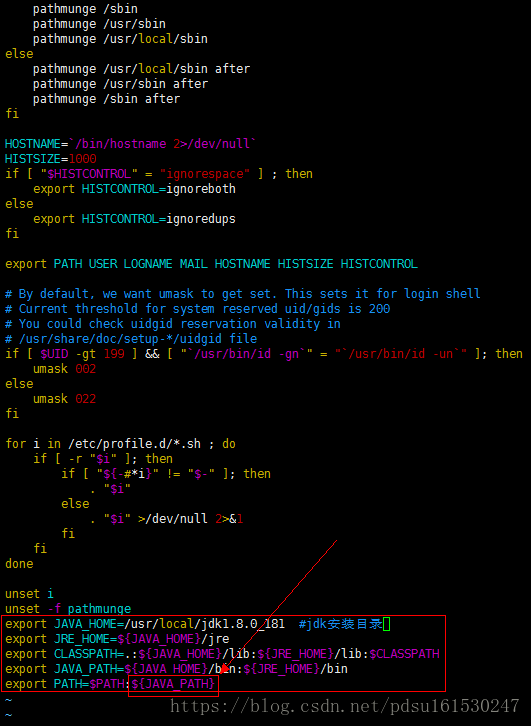
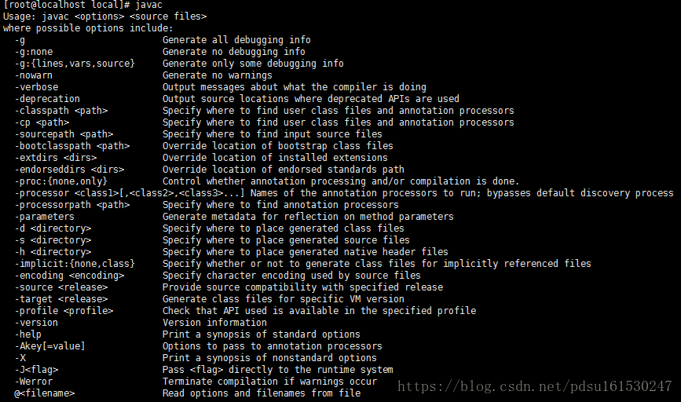
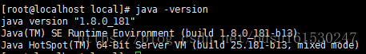

# linux安装jdk8

------

操作系统：Centos6.4 64位

工具：Xftp5、Xshell5

# 1.下载jdk8

方法一：官网手动下载

下载Linux环境下的jdk1.8

http://www.oracle.com/technetwork/java/javase/downloads/jdk8-downloads-2133151.html



**目前在官网下载低于jdk1.8的java jdk的时候需要登陆，这边分享一个账号，方便下载
账号：2696671285@qq.com 
密码：Oracle123
账号提供者：https://blog.csdn.net/WNsshssm/article/details/84315519**

方法二：在线下载

wget http://download.oracle.com/otn-pub/java/jdk/8u181-b13/96a7b8442fe848ef90c96a2fad6ed6d1/jdk-8u181-linux-x64.tar.gz

Oracle官网用Cookie限制下载方式，使得眼下只能用浏览器进行下载，使用其他方式可能会导致下载失败。

# 2.源码包解压

使用xftp将jdk源码包，上传到/usr/local（软件一般安装到这个目录）



使用解压命令解压

```
[root@localhost local]# tar -zxvf jdk-8u181-linux-x64.tar.gz
```

解压完成



顺手删掉jdk源码包

```
[root@localhost local]# rm -f jdk-8u181-linux-x64.tar.gz
```

# 3.配置jdk环境变量

/etc/profile文件的改变会涉及到系统的环境，也就是有关Linux环境变量的东西

所以，我们要将jdk配置到/etc/profile，才可以在任何一个目录访问jdk

```
[root@localhost local]# vim /etc/profile
```

 

按i进入编辑，在profile文件尾部添加如下内容

```bash
export JAVA_HOME=/usr/local/jdk1.8.0_181  #jdk安装目录
export JRE_HOME=${JAVA_HOME}/jre
export CLASSPATH=.:${JAVA_HOME}/lib:${JRE_HOME}/lib:$CLASSPATH
export JAVA_PATH=${JAVA_HOME}/bin:${JRE_HOME}/bin
export PATH=$PATH:${JAVA_PATH}
```

添加后如下



Esc --> :wq

保存并退出编辑

通过命令source /etc/profile让profile文件立即生效

```
[root@localhost local]# source /etc/profile
```

# 4.测试是否安装成功

```
[root@localhost local]# javac
```



```
[root@localhost local]# java -version
```



linux下jdk8安装成功