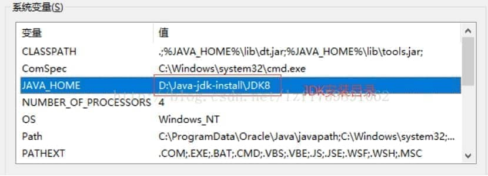
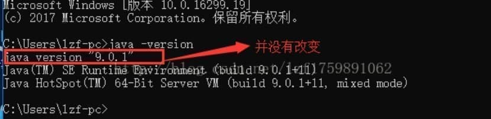
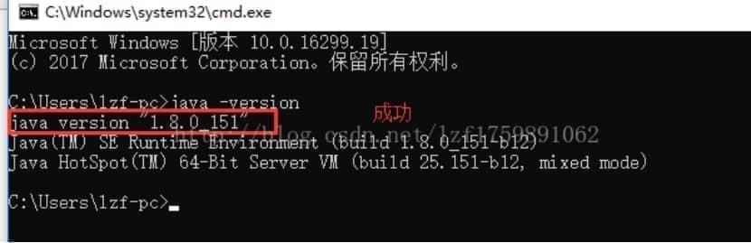

# window安装并配置多个不同版本JDK

原理：其实就是想使用哪个jdk的时候，就切换那个jdk，即切换jdk在环境变量中配置的JAVAHOME的值即可，因为该值就是对应jdk的安装路径；

 

Window是支持同时安装两个版本的jkd的，若使用的是idea开发，那么可以直接在idea上选择使用哪个jdk，而不依赖环境变量中配置了哪个jdk；是根据idea中配置的jdk为准，只要电脑安装了该jdk；那么idea就能找到该jdk；不依赖环境变量

 

## 例1：win10中安装

 

**1.环境变量的配置**

计算机（此电脑）右键→属性→高级系统设置→高级→环境变量→找到系统变量：

新建：

(a)变量名 JAVA_HOME 变量值  D:\Java-jdk-install\JDK9 （提示是JDK安装的根目录此目录包含了bin  lib conf 等）

(b)变量名 CLASSPATH 变量值  .;%JAVA_HOME%\lib\dt.jar;%JAVA_HOME%\lib\tools.jar;

(c)找到Path进行编辑 在末尾加上  ;%JAVA_HOME%\bin;%JAVA_HOME%\jre\bin

意义：

   JAVA_HOME：指向jdk目录，之所以这样命名是因为eclipse、tomcat等均通过java_home变量名寻找jdk目录

​       PATH：命令搜索路径，javac.exe、java.exe等命令均在此路径内

​        CLASSPATH：类搜索路径，import导入的类均在此路径内

**2.测试**

window键+R进入cmd；输入java 、javac 、java -version

如图：

 

 

 

**3.切换JDK版本**

说明:在同一个电脑上不能同时配置多个JDK环境变量，但是我们可以通过修改JDK环境变量中的JAVA_HOME 将值改成相应的JDK安装目录如图：

 

**4.** **测试出现的问题**

 

**5.解决问题**

原因：在安装jdk8时，默认往path变量最前面添加了C:\ProgramData\Oracle\Java\javapath；  它的优先级比JAVA_HOME高

解决方法：把path路径最前面的C:\ProgramData\Oracle\Java\javapath； 替换为%JAVA_HOME%\bin;

 

 

**找目录将C:\ProgramData\Oracle\Java\javapath目录下的java.exe  javaw.exe  javaws.exe 删除**

 

 

-------------------------------------------------------------------------------------------------------**打开文件扩展名和隐藏的项目**

 

**删除文件**

 

**测试成功**

 

 

 

## 例2：win7中安装（推荐）

 

实现jdk7和jdk8的自由切换（**推荐，更简便**）

1.先安装jdk7，配置JAVA_HOME环境变量，这时执行java -version，jdk版本为7

2.安装jdk8，修改JAVA_HOME环境变量，这时执行java -version，jdk版本为7

但当再次修改JAVA_HOME环境变量为7时，发现版本一直为8，无法进行切换

原因：在安装jdk8时，默认往path变量最前面添加了C:\ProgramData\Oracle\Java\javapath；  它的优先级比JAVA_HOME高

解决方法：把path路径最前面的C:\ProgramData\Oracle\Java\javapath； 替换为%JAVA_HOME%\bin;

这时，在切换时，只需要修改JAVA_HOME的路径即可

 

 

 

 