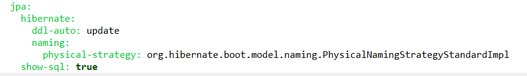
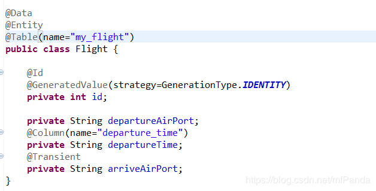
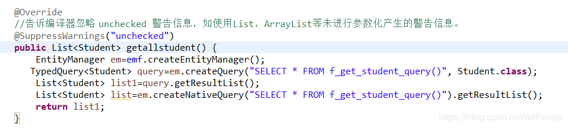
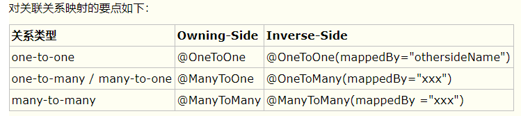

# JPA用法

## 1、**Spring Data Jpa介绍**

JPA（Java Persistence API）是Sun公司提出的Java持久化规范。它为Java开发人员提供了一种对象/关联映射工具来管理Java应用中的关系数据。Spring Data JPA 是 Spring 基于 ORM 框架、JPA 规范的基础上封装的一套JPA应用框架，可使开发者用极简的代码即可实现对数据的访问和操作。

1. **全局配置**

application.yml文件配置：



ddl-auto节点的值有几个create、create-drop、update、validate、none,

**create**：每次加载hibernate会自动创建表，以后启动会覆盖之前的表，所以这个值基本不用，严重会导致的数据的丢失。

**create-drop** ： 每次加载hibernate时根据model类生成表，但是sessionFactory一关闭，表就自动删除，下一次启动会重新创建。

**update**：加载hibernate时根据实体类model创建数据库表，这是表名的依据是@Entity注解的值或者@Table注解的值，sessionFactory关闭表不会删除，且下一次启动会根据实体model更新结构或者有新的实体类会创建新的表。

**validate**：每次加载hibernate时，验证创建数据库表结构，只会和数据库中的表进行比较，不会创建新表，但是会插入新值。

**none**：启动时不做任何操作。

1. **映射实体配置**

@Entity标记该实体映射到数据库表

@Table通过name属性指定映射到数据库表的表名

@Id表示该字段为主键



@GeneratedValue通过属性strategy=GenerationType.IDENTITY设置主键自增长

@Column注解指定字段映射到数据库表列的名称

@Transient注解指定字段不映射到数据库表中

1. **JPA查询**

JpaRepository继承PagingAndSortingRepository接口，PagingAndSortingRepository接口实现了分组排序方法，PagingAndSortingRepository接口继承CrudRepository接口（增加(Create)、读取查询(Retrieve)、更新(Update)和删除(Delete) )，CrudRepository接口继承空接口Repository，便于spring自动扫描识别。

### **4.1默认查询方法**

1. findOne(id):查询指定id的数据
2. List<T> findAll()：查询对应实体的所有数据
3. List<T> findAll(Sort sort)：带排序的查询

- Sort(Direction.DESC,String properties)，Direction指定排序方式，properties指定排序的字段
- Sort(Direction direction, List<String> properties)

1. T save(entity):新增数据/更新数据
2. Page<T> findAll(Pageable pageable)：带分页的查询

- PageRequest(int page, int size)，page代表页码，size代表每页显示的条数
- PageRequest(int page, int size, Sort sort)

1. T save(list):批量新增
2. void flush:将所有挂起的更改同步到数据库
3. T saveAndFlush(entity):更新数据
4. void delete(id):删除指定id数据
5. void delete(entity)：删除数据
6. void delete(list):删除list集合
7. void deleteAll：删除所有数据
8. exists(id):是否存在指定id的数据
9. count():统计数据数目

### **4.2自定义查询**

自定义的简单查询就是根据方法名来自动生成SQL，主要的语法是findBy,readBy,queryBy,countBy, getBy后面跟属性名称。规则如下：

1. 例findByUserAddressZip()，框架在解析该方法时，首先剔除findBy,然后对剩下的属性进行解析。假设该方法是针对UserInfo进行的查询，先判断userAddressZip(根据POJO规范，首字母变小写，下同)是否为UserInfo的一个属性，如果是则根据该属性进行查询，如果没有该属性，继续第二步；
2. 从右往左截取第一个大写字母开头的字符串，即Zip，然后检查剩下的字符串是否为UserInfo的一个属性，如果是，则根据该属性进行查询，如果没有该属性，则重复第二步，继续从右往左截取；最后假设user为UserInfo的一个属性
3. 接着处理剩下的部分AddressZip，先判断user是否有addressZip属性，如果有，则根据“UserInfo.user.addressZip”的取值进行查询，否则重复第二步，最终根据“UserInfo.user.address.zip”进行查询。
4. 可能会存在一种情况，例如UserInfo包含user属性，也有一个userAddress

属性，就会存在混淆。可以在属性之间加上”_”来区分，

user:“findByUser_AddressZip”userAddress:”findByUserAddress_Zip”

**部分例子：**

1. List<Student> findByName(String name)单个参数等值查询
2. List<Student> findByNameLike(String name)单个参数模糊查询
3. List<Student> findByNameIgnoreCaseLike(String name)忽略大小写模糊查询
4. List<Student> findByNameContainingIgnoreCase(String name)包含且忽略大小写
5. Student findByAddressAndName(String address,String name)多个参数等值查询
6. List<Student> findFirst5ByNameLike(String name,Sort sort)模糊查询前五条并排序
7. List<Student> findTop5ByNameLike(String name,Sort sort)
8. List<Student> findByBirthdayBetween(Date birthday1,Date birthday2)Between查询

具体的关键字，使用方法和生产成SQL如下表所示：

| 关键字            | 示例                                    | 原生SQL                                                      |
| ----------------- | --------------------------------------- | ------------------------------------------------------------ |
| And               | findByLastnameAndFirstname              | …where x.lastname=?1 and x.firstname = ?2                    |
| Or                | findByLastnameOrFirstname               | …where x.lastname = ?1 or x.firstname = ?2                   |
| Is, Equals        | findByFirstnameIs,findByFirstnameEquals | …where x.firstname = ?1                                      |
| Between           | findByStartDateBetween                  | …where x.startDate between ?1 and ?2                         |
| LessThan          | findByAgeLessThan                       | …where x.age < ?1                                            |
| LessThanEqual     | findByAgeLessThanEqual                  | …where x.age ⇐ ?1                                            |
| GreaterThan       | findByAgeGreaterThan                    | …where x.age > ?1                                            |
| GreaterThanEqual  | findByAgeGreaterThanEqual               | ..where x.age >= ?1                                          |
| After             | findByStartDateAfter                    | ..where x.startDate > ?1                                     |
| Before            | findByStartDateBefore                   | …where x.startDate < ?1                                      |
| IsNull            | findByAgeIsNull                         | …where x.age is null                                         |
| IsNotNull,NotNull | findByAge(Is)NotNull                    | …where x.age not null                                        |
| Like              | findByFirstnameLike                     | …where x.firstname like ?1                                   |
| NotLike           | findByFirstnameNotLike                  | ..where x.firstname not like ?1                              |
| StartingWith      | findByFirstnameStartingWith             | ..where x.firstname like ?1 (parameter bound with appended %) |
| EndingWith        | findByFirstnameEndingWith               | ..where x.firstname like ?1 (parameter bound with prepended %) |
| Containing        | findByFirstnameContaining               | ..where x.firstname like ?1 (parameter bound wrapped in %)   |
| OrderBy           | findByAgeOrderByLastnameDesc            | …where x.age = ?1 order by x.lastname desc                   |
| Not               | findByLastnameNot                       | ..where x.lastname <> ?1                                     |
| In                | findByAgeIn(Collection ages)            | …where x.age in ?1                                           |
| NotIn             | findByAgeNotIn(Collection age)          | …where x.age not in ?1                                       |
| TRUE              | findByActiveTrue                        | …where x.active = true                                       |
| FALSE             | findByActiveFalse                       | …where x.active = false                                      |
| IgnoreCase        | findByFirstnameIgnoreCase               | …where UPPER(x.firstame) = UPPER(?1)                         |

自定义SQL查询

Spring data jpa有很多关键字定义的查询方法，但是由于某些原因我们想自定义SQL来查询，Spring data jpa也是完美支持的，需要在查询方法上使用@Query注解，通过value属性写SQL语句，语句分两种：

1）使用**Jpql**语句，Jpql是面向对象查询的，例如：

```
@Query(value="select c from Course c order by c.id desc")
List<Course> getJpAllCourse();
```

2）使用**原生的Sql**语句，需要通过nativeQuery属性来设置。

```
@Query(value="select c.* from course c ",nativeQuery=true)
List<Course> getallcourse();

若是增删改，则还需要添加以下两个注解，否则会报错
@Modifying
@Transactional
```

3）涉及到修改和删除的需要加上@Modifying，也需要加上@Transactional实现对事务的支持。

```
@Transactional
@Query(value="update student  set student_address=?1 where student_id=?2",nativeQuery=true)
@Modifying
Integer updatestudentAddress(String address,Integer id);
```

4）使用自定义sql返回多表联查的综合实体，首先定义一个接收结果的interface，指定要接收的字段。例如：

```
public interface studentandCname {
  String getSname();
  String getCoursename();
}
```

查询方法：

```
@Query(value="select s.student_name as sname,c.course_name as coursename from course c ,student s,course_student_relation csr where c.course_id=csr.course_id and s.student_id=csr.student_id",nativeQuery=true)
List<studentandCname> getrelationresult();
```

Jpql语句对应的查询：

```
@Query(value="select t.name as name ,s.chinese as chinese,s.math as math from Student t,Scores s where t.scoreId=s.id")
List<StudentScores> getStudentScores();
```

Jpql查询对应的实体：

```
public interface StudentScores {
   String getName();
   String getChinese();
   String getMath();
}
```

1. 原生分页

不带查询条件的：

```
@Query(value="select * from student s  ORDER BY ?#{#pageable}",countQuery="select count(*) from student s ",nativeQuery=true)
Page<Student> findstudentCount( Pageable pageable);
```

带查询条件的：

```
@Query(value="select * from student s where s.student_name=?1 ORDER BY ?#{#pageable}",countQuery="select count(*) from student s where s.student_name=?1",nativeQuery=true)
Page<Student> findByName(String name, Pageable pageable);
```

### **4.3调用存储过程查询**

1. 返回单个实体的集合

存储过程：

```
CREATE OR REPLACE FUNCTION f_get_student_query2()
RETURNS SETOF student AS
$$

BEGIN
        return query select * from student;
END
$$

LANGUAGE 'plpgsql'
```

 

调用存储过程：

```
@PersistenceUnit   private EntityManagerFactory emf;
```

 



1. 带分页综合实体查询

存储过程：

```
create type relationspages as (sname VARCHAR,course VARCHAR);

CREATE OR REPLACE FUNCTION getrelationspage22(pageIndex INT)

RETURNS SETOF relationspages AS

$$
DECLARE

rec relationspages;

sql_temp varchar;

BEGIN

sql_temp='SELECT s.student_name,c.course_name from student s JOIN course_student_relation csr ON csr.student_id=s.student_id JOIN course c ON c.course_id=csr.course_id

ORDER BY csr."id" ASC LIMIT 2 OFFSET ('||pageIndex||'-1)*2';
FOR rec in EXECUTE sql_temp LOOP
 RETURN NEXT rec;
END LOOP;
RETURN;
END
$$
LANGUAGE 'plpgsql'
```

调用过程

```
@Override
@SuppressWarnings("unchecked")
public List<relationresult> getrelationspage(Integer pageIndex) {
       EntityManager em=emf.createEntityManager();
 List<relationresult>  list=em.createNativeQuery("SELECT * from getrelationspage("+pageIndex+") as student(student_name varchar,course_name VARCHAR) ").getResultList();
      em.close();
      return list;
}
```

### **4.4动态查询条件查询**

动态查询条件查询需要继承JpaSpecificationExecutor<T>，该接口有一下几个方法：

T findOne(Specification<T> spec);

List<T> findAll(Specification<T> spec);

Page<T> findAll(Specification<T> spec, Pageablepageable);

List<T> findAll(Specification<T> spec, Sort sort);

long count(Specification<T> spec);

其中几个方法中都有Specification，改接口下只有一个方法

Predicate toPredicate(Root<T> root, CriteriaQuery<?> query, CriteriaBuilder cb);

Root接口：代表Criteria查询的根对象；

CriteriaQuery接口：代表一个specific的顶层查询对象，它包含着查询的各个部分，比如：select 、from、where、group by、order by等。

CriteriaBuilder也作为Predicate实例的工厂，通过调用CriteriaBuilder 的条件方（ equalnotEqual， gt， ge，lt， le，between，like等）创建Predicate对象。复合的Predicate 语句可以使用CriteriaBuilder的and, or andnot 方法构建。

具体应用：

1）单表动态条件查询

```
@Override
public Page<Student> findInfoRadom(String startDate, String endDate, String name, Integer sex) {
     
      int pageNo=0;
      int pageSize=2;
      PageRequest pageRequest=new PageRequest(pageNo, pageSize);
      SimpleDateFormat simpleDateFormat=new SimpleDateFormat("yyyy-MM-dd");

      Specification<Student>  specification=new Specification<Student>(){
             public Predicate toPredicate(Root<Student> root, CriteriaQuery<?> query, CriteriaBuilder cb) {
             List<Predicate> predicates=new Vector<Predicate>();
             
             if(startDate!=null){
                Predicate p1=null;

                try {
				p1 = cb.greaterThanOrEqualTo(root.get("birthday").as(Date.class),simpleDateFormat.parse(startDate));
                } catch (ParseException e) {
                   e.printStackTrace();
                }
                predicates.add(p1);
             }
             if(endDate!=null){
                Predicate p2=null;
                try {
                    p2 = cb.lessThanOrEqualTo(root.get("birthday").as(Date.class), simpleDateFormat.parse(endDate));
                } catch (ParseException e) {
                   e.printStackTrace();
                }
                predicates.add(p2);
             }
             if(name!=null&&name.length()>0){
                Predicate p3=cb.like(root.get("name"), name);
                predicates.add(p3);
             }
             if(sex>-1){
                Predicate p4=cb.equal(root.get("sex"), sex);
                predicates.add(p4);
             }
             Predicate[] pres = new Predicate[predicates.size()];
             query.where(predicates.toArray(pres));
             query.groupBy(root.get("sex"));
             //return cb.and(predicates.toArray(pres));
             return query.getRestriction();
          };
      };
      return studentrepository.findAll(specification, pageRequest);  
    }
```

 

**以下为补充的实体关系映射**

 

**实体关系映射(ORM)**

**一．映射关系**

JPA定义了one-to-one、one-to-many、many-to-one、many-to-many 4种关系。

对于数据库来说，通常在一个表中记录对另一个表的外键关联；对应到实体对象，持有关联数据的一方称为owning-side，另一方称为inverse-side。

为了编程的方便，我们经常会希望在inverse-side也能引用到owning-side的对象，此时就构建了双向关联关系。 在双向关联中，需要在inverse-side定义mappedBy属性



其中 many-to-many关系的owning-side可以使用@JoinTable声明自定义关联表，比如Book和Author之间的关联表：

 

```
@JoinTable(name = "BOOKAUTHOR", joinColumns = { @JoinColumn(name = "BOOKID", referencedColumnName = "id") }, inverseJoinColumns = { @JoinColumn(name = "AUTHORID", referencedColumnName = "id") })
```

 

**二．映射关系注解属性**

**1.mappedBy****属性:**

表示：本类放弃控制关联关系，所有对关联关系的控制，如：建立、解除与另一方的关系，都由对方控制，本类不管。

1>只有OneToOne，OneToMany，ManyToMany上才有mappedBy属性，ManyToOne不存在该属性；

2>mappedBy标签一定是定义在被拥有方的，他指向拥有方；

3>mappedBy的含义，应该理解为，拥有方能够自动维护跟被拥有方的关系，当然，如果从被拥有方，通过手工强行来维护拥有方的关系也是可以做到的；

4>mappedBy跟joinColumn/JoinTable总是处于互斥的一方，可以理解为正是由于拥有方的关联被拥有方的字段存在，拥有方才拥有了被拥有方。mappedBy这方定义JoinColumn/JoinTable总是失效的，不会建立对应的字段或者表

 

 

**2.fetch****属性：**

指定加载方式，有两个值:

FetchType.LAZY：延迟加载

FetchType.EAGER：急加载

 

在JPA中，一个实体中如果存在多个关联对象，那么不能同时eager获取，只能有一个是eager获取，其他只能lazy

**3. CascadeType****属性：**

通过设置cascade={options}可以设置级联操作的行为，其中options可以是以下组合：

1.CascadeType.PERSIST：级联新增（又称级联保存）：对order对象保存时也对items里的对象也会保存。对应EntityManager的presist方法。

2.CascadeType.MERGE：级联合并（级联更新）：若items属性修改了那么order对象保存时同时修改items里的对象。对应EntityManager的merge方法 。

3.CascadeType.REMOVE：级联删除：对order对象删除也对items里的对象也会删除。对应EntityManager的remove方法。

4.CascadeType.REFRESH：级联刷新：获取order对象里也同时也重新获取最新的items时的对象。对应EntityManager的refresh(object)方法有效。即会重新查询数据库里的最新数据。

5.CascadeType.ALL：以上四种都是。