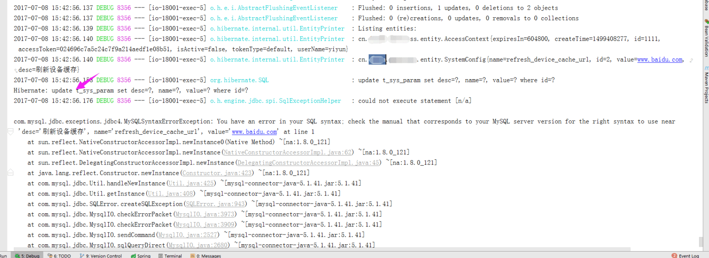

# Spring Data Jpa遇到mysql关键字

错误问题：



分析知道，这是因为Spring Data Jpa遇到了mysql的关键字，导致 sql 执行失败

查看了实体类中，是这样写的。

```
/**
* 参数名
*/
@Column(name = "name")
private String name;
```

解决方式：将实体类中含有mysql的关键字的字段的映射，使用符号 `` 包裹，如下

```
/**
* 参数名
*/
@Column(name = "`name`")
private String name;
```