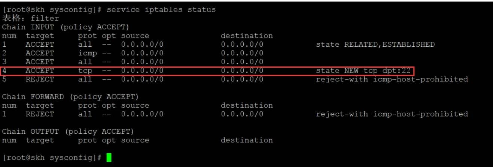

# Centos6.8防火墙配置

1、基本操作

```
# 查看防火墙状态
service iptables status
 
# 停止防火墙
service iptables stop
 
# 启动防火墙
service iptables start
 
# 重启防火墙
service iptables restart
 
# 永久关闭防火墙
chkconfig iptables off或者
chkconfig --level 2345 iptables off
 
# 永久关闭后重启
chkconfig iptables on
```

2、查看防火墙状态，防火墙处于开启状态并且只开放了22端口

 

3、开启80端口

 vim /etc/sysconfig/iptables
\# 加入如下代码，比着两葫芦画瓢 :)
-A INPUT -m state --state NEW -m tcp -p tcp --dport 80 -j ACCEPT

 

保存退出后重启防火墙

service iptables restart

 


其他开启其他端口亦是如此。

 