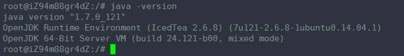
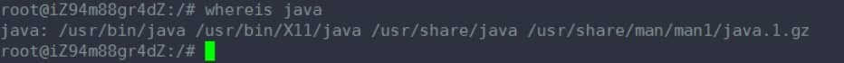
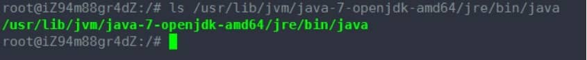

# ubuntu 14.04查看java的安装路径

有时候，使用apt-get install 安装了某个软件之后，却不知道这个软件的安装路径在哪里。 那怎么样去找出这个软件的安装路径呢？

下面我们java 这个软件为例， 找出ubuntu 14.04 上面java的安装路径。

1. 首先 java -version , 输出信息显示确实已经安装了java

 

2. whereis java , 输出信息看出路径在哪里

 

3. ls -l /usr/bin/java 看看这是否是个软连接，找出这个软连接指向的路径即可

 

发现输出的信息，显示还是个软连接，继续找出， ls -l /etc/alternatives/java

 

发现输出的信息，显示还是个软连接，继续找出，ls  /usr/lib/jvm/java-7-openjdk-amd64/jre/bin/java

 

这个就是实实在在的文件路径了，到此，就找到了java的路径地址。

\----------------------------------------------------------------------------------

参考：http://www.blogjava.net/paulwong/archive/2014/05/04/413199.html

有时候不知道java安装在哪里了 通过whereis java命令不能知道java真是的安装路径 
可以通过 update-alternatives --config java 命令察看

```
bean@ubuntu :~$ update-alternatives --config java
There is only one alternative in link group java: /usr/lib/jvm/java-7-oracle/jre/bin/java
Nothing to configure.
bean@ubuntu :~$
```

或者这种方法也可以：
进入到相应的目录：cd /usr/bin

查看java链接到了哪里：ls -l java

 