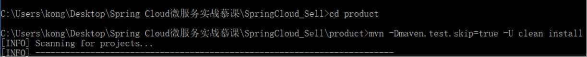

# 1、maven打包项目

(1) 进入项目文件夹，例如要将product项目打包，则通过cmd进入到项目源码所在文件夹，即product文件夹下，执行命令：mvn package

 

## 2、将项目打包安装到maven仓库

(1) 打开命令行cmd，进入到项目源码所在目录下，例如要将product项目打包，则进入到项目源码所在文件夹，即product文件夹下，执行命令：mvn -Dmaven.test.skip=true -U clean install

 