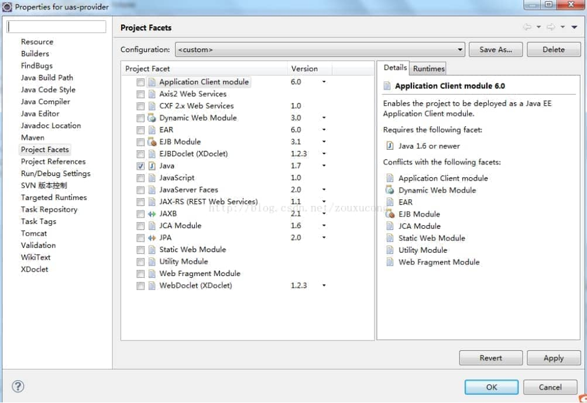
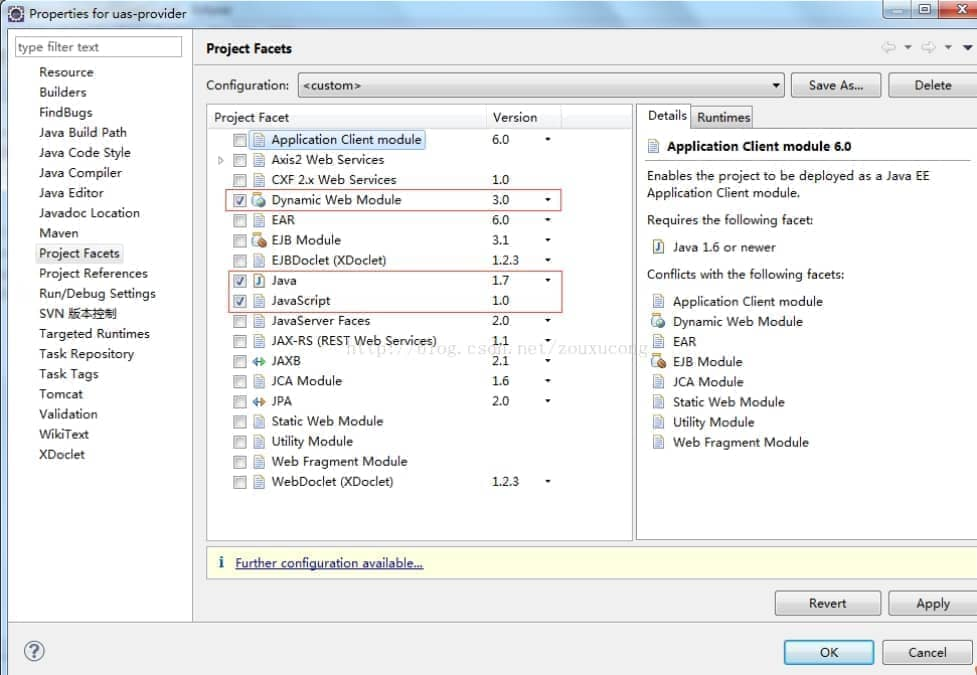
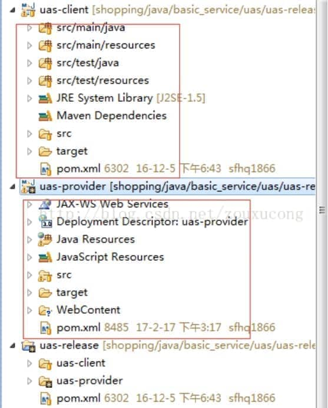
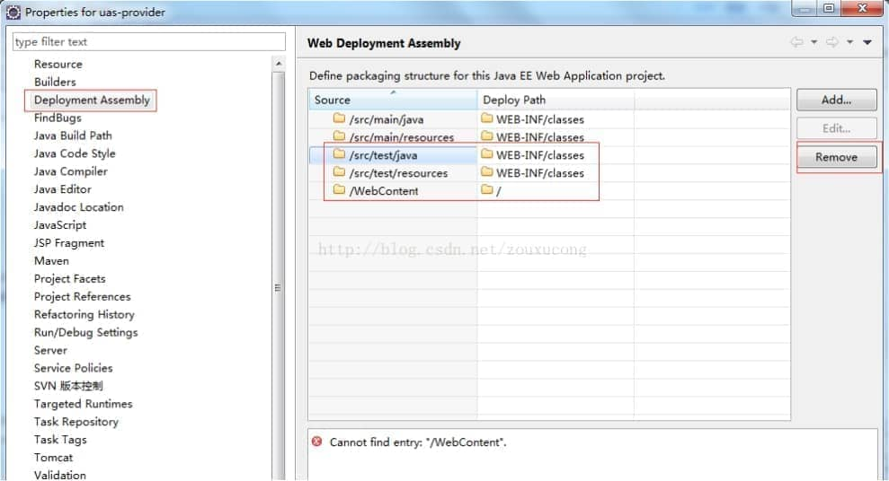
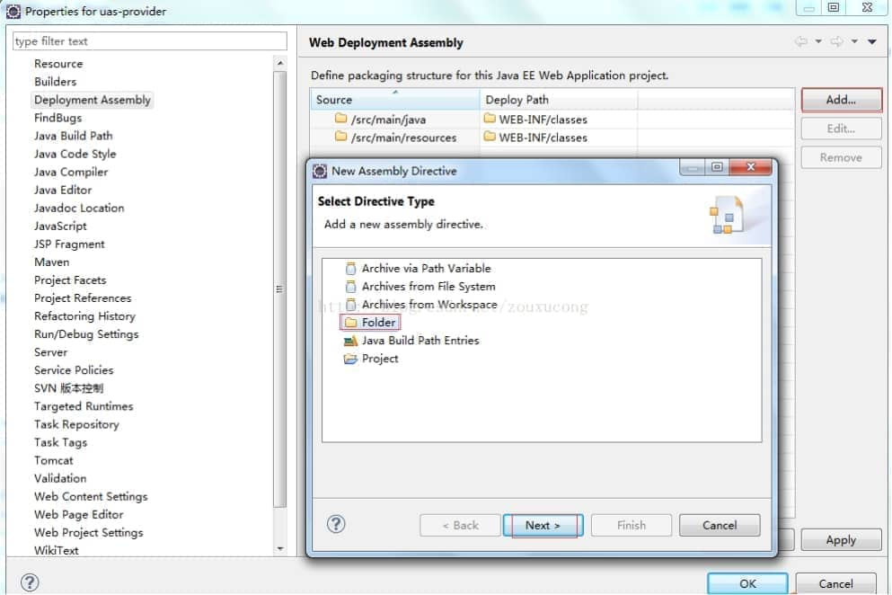
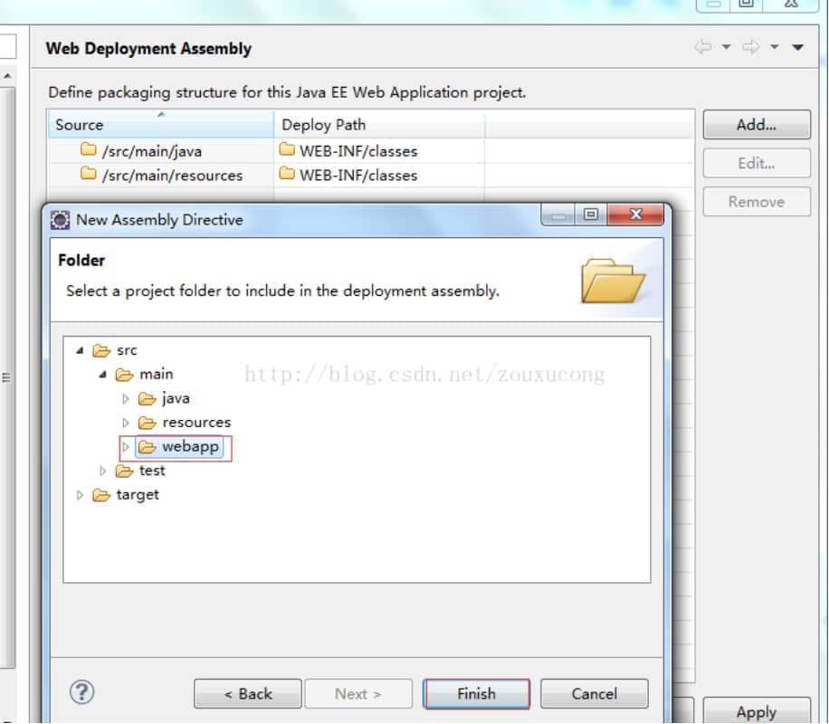
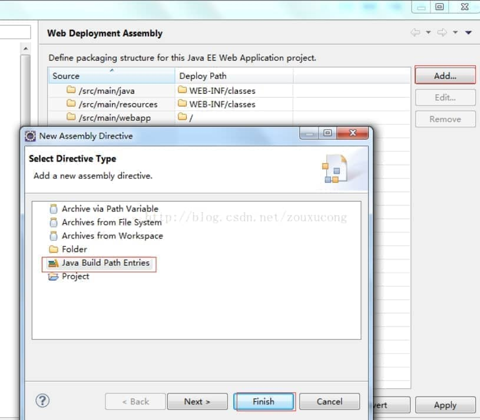
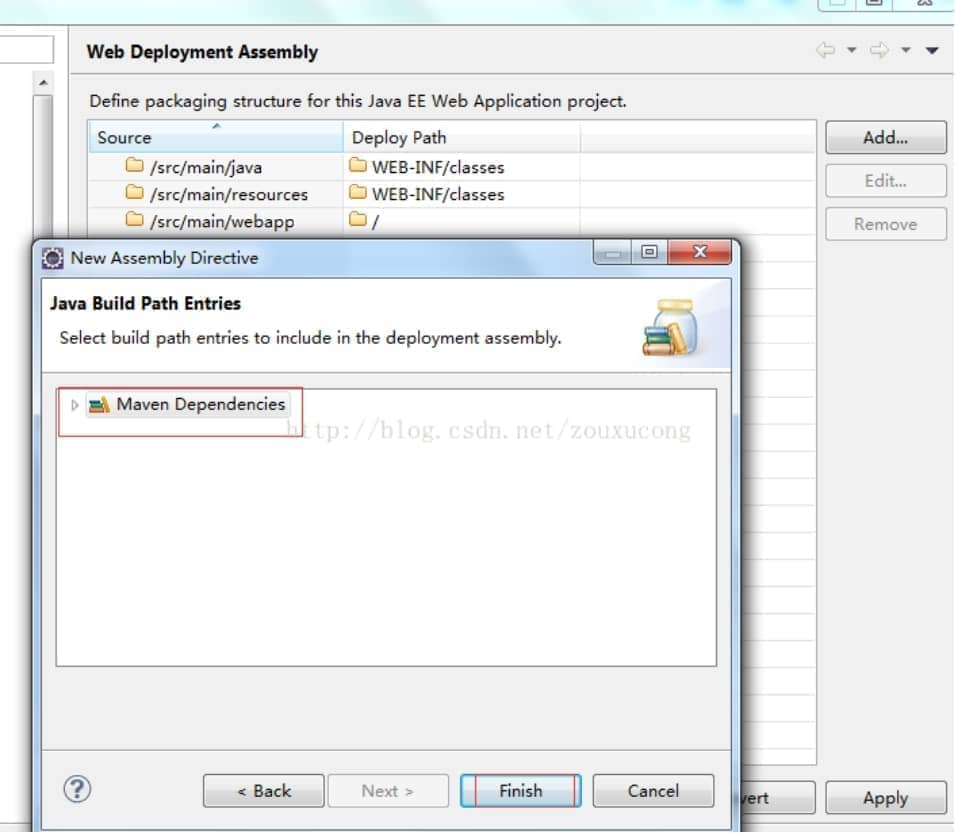

# 示例一

创建Web工程，使用 eclipse ee创建maven web工程 

1. 右键项目,选择Project Facets,点击Convert to faceted from 
2. 更改Dynamic Web Module的Version为2.5.(3.0为Java7的,Tomcat6不支持). 
   如果提示错误,可能需要在Java Compiler设置Compiler compliance level 为1.6 .或者需要在此窗口的Java的Version改成1.6. 

3. 点击下面的Further configuration available…，弹出Modify Faceted Project窗口 
   此处是设置web.xml文件的路径,输入src/main/webapp. 
   Generate web.xml deployment descriptor自动生成web.xml文件,可选可不选. 

4. 点击OK 

5. 设置部署程序集(Web Deployment Assembly) 

6. 在右键项目打开此窗口.在左侧列表中会出现一个Deployment Assembly,点击进去后 

7. 删除test的两项,因为test是测试使用,并不需要部署. 

8. 设置将Maven的jar包发布到lib下. 
   Add -> Java Build Path Entries -> Maven Dependencies -> Finish 

   

完成后有: 
/src/main/webapp  / 
/src/main/java   /WEB-INF/classes 
/src/main/resources /WEB-INF/classes 
Maven Dependencies /WEB-INF/lib 

好了，这样就把一个maven项目转化成web项目了。

 

 

 

# 实例二

新接手的一个项目，是maven项目，却不是web项目，无法部署到tomcat上，在Jetty服务器上启动，平时运行倒也没啥问题，但是有时候升级改造的时候，与生产环境用tomcat启动不一样，这样就容易出一些问题，就上网搜索如何把maven项目转变成web项目，转变方案很多，试了很多，项目在改造完之后总会报错，总是一些细小的操作失误导致的，总的来说，是别人的改造方案，个人感觉有问题，在这里我分享下我是如何改造的，希望能帮助到需要的朋友。

 

一、右键项目，Configure-->Convert to Faceted Form，打开后，界面如下：

 

二、转换成web项目，选中Dynamic Web Module和 JavaScript，这里我选的是Dynamic Web Module版本是3.0，然后点击ok

 

三、测试转成web项目，结构如下图所示，uas-client为普通的maven项目结构，uas-provider为转变后的maven web项目结构，若项目中有报错提示，可能是Eclipse中的校验引起的，此时只需要不校验即可以，Window-->Preferences-->Validation,选择Disable All,点击ok。

 

四、若生成的maven web项目中有WebContent，删掉WebContent文件夹

五、修改部署项目时文件的发布路径，右键项目，Properties-->Deployment Assembly,删除test两项以及WebContent，因为test是测试时使用，并不需要部署

 

六、添加src/main/webapp的部署路径以及

 

 

七、添加Maven Dependencies的部署路径

 

 

八、点击ok，完成maven web项目的转换，此时即可以把该项目部署到tomcat上。

 