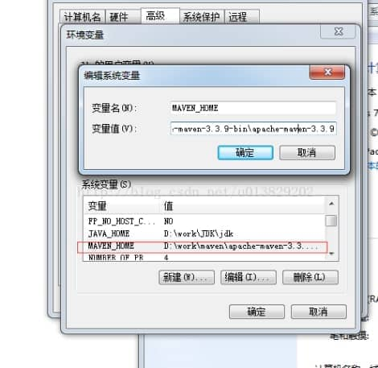
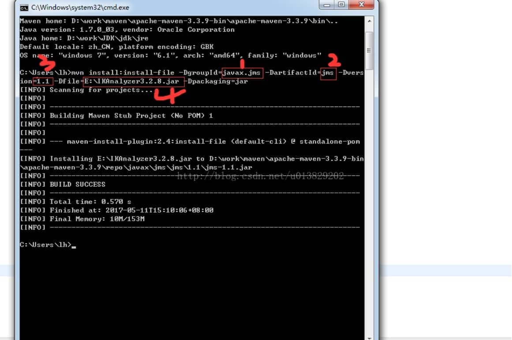

# 把本地的jar包添加到Maven仓库

本地 jar 添加到 maven 仓库的方法。 有些包在 mvn repository 是没有的，例如IKAnlyzer.jar，若要使用maven管理该jar包，如下


 一、安装maven环境，配置环境变量

 二、下载你需要加入到maven的jar包

 

1、配置maven环境，计算机-属性-高级系统设置-环境变量，添加系统变量MAVEN_HOME。值指向bin层，复制到变量值里面。

 

我下载的是apache-maven-3.3.9 

  

 

2、下载需要加入到maven的包，我这里的例子是IKAnlyzer,因为他在maven仓库里没有。 

2.1、先测试maven环境变量是否安装成功，打开cmd后输入： mvn -v

2.2、在cmd中输入（需要注意的是，下边的语句必须要在同一行中，不能换行执行。）

mvn install:install-file -DgroupId=javax.jms -DartifactId=jms -Dversion=1.1 -Dfile=E:\IKAnalyzer3.2.8.jar -Dpackaging=jar

这些参数与pom.xml里面的参数对应关系。其实4是本地jar的路径。我把包放在E盘了。 如图：

DgroupId--》groupId（组名），对应上边的javax.jms
    DartifactId--》artifactId（文件名）对应上边的jms
    Dversion--》version（版本号），对应上边的 1.1

Dfile--》文件路径，对应上边的E:\IKAnalyzer3.2.8.jar

那在pom.xml 加入： 

```
<dependency> 
     <groupId>javax.jms</groupId> 组名
     <artifactId>jms</artifactId> 文件名
     <version>1.1</version> 版本号
 </dependency>  
```

 

 

 