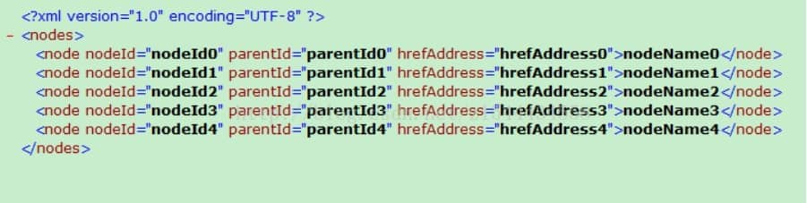

 

# JAVA将list转化为xml文件


## 示例1

pojo类：

```java
public class TreeNode { 

  private int id; 
  private String nodeId; 
  private String parentId; 
  private String hrefAddress; 
  private String nodeName; 
  
  // 对应get、set方法
} 
```

 

**将list转化为xml形式的字符串的工具类**

```java
public class TreeUtil { 

  /** 
   * 根据节点数据集合，生成XML 
   * @param treeNodes 权节点集合 
   * @return 
   */ 
  public String parseNodeToXML(List<TreeNode> treeNodes) { 

    StringBuffer xmlnodes = new StringBuffer(); 
    if (treeNodes != null && treeNodes.size() > 0) { 
      xmlnodes.append("<?xml version=\"1.0\" encoding=\"UTF-8\"?>"); 
      xmlnodes.append("<nodes>"); 
      
      for (int i = 0; i < treeNodes.size(); i++) { 
        TreeNode node = treeNodes.get(i); 
        xmlnodes.append("<node nodeId='" + node.getNodeId() + "' parentId='" + node.getParentId() 
            + "' hrefAddress='" + node.getHrefAddress() + "'>" + node.getNodeName() + "</node>"); 
      } 
      xmlnodes.append("</nodes>"); 
    } 
    return xmlnodes.toString(); 
  } 
}  
```

 

**将字符串写入到文件中**

```java
public static void main(String[] args) throws Exception { 

    List<TreeNode> list = new ArrayList<TreeNode>(); 

    for (int i = 0; i < 5; i++) { 
      TreeNode treeNode = new TreeNode(); 
      treeNode.setHrefAddress("hrefAddress" + i); 
      treeNode.setId(i); 
      treeNode.setNodeId("nodeId" + i); 
      treeNode.setNodeName("nodeName" + i); 
      treeNode.setParentId("parentId" + i); 
      list.add(treeNode); 
    } 

    String xmlFile = new TreeUtil().parseNodeToXML(list); 
    FileWriter writer = new FileWriter("F:/node.xml"); 
    writer.write(xmlFile); 
    writer.flush(); 
    writer.close(); 
    System.out.println("写入完成！"); 
  } 
```

最终xml文件的形式如：

 


## 示例2  


```java
//生成一个List集合，元素是NameValuePair类型的
private String genProductArgs(String out_trade_no,String order_price,String notify_url,String product_name) {
		List<NameValuePair> packageParams = new LinkedList<NameValuePair>();
		packageParams.add(new NameValuePair("appid", WX_APP_ID));
		packageParams.add(new NameValuePair("body", product_name));
		packageParams.add(new NameValuePair("mch_id", WX_PARTNER));
		//改过
		packageParams.add(new NameValuePair("nonce_str",randomUtil.getUUID()));
		packageParams.add(new NameValuePair("notify_url",notify_url));
		packageParams.add(new NameValuePair("out_trade_no",out_trade_no));
		//packageParams.add(new NameValuePair("spbill_create_ip",magicBagService.getServerIp()));
		//packageParams.add(new NameValuePair("spbill_create_ip","100.200.230.2"));
		packageParams.add(new NameValuePair("total_fee", order_price));
		packageParams.add(new NameValuePair("trade_type", "APP"));

		String sign = SignUtils.genPackageSign(packageParams, WX_API_KEY);
		packageParams.add(new NameValuePair("sign", sign));

		//改过，将map转为XML形式的字符串
		String xmlstring = XMLUtil.toXML(packageParams);
		return xmlstring;
	}
```


```java
	//根据节点数据集合，生成XML 
    public static String toXML(List nodesMap) {  
        StringBuffer xmlnodes = new StringBuffer();  
        if (nodesMap != null && nodesMap.size() > 0) {  
             
            xmlnodes.append("<xml>");  
            for (int i = 0; i <nodesMap.size(); i++) { 
            	
            	NameValuePair nv = (NameValuePair) nodesMap.get(i);
                String  nodeName = nv.getName();
                String  nodeValue = nv.getValue();
                
                xmlnodes.append("<"+ nodeName+ ">" + nodeValue + "</"+ nodeName+">");  
            }  
            xmlnodes.append("</xml>");  
        }  
        return xmlnodes.toString();  
    }  
```

