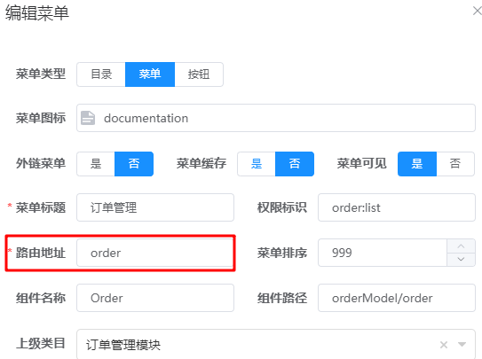
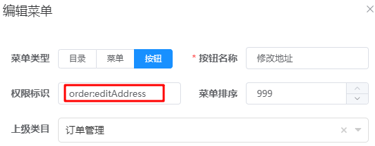
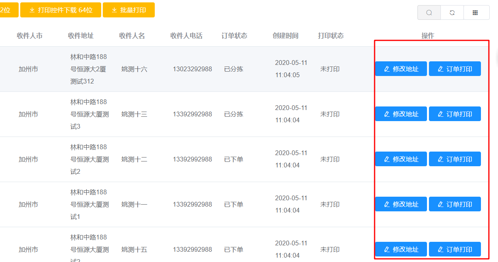
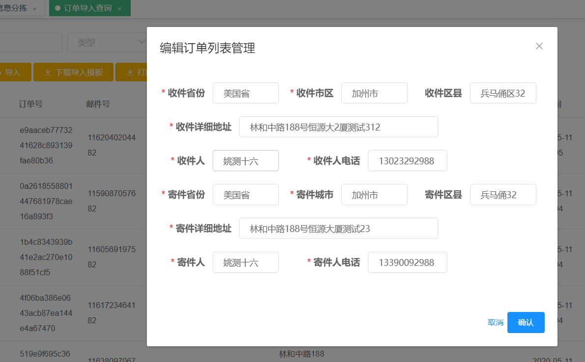
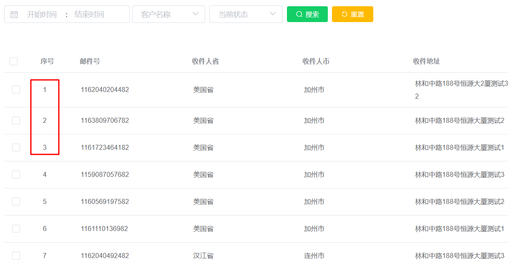
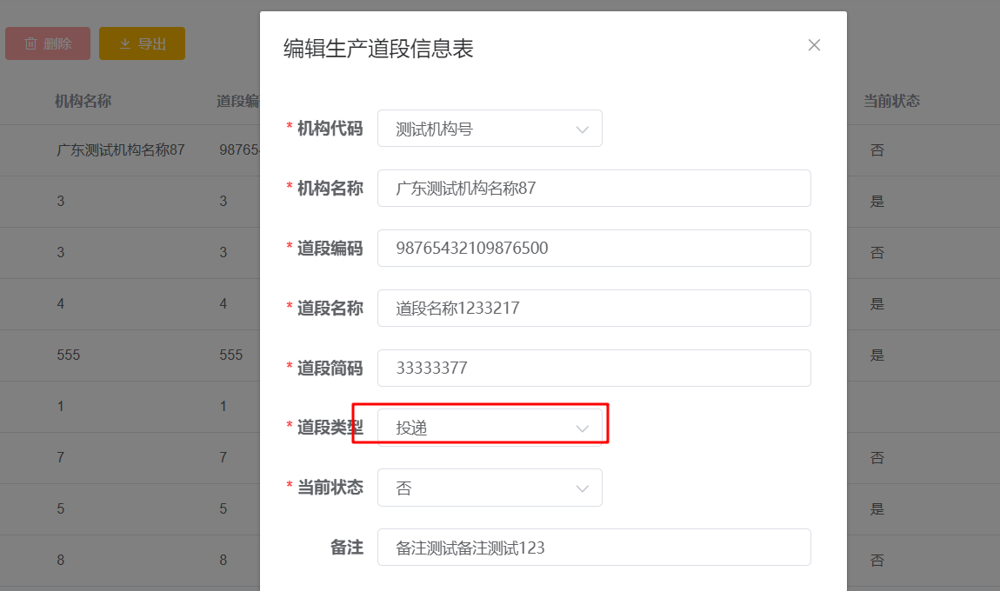

# 2、生成代码时事项

1. 所有字段的注释都不能为空，否则会生成代码失败

# 3、添加菜单时事项

## 添加菜单流程：

​	第一步：在菜单管理处添加菜单

​	第二步：在权限管理处为指定用户添加新菜单权限，若不添加，则该用户是无法看到该菜单的；


## 情况1：

添加按钮时路由地址的名称和表名必须一样并且首字母小写，否则非超级管理员会出现权限问题，前端会提示不允许访问

 


## 情况2：

一般情况下，我们复制得到的页面默认会去访问该原有页面的list接口，那么若为该页面配置菜单的权限标识的时候就是获取该页面的列表的权限标识；如果配置的不是原来页面的权限标识，就会出现不允许访问的情况，即访问那个获取列表的接口失败；

解决方法：

1. 如果不需要访问那个list接口，就在页面上找到默认请求该list接口的代码，注释掉即可；
2. 在接口中注释掉该list接口的权限校验
3. 继续访问该list接口，因此在配置该菜单的权限标识的时候，使用原来页面的权限标识；其实最好使用方法1，但是页面封装一起，比较难找到该方法，无奈又急用时候，使用方式3即可；或者方式2


# 4、为自定义按钮添加权限控制

1. 添加一个自定义按钮，并指定该按钮的权限控制名称 order:editAddress，并指定admin用户默认拥有该权限

   ```js
     <el-button
         v-permission="['admin','order:editAddress']"
         :disabled="disabledEdit"
         :loading="crud.status.cu === 2"
         size="mini"
         type="primary"
         icon="el-icon-edit"
         @click="crud.toEdit(data)"
       >修改地址</el-button>
   ```

2. 添加菜单按钮

    

3. 在对应controller中指定该菜单权限的用户可以请求的接口

   ```js
   //此处是直接在修改接口中加了一个权限，当然也可以写一个新的接口，因为此处功能一样，因此就使用该接口就可以了
   @Log("修改订单列表管理")
   @ApiOperation("修改订单列表管理")
   @PutMapping
   @PreAuthorize("@dokit.check('order:edit','order:editAddress')")
   public ResponseEntity<Object> update(@Validated @RequestBody Order resources){
   orderService.update(resources);
       return new ResponseEntity<>(HttpStatus.NO_CONTENT);
   }
   ```

4. 为对应角色分配该菜单权限后，对应用户就能获得该菜单的权限功能

   

# 5、弹框

1. 弹出一个警告框

   ```js
   this.$message.warning('文件不能为空');
   ```

2. 水电费

3. 水电费


# 6、工具栏添加按钮（插槽方式）

```js
1、插槽位置在CRUD.operation.vue文件<slot name="right" />中和<slot name="left" /> 处

2、对应index.vue的代码，slot="right" 指示这段代码为放到对应 插槽位置；代码运行后带有slot="right"这段代码就会替换掉子组件中的插槽位置的代码
<crudOperation :permission="permission" >
  <el-button
    slot="right"
    v-permission="['admin','order:uploadImage']"
    class="filter-item"
    size="mini"
    type="warning"
    icon="el-icon-upload"
    @click="dialogFormVisible = true"
  >导入</el-button>
</crudOperation>
```

# 7、列表添加按钮（插槽方式）

```js
1、插槽位置在UD.operation.vue文件<slot name="ud-right" />中和<slot name="ud-left" /> 处

2、对应index.vue的代码，slot="ud-right" 指示这段代码为放到对应 插槽位置；代码运行后带有slot="ud-right"这段代码就会替换掉子组件中的插槽位置的代码
<udOperation :data="scope.row" :permission="permission" :showEdit="false" :showDel="false">
  <el-button
    slot="ud-right"
    v-permission="['admin','order:editAddress']"
    :disabled="disabledEdit"
    :loading="crud.status.cu === 2"
    size="mini"
    type="primary"
    icon="el-icon-edit"
    @click="crud.toEdit(data)"
  >修改地址</el-button>
</udOperation>
```

# 8、控制工具栏按钮显示与隐藏

```js
methods: {
  // 获取数据前设置好接口地址
  [CRUD.HOOK.beforeRefresh]() {
    const query = this.query
    if (query.type && query.value) {
      this.crud.params[query.type] = query.value
    }

    //隐藏工具栏增删除改开始----------
    this.crud.optShow.del = false
    this.crud.optShow.edit = false
    this.crud.optShow.add = false
    //隐藏工具栏增删除改结束----------

    return true
  }
  }
```

# 9、控制列表删改按钮

```js
//通过属性绑定，将对应控制显示的属性 :showEdit="false" :showDel="false" 改为false
<udOperation :data="scope.row" :permission="permission" :showEdit="false" :showDel="false" />
```


# 10、搜索框为某个字段添加下拉列表

```js
//print_status为字典中字段
<el-select v-model="query.printStatus" clearable placeholder="打印状态" class="filter-item" style="width: 130px">
  <el-option v-for="item in dict.print_status" :key="item.id" :label="item.label" :value="item.value" />
</el-select>
js
注意事项：若查询条件不生效，检查对应的 QueryCriteria 表中对应字段是否加上；有可能生成时候没有加上
```


# 11、添加外键搜索的name搜索

```js
//如下，用户id在当前表中的为外键，若要在该表的搜索页面根据用户名搜索，则进行如下改进操作
1、在搜索条件中，修改提示搜索的内容（index.vue）
queryTypeOptions: [
        {
          key: 'custId',
          display_name: '用户名称'
        },
        ......
        }
        
 2、service实现层、dao层
 通过方法criteria.getCustId()，获取前端出过来的需要查询的用户名字，然后将该用户名字放到用户表中进行查询，获取到符合条件的用户的id列表
 @Override
    //@Cacheable
    public Map<String,Object> queryAll(OrderQueryCriteria criteria, Pageable pageable){

        List<String> custId = criteria.getCustId();
        if (custId != null && !"".equals(custId)){
            List<String> custIdList = orderRepository.selectDictCustInfo(custId.get(0),custId.get(0));
            if (custIdList.size()==0){
                custIdList.add("0");
            }
            criteria.setCustId(custIdList);
        }

        Page<Order> page = orderRepository.findAll((root, criteriaQuery, criteriaBuilder) -> QueryHelp.getPredicate(root,criteria,criteriaBuilder),pageable);
        return PageUtil.toPage(page.map(orderMapper::toDto));
    }
    


//repositoryDao层
public interface OrderRepository extends JpaRepository<Order, String>, JpaSpecificationExecutor<Order> {

    @Query(value="select u.cust_id from tb_dict_cust_info u where u.cust_code=?1 or u.cust_name=?2",nativeQuery=true)
    List<String> selectDictCustInfo(String custCode,String custName);
}


3、查询条件层
//custId原来和receiver一样都是精确查询的，因为返回的id可能有多个，因此，此处改为in查询，根据真实逻辑修改
@Data
public class OrderQueryCriteria{

    // in范围查询
    @Query(type = Query.Type.IN)
    private List<String> custId;

    // 精确
    @Query
    private String receiver;
    
    ......
}
```


# 12、index.vue发起get请求示例

```
//获取客户地址列表
service.get('/api/order/getCustInfoList').then(result => {
  this.options= result
})
```


# 13、index.vue上传图片，请求示例

```js
var dataa = new FormData()
dataa.append('file', this.fileList[0])
dataa.append('custAddressId',this.address[1])

service.post('/api/order/importExcel',dataa).then(result => {
          this.dialogFormVisible = false
          this.crud.refresh()
          this.buttonDisabled = false
        })
```


# 14、文件导出

```js
1、添加按钮
<el-button
  slot="right"
  v-permission="['admin','order:downloadImportTemplet']"
  class="filter-item"
  size="mini"
  type="warning"
  icon="el-icon-download"
  :loading="downloadLoading2"
  @click="downloadImportTemplet"
>下载导入模板</el-button>

2、定义定义下载中动效
xport default {
    data() {
      return {
        downloadLoading2: false
        }
        .......
        
3、文件下载的方法
<script>
	import { downloadFile } from '@/utils/index'
	import { download } from '@/api/data'
</script>
```
# 15、预防this指向改变

如下，在最外层，代码开始执行的时候，即this.form.expressNbr != null，this的指向一开始是不会改变的，但是经过代码执行后，this的执行可能会发生变化，如下，若想要将 result.custId 的值付给当前this的form.originOrgCode 属性，那么需要一开始就将 this的引用存储到self中，防止this的指向发生变化，如下，若将self.form.originOrgCode = result.custId 改为 this.form.originOrgCode = result.custId 就会导致赋值失败；

```js
getCustId(sortingType,expressNbr){
  const self = this;
  //揽收分拣
  if (this.form.expressNbr != null){
    if (sortingType == 0){
      this.form.addressId = null
      service.get("/api/mailSorting/getCollect?expressNbr=" + expressNbr)
        .then(function (result) {
          console.log(result.custId)
          self.form.originOrgCode = result.custId
        })
    }else{
      self.form.originOrgCode = null
    }
  }else {
    this.$message.warning('邮件号不能为空！');
  }
```


# 16、方法导出

```js
//若要使用引入的js的某个方法，那么该js中的该方法需要导入，如下使用 export 是实现方法导出的一种方式
export function needCLodop(){ ...... }
```

# 17、固定右侧的操作列

效果：固定在此处，不随着拖动条移动



```js
//只需要在下列代码中加入 fixed="right" 即可
<el-table-column v-permission="['admin']" label="操作" width="230px" align="center" fixed="right">
	........
</el-table-column>
```

# 18、修改页面多个标签并排

效果



```js
<!--表单渲染-->
<el-dialog
  append-to-body
  :close-on-click-modal="false"
  :before-close="crud.cancelCU"
  :visible.sync="crud.status.cu > 0"
  :title="crud.status.title"
  width="580px" //表示最外层方框的宽度
>
  //加入 :inline="true" 表示允许多个标签在同一行
  // el-from 中的 label-width="80px"表示该表单的所有标签默认宽度
  <el-form ref="form" :inline="true" :model="form" :rules="rules" size="small" label-width="80px">
    //此处是为特定标签指定宽度，覆盖默认宽度
    <el-form-item v-if="form.type.toString() !== '2'" label="路由地址" prop="path" label-width="100px">
      //el-input 中的 label-width="80px" 是指定输入框的宽度
      <el-input v-model="form.path" placeholder="路由地址" style="width: 178px;" />
    </el-form-item>
</el-dialog>
```

# 19、el-table-column 添加序号列

效果



```js
//每一页序号都是重新开始
<el-table-column
  label="序号"
  width="70px">
  <template slot-scope="scope">
    {{scope.$index + 1}}
  </template>
</el-table-column>

//序号翻页累加
//(crud.page.page-1)*crud.page.size 为 页数*页码，当为第一页的时（1-1）*10 = 0，则从0开始，第二页就+10，第三页+20，以此类推
<el-table-column
  label="序号"
  width="70px">
  <template slot-scope="scope">
    {{scope.$index + (crud.page.page-1)*crud.page.size + 1}}
  </template>
</el-table-column>

//最简单的序列自增，只要设置当前行的 type="index" 即可
<el-table-column label="序号" width="50px" type="index">
</el-table-column>
```


# 20、表单页字典值字段展示中文

使用 Number( ) 方法将字段数字转为对应中文含义，效果如下：



```js
<el-form-item label="当前状态" prop="status">
  <el-select v-model="form.status" filterable placeholder="请选择">
    <el-option
      v-for="item in dict.whether"
      :key="item.id"
      :label="item.label"
      :value="Number(item.value)"
    />
  </el-select>
</el-form-item>
```


# 21、抛出让前前端可继续往下执行的异常

```java
// serviceImpl
@Transactional(rollbackFor = Exception.class)
public void importExcel(String custAddressId,MultipartFile file) {

    .........
        //查询客单号是否已经存在
        Order queryOrder = orderRepository.findByCustOrderId(custOrderId);
    if (queryOrder != null){
        throw new BadRequestException(HttpStatus.ALREADY_REPORTED,"订单 "+ custOrderId +" 已存在");
    }
    .......
}

//对应HttpStart中的类型
ALREADY_REPORTED(208, "Already Reported")
```


前端 vue.js 的方法中的 post请求，根据响应内容做进一步处理

```js
service.post('/api/order/importExcel',dataa).then(result => {
  self.dialogFormVisible = false
  self.buttonDisabled = false

  if (result.status == 208){
    self.$message.error(result.message);
  }else {
    self.$message.success('导入成功！');
    self.crud.refresh()
  }

}
```


# 22、实体类

## 	22.1 非空校验

```
@Column(name = "two_code",nullable = false)
@NotBlank //非空校验注解，若该注解存在，那么插入数据的时，字段值不能为空，否则会插入失败
private String twoCode;
```


# 23、自动生成的代码增删改失败

处理方式：

​	查看报错日志，若报错日志中提示 sql 语句有问题，将有问题的 sql 语句复制到 Navicat 上，若如下

```
INSERT INTO tb_postage_zone_scheme ( create_person, create_time, DESCRIBE, NAME, remark, update_person, update_time, valid_status )
VALUES
	( NULL, '07/10/2020 15:18:47.129', '2', '1', NULL, NULL, '07/10/2020 
	15:18:47.129', 0 )
	
关键字在 sql 中正确写法：`name`
```

若发现 sql 中带有大写中文字段，那么则可能这些是 mysql 的关键字，是因为关键字冲突导致程序执行失败，关键字在 sql 中正确写法如上图所示；根本原因是持久层 spring Data jpa 和 mysql 关键字不兼容；程序中解决方式如下，在实体类中指定字段的映射值的时，为关键字加上符号 `` 

```
@Entity
@Data
@Table(name="tb_postage_zone_scheme")
public class PostageZoneScheme implements Serializable {

    /** 方案名称 */
    @Column(name = "`name`",nullable = false)
    @NotBlank
    private String name;

    /** 方案描述 */
    @Column(name = "`describe`")
    private String describe;
}
```


# 24、显式指定操作栏名称

```
<crudOperation :permission="permission" crudDelTitle="批量删除"/>
```


# 25、刷新当前页面

```
this.crud.refresh()
```


