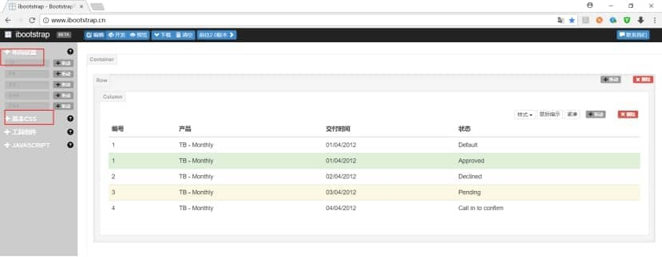
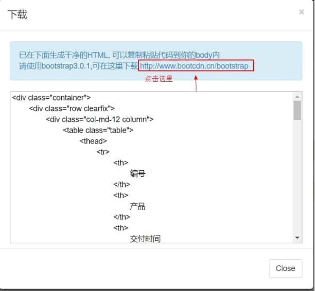
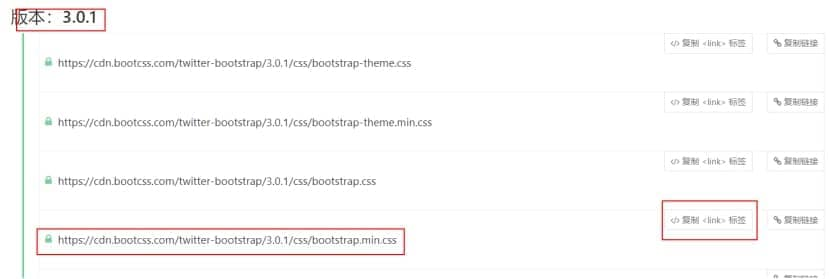
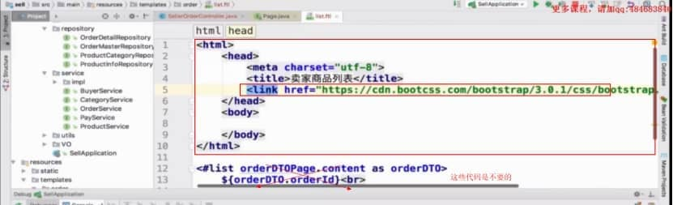

1、第一步：登录http://www.ibootstrap.cn/网站

2、第二步：将我们想要的布局样式拖拉到右边位置，选好之后点击右上角的下载按钮；

 

下载

 

**跳转到样式页面**

 

**然后回到代码页面，书写一个标准的hetm文档，然后将刚刚复制的css样式添加到我们写的代码中；接着将一开始我们拖拉生成的表格代码添加到该图的body标签中**

 

最后，带样式的html代码就生成了；后面就是写逻辑代码了；这个也是适用freemarker

 