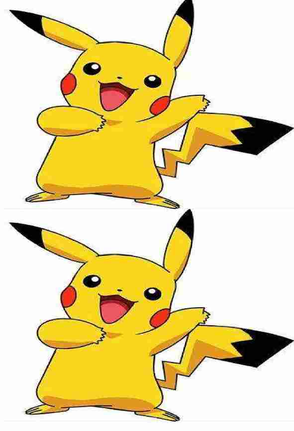

```java
import org.apache.commons.logging.Log;
import org.apache.commons.logging.LogFactory;
import sun.misc.BASE64Encoder;
import javax.imageio.ImageIO;
import java.awt.*;
import java.awt.image.BufferedImage;
import java.io.ByteArrayOutputStream;
import java.io.IOException;
import java.io.InputStream;
import java.net.URL;

/**
 * @Auther: kxq
 * @Date: 2020/12/1 16:09
 * @Description: 图片处理类
 */
public class ImageHandle {

    /**
     * 两图片合并（思路：在一张透明的背景图片中，将需要合并的图片合并到背景图片中即可）
     * @param backgroundImg 背景图片,是项目本地路径的图片，路径需要用这个斜杠 /
     * @param topImg    上图，网络图片的url
     * @param undersideImg  下图，网络图片的url
     * @return 图片base64编码
     * @throws Exception .
     */
    public String modifyImagetogeter(String backgroundImg,String topImg,String undersideImg ) throws Exception {

        String base64Img = null;
        //获取项目resources目录下文件，如："image/透明底图.png",注意，必须为这个斜杠 /
        InputStream srcImgFile = this.getClass().getClassLoader().getResourceAsStream(backgroundImg);
        Image srcImg = null;//文件转化为图片
        try {
            //获取背景图片信息
            srcImg = ImageIO.read(srcImgFile);
            int srcImgWidth = srcImg.getWidth(null);//获取图片的宽
            int srcImgHeight = srcImg.getHeight(null);//获取图片的高

            BufferedImage bufImg = new BufferedImage(srcImgWidth, srcImgHeight, BufferedImage.TYPE_INT_RGB);
            Graphics2D g = bufImg.createGraphics();

            // 将图放到背景图上半部分
            URL url = new URL(topImg);
            BufferedImage bufferedImage = ImageIO.read(url);
            g.drawImage(bufferedImage,0,0,srcImgWidth,srcImgHeight/2,null);

            // 将图放到背景图下半部分
            URL url2 = new URL(undersideImg);
            BufferedImage bufferedImage2 = ImageIO.read(url2);
            g.drawImage(bufferedImage2,0,srcImgHeight/2,srcImgWidth,srcImgHeight/2,null);
            g.dispose();

            // 输出图片看效果
//            FileOutputStream outImgStream = new FileOutputStream("F:\\1.jpg");
//            ImageIO.write(bufImg, "jpg", outImgStream);
//            System.out.println("添加水印完成");
//            outImgStream.flush();
//            outImgStream.close();

            //输出 base64 编码
            ByteArrayOutputStream outputStream = new ByteArrayOutputStream();
            ImageIO.write(bufImg,"jpg",outputStream);
            BASE64Encoder encoder = new BASE64Encoder();
            base64Img = encoder.encode(outputStream.toByteArray());

        } catch (IOException e) {
            throw new Exception(e);
        }
        return base64Img;
    }

    // 测 试
    public static void main(String[] args) throws Exception {
        ImageHandle imageHandle = new ImageHandle();
        String base64Img = imageHandle.modifyImagetogeter("image/透明底图.png",
                                                          "https://timgsa.baidu.com/timg?image&quality=80&size=b9999_10000&sec=1607593714001&di=b4584912745a9f6a9e6d22300ee0d5c9&imgtype=0&src=http%3A%2F%2F5b0988e595225.cdn.sohucs.com%2Fq_70%2Cc_zoom%2Cw_640%2Fimages%2F20171222%2F0a90b9a6542d4e1f8c336370d734bfe7.jpeg",
                                                          "https://timgsa.baidu.com/timgimage&quality=80&size=b9999_10000&sec=1607593714001&di=b4584912745a9f6a9e6d22300ee0d5c9&imgtype=0&src=http%3A%2F%2F5b0988e595225.cdn.sohucs.com%2Fq_70%2Cc_zoom%2Cw_640%2Fimages%2F20171222%2F0a90b9a6542d4e1f8c336370d734bfe7.jpeg");
        System.out.println(base64Img);
    }
}

```


处理前：


处理后：

