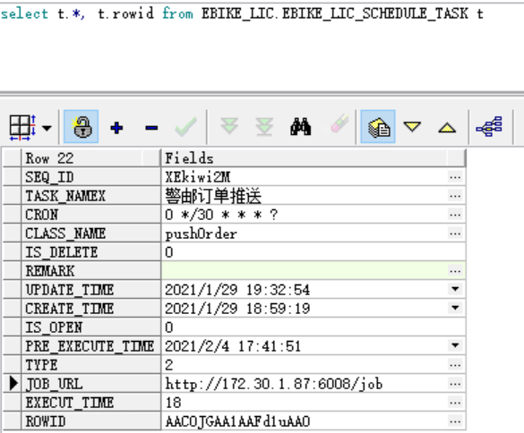

## 1. 编写定时器类

该定时器类必须实现Task接口，并实现接口中的execute方法，将要定时执行的方法放到该方法中即可

```java
import cn.hutool.cron.task.Task;
import org.springframework.stereotype.Component;

/**
 * 警邮综合服务平台定时器
 */
@Component
public class PushOrder implements Task {
    
    @Override
    public void execute() {
        push();
    }

    public void push() {
        //业务逻辑代码写在此处
    }
}
```


## 2. 添加配置类

该类在程序启动时，读取数据库中配置的定时任务，将这些定时任务加载到内存中

```java
import cn.hutool.cron.CronUtil;
import cn.hutool.cron.task.Task;
import com.ems.policepost.mapper.DaoMapper;
import org.slf4j.Logger;
import org.slf4j.LoggerFactory;
import org.springframework.beans.factory.annotation.Autowired;
import org.springframework.beans.factory.annotation.Value;
import org.springframework.context.annotation.Lazy;
import org.springframework.scheduling.annotation.SchedulingConfigurer;
import org.springframework.scheduling.config.ScheduledTaskRegistrar;
import org.springframework.scheduling.config.TriggerTask;
import org.springframework.stereotype.Component;

import java.text.SimpleDateFormat;
import java.util.*;

/**
 * 定时任务工具类（数据库）
 *
 * @author souwind
 * @data 2021-01-22
 * @Description :查询数据库 ebike_lic.EBIKE_LIC_SCHEDULE_TASK 中的定时任务表
 */
@Component
@Lazy(value = false)
public class TasksConfig implements SchedulingConfigurer {
    private static Logger log = (Logger) LoggerFactory.getLogger(TasksConfig.class);
    public static SimpleDateFormat sdf = new SimpleDateFormat("yyyy-MM-dd HH:mm:ss");
    @Autowired
    private DaoMapper daoMapper;
    @Value("${tasks.open}")
    private Boolean open;

    private Map<String, Object> tasksMap = null;
    private List<TriggerTask> tasksList = null;

    @Override
    public void configureTasks(ScheduledTaskRegistrar taskRegistrar) {
        //获取可用定时任务数
        List<Map<String, Object>> tasks = new ArrayList<>();
        if (open) {
            tasks = getAllScheduleTasks();
        }
        log.info("[定时任务启动] 启动任务数：{}；time={}", tasks.size(), sdf.format(new Date()));
        tasksMap = new HashMap<>();
        //校验数据
//        checkDataList(tasks);
        //通过校验的数据执行任务
        int count = 0;
        if (tasks.size() > 0) {
            for (int i = 0; i < tasks.size(); i++) {
                String className = tasks.get(i).get("CLASS_NAME").toString();
                Task task = (Task) SpringUtil.getBean(className);
                CronUtil.schedule(tasks.get(i).get("SEQ_ID").toString(), tasks.get(i).get("CRON").toString(), task);
                log.info("定时任务：编号：{},{} 启动成功！", tasks.get(i).get("SEQ_ID"), tasks.get(i).get("CLASS_NAME"));
            }
            CronUtil.setMatchSecond(true);
            CronUtil.start();
        }
    }

    /**
     * 获取可用任务集
     * type = 1：电动车；2：警邮；
     *
     * @return
     */
    public List<Map<String, Object>> getAllScheduleTasks() {
        return daoMapper.selectBySql("select * from ebike_lic.ebike_lic_schedule_task where is_open=1 and is_delete = 0 and type = 2");
    }
}
```


## 3. 编写管理定时器的Controller

```java
import cn.hutool.cron.CronUtil;
import cn.hutool.cron.Scheduler;
import cn.hutool.cron.pattern.CronPattern;
import cn.hutool.cron.task.Task;
import com.ems.policepost.config.SpringUtil;
import com.ems.policepost.mapper.DaoMapper;
import com.ems.policepost.utils.ResponseVO;
import com.ems.policepost.utils.ResultUtil;
import org.springframework.beans.factory.annotation.Autowired;
import org.springframework.scheduling.concurrent.ThreadPoolTaskExecutor;
import org.springframework.web.bind.annotation.RequestMapping;
import org.springframework.web.bind.annotation.RestController;
import javax.servlet.http.HttpServletRequest;
import java.util.List;
import java.util.Map;

/**
 * 定时任务控制器
 */
@RestController
@RequestMapping("/job")
public class JobController {
    @Autowired
    private DaoMapper daoMapper;
    @Autowired
    ThreadPoolTaskExecutor taskExecutor;

    /**
     * 根据ID停止任务
     *
     * @param id
     */
    @RequestMapping("/stopJob")
    public String stopJobById(HttpServletRequest request, String id) {
        try {
            CronUtil.remove(id);
        } catch (Exception e) {
            e.printStackTrace();
            return ResultUtil.error("操作失败").toJson();
        }
        return ResultUtil.success("操作成功").toJson();
    }

    /**
     * 根据任务ID开启任务
     *
     * @param id
     */
    @RequestMapping("/startJob")
    public String startJobById(HttpServletRequest request, String id) {
        try {
            List<Map<String, String>> tasks = daoMapper.selectBySql2("select * from ebike_lic.ebike_lic_schedule_task where seq_id = '" + id + "'");
            if (tasks != null && tasks.size() > 0) {
                Task task = (Task) SpringUtil.getBean(tasks.get(0).get("CLASS_NAME"));
                CronUtil.schedule(tasks.get(0).get("SEQ_ID"), tasks.get(0).get("CRON"), task);
                Scheduler scheduler = CronUtil.getScheduler();
                if (!scheduler.isStarted()){
                    CronUtil.setMatchSecond(true);
                    CronUtil.start();
                }

            } else {
                return ResultUtil.error("未找到此定时任务").toJson();
            }
        } catch (Exception e) {
            e.printStackTrace();
            return ResultUtil.error("操作失败").toJson();
        }
        return ResultUtil.success("操作成功").toJson();
    }

    /**
     * 根据任务ID改变任务执行规则
     *
     * @param id
     */
    @RequestMapping("/updatePattern")
    public String updatePattern(HttpServletRequest request, String id) {
        try {
            List<Map<String, String>> tasks = daoMapper.selectBySql2("select * from ebike_lic.ebike_lic_schedule_task where seq_id = '" + id + "'");
            if (tasks != null && tasks.size() > 0) {
                CronPattern cronPattern = new CronPattern(tasks.get(0).get("CRON"));
                CronUtil.updatePattern(id, cronPattern);
            } else {
                return ResultUtil.error("未找到此定时任务").toJson();
            }
        } catch (Exception e) {
            e.printStackTrace();
            return ResultUtil.error("操作失败").toJson();
        }
        return ResultUtil.success("操作成功").toJson();
    }

    /**
     * 根据任务ID立即启动一次
     *
     * @param id
     */
    @RequestMapping("/onceDoJob")
    public ResponseVO onceDoJob(HttpServletRequest request, String id) {
        try {
            taskExecutor.execute(() -> {
                List<Map<String, String>> tasks = daoMapper.selectBySql2("select * from ebike_lic.ebike_lic_schedule_task where seq_id = '" + id + "'");
                if (tasks != null && tasks.size() > 0) {
                    Task task = (Task) SpringUtil.getBean(tasks.get(0).get("CLASS_NAME"));
                    task.execute();
                }
            });
        } catch (Exception e) {
            e.printStackTrace();
            return ResultUtil.error("操作失败");
        }
        return ResultUtil.success("操作成功");
    }
}
```


## 4.  往表中添加一条定时任务记录

 


添加的 sql示例

```sql
INSERT INTO EBIKE_LIC.EBIKE_LIC_SCHEDULE_TASK
(SEQ_ID, TASK_NAMEX, CRON, CLASS_NAME, IS_DELETE, REMARK, UPDATE_TIME, CREATE_TIME, IS_OPEN, PRE_EXECUTE_TIME, "TYPE", JOB_URL, EXECUT_TIME)
VALUES('XEkiwi2M', '警邮订单推送', '0 */30 * * * ? ', 'pushOrder', 0, NULL, TIMESTAMP '2021-01-29 19:18:22.000000', TIMESTAMP '2021-01-29 18:59:19.000000', 1, TIMESTAMP '2021-01-29 19:05:11.000000', '2', 'http://172.30.1.87/job', '3');

```

