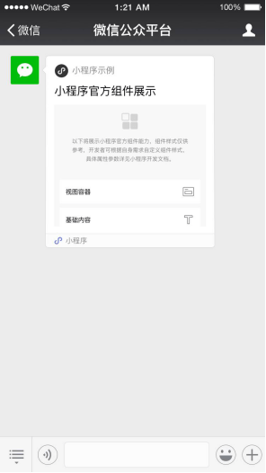

微信接口文档：

## **客服接口-发消息**

**接口调用请求说明**

http请求方式: POST

https://api.weixin.qq.com/cgi-bin/message/custom/send?access_token=ACCESS_TOKEN

各消息类型所需的JSON数据包如下：

发送文本消息

```
{
    "touser":"OPENID",
    "msgtype":"text",
    "text":
    {
         "content":"Hello World"
    }
}
```

发送图片消息

```
{
    "touser":"OPENID",
    "msgtype":"image",
    "image":
    {
      "media_id":"MEDIA_ID"
    }
}
```

发送语音消息

```
{
    "touser":"OPENID",
    "msgtype":"voice",
    "voice":
    {
      "media_id":"MEDIA_ID"
    }
}
```

发送视频消息

```
{
    "touser":"OPENID",
    "msgtype":"video",
    "video":
    {
      "media_id":"MEDIA_ID",
      "thumb_media_id":"MEDIA_ID",
      "title":"TITLE",
      "description":"DESCRIPTION"
    }
}
```

发送音乐消息

```
{
    "touser":"OPENID",
    "msgtype":"music",
    "music":
    {
      "title":"MUSIC_TITLE",
      "description":"MUSIC_DESCRIPTION",
      "musicurl":"MUSIC_URL",
      "hqmusicurl":"HQ_MUSIC_URL",
      "thumb_media_id":"THUMB_MEDIA_ID" 
    }
}
```

发送图文消息（点击跳转到外链） 图文消息条数限制在8条以内，注意，如果图文数超过8，则将会无响应。

```
{
    "touser":"OPENID",
    "msgtype":"news",
    "news":{
        "articles": [
         {
             "title":"Happy Day",
             "description":"Is Really A Happy Day",
             "url":"URL",
             "picurl":"PIC_URL"
         },
         {
             "title":"Happy Day",
             "description":"Is Really A Happy Day",
             "url":"URL",
             "picurl":"PIC_URL"
         }
         ]
    }
}
```

发送图文消息（点击跳转到图文消息页面） 图文消息条数限制在8条以内，注意，如果图文数超过8，则将会无响应。

```
{
    "touser":"OPENID",
    "msgtype":"mpnews",
    "mpnews":
    {
         "media_id":"MEDIA_ID"
    }
}
发送卡券
{
  "touser":"OPENID", 
  "msgtype":"wxcard",
  "wxcard":{              
           "card_id":"123dsdajkasd231jhksad"        
            },
}
```

特别注意客服消息接口投放卡券仅支持非自定义Code码和导入code模式的卡券的卡券，详情请见：[是否自定义code码](http://mp.weixin.qq.com/wiki?t=resource/res_main&id=mp1451025056&token=&lang=zh_CN&anchor=2.2.2)。

**发送小程序卡片（要求小程序与公众号已关联）**

客户端效果如下图：



接口调用示例：

```
{
    "touser":"OPENID",
    "msgtype":"miniprogrampage",
    "miniprogrampage":
    {
        "title":"title",
        "appid":"appid",
        "pagepath":"pagepath",
        "thumb_media_id":"thumb_media_id"
    }
}
```

请注意，如果需要以某个客服帐号来发消息（在微信6.0.2及以上版本中显示自定义头像），则需在JSON数据包的后半部分加入customservice参数，例如发送文本消息则改为：

```
{
    "touser":"OPENID",
    "msgtype":"text",
    "text":
    {
         "content":"Hello World"
    },
    "customservice":
    {
         "kf_account": "test1@kftest"
    }
}
```

| **参数**       | **是否必须** | **说明**                                                     |
| -------------- | ------------ | ------------------------------------------------------------ |
| access_token   | 是           | 调用接口凭证                                                 |
| touser         | 是           | 普通用户openid                                               |
| msgtype        | 是           | 消息类型，文本为text，图片为image，语音为voice，视频消息为video，音乐消息为music，图文消息（点击跳转到外链）为news，图文消息（点击跳转到图文消息页面）为mpnews，卡券为wxcard，小程序为miniprogrampage |
| content        | 是           | 文本消息内容                                                 |
| media_id       | 是           | 发送的图片/语音/视频/图文消息（点击跳转到图文消息页）的媒体ID |
| thumb_media_id | 是           | 缩略图/小程序卡片图片的媒体ID，小程序卡片图片建议大小为520*416 |
| title          | 否           | 图文消息/视频消息/音乐消息/小程序卡片的标题                  |
| description    | 否           | 图文消息/视频消息/音乐消息的描述                             |
| musicurl       | 是           | 音乐链接                                                     |
| hqmusicurl     | 是           | 高品质音乐链接，wifi环境优先使用该链接播放音乐               |
| url            | 否           | 图文消息被点击后跳转的链接                                   |
| picurl         | 否           | 图文消息的图片链接，支持JPG、PNG格式，较好的效果为大图640*320，小图80*80 |
| appid          | 是           | 小程序的appid，要求小程序的appid需要与公众号有关联关系       |
| pagepath       | 是           | 小程序的页面路径，跟app.json对齐，支持参数，比如pages/index/index?foo=bar |

 

**以下的为代码示例：**

 

主方法：

```java
public static void main(String[] args){  	        
//测试推送消息
//中山医院公众号的appid和appsecret
String appid = "wx53dbcd7852096299";
String appsecret = "a81a79543529ab526b4a58c7ce1fd4ab";
    	
Map map = WxUtil.getAccessToken(appid, appsecret);//获取接口凭证
String accessToken = (String) map.get("access_token");//新的accessToken
   //发送推送的url  
String url = "https://api.weixin.qq.com/cgi-bin/message/custom/send?access_token="+accessToken;   		
//发送的消息
String json = "{\"touser\":\"oE2XCwQb6WdYSo54avF41qKoU3rY\",\"msgtype\":\"text\",\"text\":{\"content\":\"Hello World\"}}";
try {
	String wxResult = WxHttpUtil.senPost(json, url,"application/json");
	} catch (IOException e) {
		// TODO Auto-generated catch block
		e.printStackTrace();
		}                        
}
```

获取accessToken的工具类

```java
import java.util.HashMap;
import java.util.Map;
import com.alibaba.fastjson.JSON;
import com.alibaba.fastjson.JSONObject;
import com.group.core.exception.ServiceException;
import com.group.utils.HttpUtils;

/**
 * 微信接口工具类
 * @author Administrator
 */
public class WxUtil {
    // 获取access_token的接口地址（GET） 限200(次/天)  
    static String access_token_url = "https://api.weixin.qq.com/cgi-bin/token";

    /**
     * 获取微信接口凭证accessToken
     * @param appID
     * @param appSecret
     * @return
     */
	public static Map getAccessToken(String appID,String appSecret)
	{
    	//拼接获取access_token的get请求参数
    	String accessTokenParam = "grant_type=client_credential&appid="+appID+"&secret="+appSecret;               
            
    	//获取access_token
    	String accessToken = HttpUtils.sendGet(access_token_url, accessTokenParam,"text/html");
    	//转为jsonObject
    	JSONObject jsonObject = JSON.parseObject(accessToken);
    	
    	String access_token = jsonObject.getString("access_token");
    	Integer expires_time = jsonObject.getInteger("expires_in");
    	    
        if(access_token==null)
        {
        	throw new ServiceException("2001","获取 access_token 出错");
        }
        
        Map<String, Object> map = new HashMap<>();
        map.put("access_token", access_token);
        map.put("expires_time", expires_time);
        return map;
	}
	
     // 测试
	public static void main(String[] args) {
		Map map = WxUtil.getAccessToken("wx53dbcd7852096299", "a81a79543529ab526b4a58c7ce1fd4ab");
		System.out.println(map.get("access_token"));
	}
}
```

调用微信的客服信息接口，发送客服信息

```java
import java.io.BufferedReader;
import java.io.IOException;
import java.io.InputStream;
import java.io.InputStreamReader;
import java.io.OutputStream;
import java.net.HttpURLConnection;
import java.net.URL;

import org.springframework.web.util.HtmlUtils;

public class WxHttpUtil {

	/**
	 * 微信发送客服消息，使用post方式发送，contentType为application/json
	 * post 请求
	 * @param requestBody	请求体字符串
	 * @param url 请求的url
	 * @return
	 * @throws IOException
	 */
	public static String senPost(String requestBody,String url,String contentType) throws IOException{
		
	  //服务的地址
        URL wsUrl = new URL(url);
        
        HttpURLConnection conn = (HttpURLConnection) wsUrl.openConnection();
        
        conn.setDoInput(true);
        conn.setDoOutput(true);
        conn.setRequestMethod("POST");
        conn.setRequestProperty("Content-Type", contentType);
        
        
        OutputStream os = conn.getOutputStream();
        
        //请求体
        String soap = requestBody;
        
        os.write(soap.getBytes());
        
        InputStream is = conn.getInputStream();
        
        InputStreamReader isr = new InputStreamReader(is);  
        BufferedReader br = new BufferedReader(isr);  
          
        StringBuilder sb = new StringBuilder();  
        String temp = null;  
        while(null != (temp = br.readLine())){  
            sb.append(temp);  
        }  
        
        String result = sb.toString();
        
        is.close();
        os.close();
        conn.disconnect();       
        
		return result;
	}
}
```


**我的示例：**

```java
	@Override
	public String pushMessage(String message) {
		
		//推送后微信的相应结果
		String resultXml = null;
		
//		//测试推送信息
//      File file = new File("D:/return.txt");
//      String message2 = txt2String(file);
      
		//获得GUID
		int extension =message.indexOf("extension=\"");
      	String requestGUID = message.substring(extension+11, extension+47);
		//去掉字符串中的转义字符
        String xml= HtmlUtils.htmlUnescape(message);
        
        //获得字符串中的有效信息
        int begin = xml.indexOf("<request>");	//获得最开始出现该字符串的位置
        int last = xml.lastIndexOf("</request>");//获得最后出现该字符串的位置
        String str = xml.substring(begin+9, last);
        
		//将String格式的xml转为json字符串
		org.json.JSONObject xmlJSONObj = XML.toJSONObject(str);  
       //设置缩进  
       String jsonPrettyPrintString = xmlJSONObj.toString(4);        	     			    	   
	   	    	
    	//若响应主体不为空，返回相应内容
    	if(!"".equals(xmlJSONObj)){
    		//将json字符串转为json对象
    		JSONObject jsonObject = JSON.parseObject(jsonPrettyPrintString);
    			    		
    		String jobNumber = jsonObject.get("employee_no").toString();
    		
    		//查询数据库中有没有该工号的员工
    		ZsUser user = new ZsUser();
    		user.setJobNumber(jobNumber);
    		
    		ZsUser sysUser = zsUserMapper.selectOne(user);
    		
    	if(sysUser!=null){
    			
			//解析推送消息
			Object approval_date = jsonObject.get("approval_date");//审批时间
			Object approval_opinion = jsonObject.get("approval_opinion");//审批意见
			Object bill_num = jsonObject.get("bill_num");//单据编号
			Object bill_type = jsonObject.get("bill_type");//单据类型
			Object employee_no = jsonObject.get("employee_no");//申请员工编号
			Object operator = jsonObject.get("operator");//经办人工号
			
			Object listsObject = jsonObject.get("lists");//获得卡主工号，项目名称，卡号的List组合
			
			String strList = "";//将list里面的消息遍历到该字符串上
			
			if(listsObject instanceof JSONArray){
				//返回的数据是JSONObject类型的
				JSONArray jsonArray = jsonObject.getJSONArray("lists");
				
				for (int i = 0; i < jsonArray.size(); i++) {
					
					JSONObject json = jsonArray.getJSONObject(i);//将获得的json字符串转为json对象
					
					Object PI = json.get("PI");//卡主工号
					Object card_num = json.get("card_num");//卡号
					Object project_name = json.get("project_name");//项目名称
					
					strList = strList +"项目名称:"+project_name+"\n卡主工号："+PI+"\n卡号："+card_num+"\n";
				}
				
			}else{
				//返回的数据是json类型的
				JSONObject object = jsonObject.getJSONObject("lists");
				
				Object PI = object.get("PI");
				Object card_num = object.get("card_num");//卡号
				Object project_name = object.get("project_name");//项目名称
				
				strList = strList +"项目名称:"+project_name+"\n卡主工号："+PI+"\n卡号："+card_num+"\n";
			}

			//组织推送消息
			String senMessage = "审批消息\n\n申请人工号："+employee_no+"\n经办人工号："+operator+"\n单据类型:"+bill_type+"\n单据编号:"+ bill_num+"\n审批时间:"+approval_date+"\n审批意见:"+approval_opinion+"\n"+strList;
					
			//有该用户,发送推送消息
			String openId = sysUser.getWxOpenid();//获得用户的openId
			
			String accessToken = weixinServiceImpl.getAccessTokenForSysConfig(appid, appsecret);//获取接口凭证
			
			String url = "https://api.weixin.qq.com/cgi-bin/message/custom/send?access_token="+accessToken;

			//发送的消息
			String json = "{\"touser\":\""+openId+"\",\"msgtype\":\"text\",\"text\":{\"content\":\""+senMessage+"\"}}";
			
			try {
				String wxResult = WxHttpUtil.senPost(json, url,"application/json");
				
				JSONObject resultJsonObject = JSON.parseObject(wxResult);
				String errcode = resultJsonObject.get("errcode").toString();//获得微信响应code，0表示成功
				String errmsg = resultJsonObject.get("errmsg").toString();//获得微信响应内容
				
				if("0".equals(errcode)){
					//微信处理成功
					resultXml = CreateXml.createGCPResponseXml("AA", "处理成功", requestGUID);
				}else{
					//微信处理失败
					resultXml = CreateXml.createGCPResponseXml("AE", errmsg, requestGUID);
				}
				
			} catch (IOException e) {
				// TODO Auto-generated catch block
				e.printStackTrace();
				resultXml = CreateXml.createGCPResponseXml("AE", "操作错误", requestGUID);
			}
				    			
		}else{
			resultXml = CreateXml.createGCPResponseXml("AE", "工号关联账号不存在", requestGUID);
		}

	}else{
		//相应主体为空，返回一个空字符串
		resultXml = CreateXml.createGCPResponseXml("AE", "推送消息不能为空", requestGUID);
	}

		return resultXml;
	}
```

