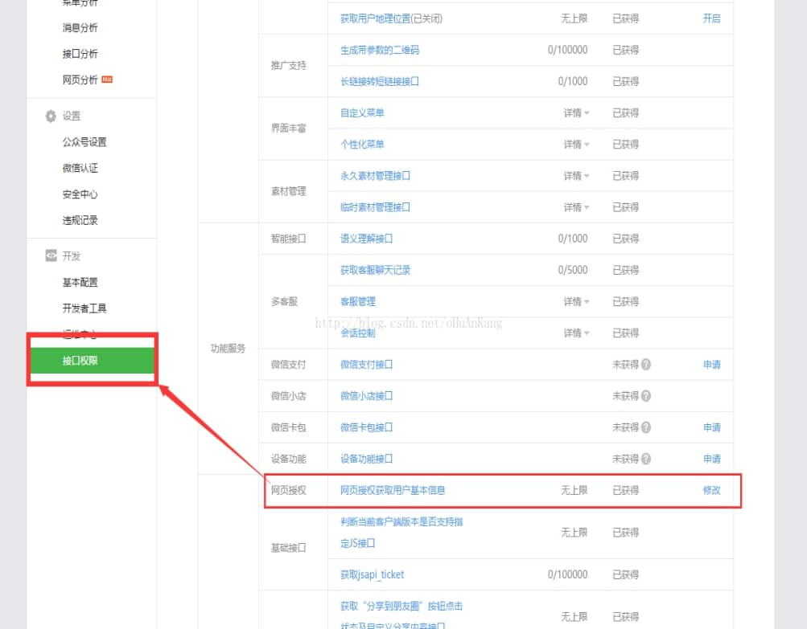
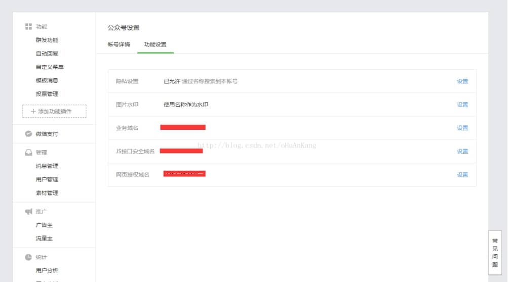
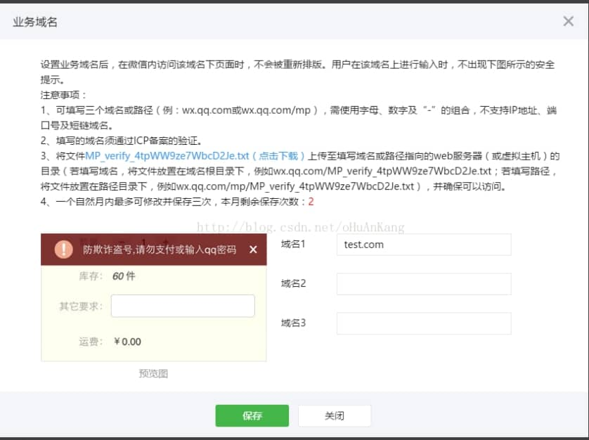

# **微信公众平台授权登录（java版）**

微信公众平台授权登录获取用户openid。

微信公众平台地址:https://mp.weixin.qq.com/

微信平台配置：

1、配置获取[网页授权获取用户基本信息](https://mp.weixin.qq.com/wiki?t=resource/res_main&id=mp1421140842&token=&lang=zh_CN) 权限

 

 

2、修改配置

 

2.1  业务域名配置

 

注意：按照文字提示下载[MP_verify_4tpWW9ze7WbcD2Je.txt](https://mp.weixin.qq.com/cgi-bin/mpverifytxt?lang=zh_CN&token=2019898395) 文件，放到指定位置（即工程目录下）

JS接口安全域名、网页授权域名 同理操作就可以了，正常操作业务域名就完成了，剩下两个步骤直接配置域名就可以了，如果有其他业务需求，就自己研究吧。

-----------------------------------------------------配置结束

3、具体实现代码：

网页打开地址

https://open.weixin.qq.com/connect/oauth2/authorize?appid=appid&redirect_uri=redirect_uri&response_type=code&scope=snsapi_login&state=123#wechat_redirect

参数说明：

appid: 第二步提到的appid

redirect_uri:登录后回掉地址（请使用[urlEncode](https://zh.wikipedia.org/wiki/%E7%99%BE%E5%88%86%E5%8F%B7%E7%BC%96%E7%A0%81)对链接进行处理）

scope:

​    snsapi_login (获取基本信息，需要的openid就够了）

4.2 微信回调域名处理

地址：https://api.weixin.qq.com/sns/oauth2/access_token?appid=appid&secret=secret&code=code&grant_type=authorization_code

参数说明：

 appid: 第二步提到的appid

 secret: 第二步提到的secret

 code：微信回调时候会传会该参数，直接使用就可以了

返回内容(json)：

```
{   
    "access_token": "",  
    "expires_in": 7200,  
    "refresh_token": "",  
    "openid": "",  
    "scope": "",  
    "unionid": ""  
 }  
```


access_token：获取用户详细信息会使用到的
refresh_token：刷新token,因为access_token会有expires_in的过期时效，可以使用刷新
刷新地址：https://api.weixin.qq.com/sns/oauth2/refresh_token?appid=APPID&grant_type=refresh_token&refresh_token=REFRESH_TOKEN 
openid：登录用户openid
unionid：unionid 

4.3 获取登录用户详细信息

地址：http：GET（请使用https协议） https://api.weixin.qq.com/sns/userinfo?access_token=ACCESS_TOKEN&openid=OPENID&lang=zh_CN 
参数说明：
access_token: 上一步获取的access_token,
openid : 用户的opneid,
返回内容就会有一些想要的内容，头像地址，性别，昵称。

 

补充说明：

微信开放平台网页登录获取openid 和 微信公众平台（服务号）获取的openid 是不一致的，如果要在微信公众平台里做事情

比如推送消息，必须使用微信公众平台的授权登录方式。

以上所有代码都是经过测试，并且通过的。放心使用。转载请注明出处。

 

Java代码：

```java
		//通过code换取网页授权access_token
		String params = "appid="+appid+"&secret="+appsecret+"&code="+code+"&grant_type=authorization_code";
        String response = HttpUtils.sendGet("https://api.weixin.qq.com/sns/oauth2/access_token", params,null);
        
		JSONObject accessTokenJsonObject = JSON.parseObject(response);
        String access_token = accessTokenJsonObject.getString("access_token");
        String openid = accessTokenJsonObject.getString("openid");
        
        if(StringUtils.isEmpty(openid) || StringUtils.isEmpty(access_token)){
            throw new ServiceException("2000","获取openid为空");
        }
```

