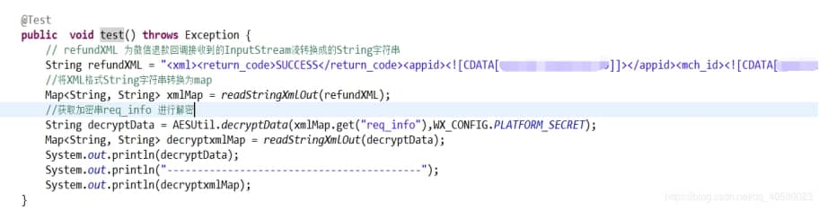
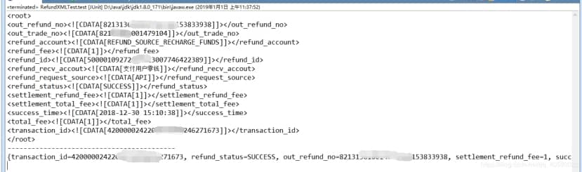

# 微信退款回调信息解密笔记

微信退款回调信息解密过程记录,方便自己查看

解密步骤： 

（1）对加密串A做base64解码，得到加密串B

（2）对商户key做md5，得到32位小写key* ( key设置路径：微信商户平台(pay.weixin.qq.com)-->账户设置-->API安全-->密钥设置 )

（3）用key*对加密串B做AES-256-ECB解密（PKCS7Padding）

 **Base64解密工具类：**

```java
import java.util.Base64;

public class Base64Util {

	/**
	 * 解码
	 * @param encodedText
	 * @return
	 */
	 public static byte[] decode(String encodedText){
	    final Base64.Decoder decoder = Base64.getDecoder();
	    return decoder.decode(encodedText);
	  }

	  /**
	   * 编码
	   * @param data
	   * @return
	   */
	  public static String encode(byte[] data){
	    final Base64.Encoder encoder = Base64.getEncoder();
	    return encoder.encodeToString(data);
	  }
}
```

 

**AES加密解密工具类：**

```java
import javax.crypto.Cipher;
import javax.crypto.spec.SecretKeySpec;

public class AESUtil {
 /** 
   * 密钥算法 
   */ 
  private static final String ALGORITHM = "AES";  
  /** 
   * 加解密算法/工作模式/填充方式 
   */ 
  private static final String ALGORITHM_MODE_PADDING = "AES/ECB/PKCS5Padding";  

  /** 
   * AES加密 
   * 
   * @param data 
   * @return 
   * @throws Exception 
   */ 
  public static String encryptData(String data,String password) throws Exception {  
    // 创建密码器  
    Cipher cipher = Cipher.getInstance(ALGORITHM_MODE_PADDING);
    SecretKeySpec key = *new* SecretKeySpec(MD5.MD5Encode(password).toLowerCase().getBytes(), ALGORITHM);
    // 初始化  
    cipher.init(Cipher.ENCRYPT_MODE, key);  
    return Base64Util.encode(cipher.doFinal(data.getBytes()));  
  }  

  /** 
   * AES解密 
   *  
   * @param base64Data 
   * @return 
   * @throws Exception 
   */ 
  public static String decryptData(String base64Data,String password) throws Exception {  
    Cipher cipher = Cipher.getInstance(ALGORITHM_MODE_PADDING);  
    SecretKeySpec key = new SecretKeySpec(MD5.MD5Encode(password).toLowerCase().getBytes(), ALGORITHM);
    cipher.init(Cipher.DECRYPT_MODE, key);  
    byte[] decode = Base64Util.decode(base64Data);
    byte[] doFinal = cipher.doFinal(decode);
    return new String(doFinal,"utf-8");  
  }  
}
```


**工具方法：**

```java
   /**
	 * InputStream流转换成String字符串
	 * @param inStream InputStream流
	 * @param encoding 编码格式
	 * @return String字符串
	 */
	public static String inputStreamToString(InputStream inStream, String encoding){
	 String result = null;
	 try {
         if(inStream != null){
         ByteArrayOutputStream outStream = new ByteArrayOutputStream();
         byte[] tempBytes = new byte[1024];
         int count = -1;
         while((count = inStream.read(tempBytes, 0, 1024)) != -1){
	  	outStream.write(tempBytes, 0, count);
	 	}
         tempBytes = null;
         outStream.flush();
         result = new String(outStream.toByteArray(), encoding);
         }
	 } catch (Exception e) {
	 		result = null;
	 	}
	 	return result;
	}

	/**
	 * xml转换成map
	 * @param xml
	 * @return
	 */
	public static Map<String, String> readStringXmlOut(String xml) {
		Map<String, String> map = new HashMap<String, String>();
		Document doc = null;
		try {
			doc = DocumentHelper.parseText(xml); // 将字符串转为XML
			Element rootElt = doc.getRootElement(); // 获取根节点
			List<Element> list = rootElt.elements();// 获取根节点下所有节点
			for (Element element : list) { // 遍历节点
				map.put(element.getName(), element.getText()); // 节点的name为map的key，text为map的value
			}
		} catch (DocumentException e) {
			e.printStackTrace();
		} catch (Exception e) {
			e.printStackTrace();
		}
		return map;
	}
```

 

测试方法

 

 

 