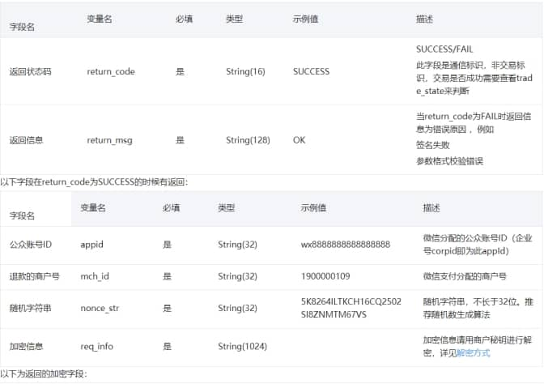

# 密微信退款结果通知中的加密信息req_info

 

在微信返回的退款结果通知中，包含了一个加密信息字段req_info

 


微信支付文档中有提及到如何解密：

解密步骤如下： 

（1）对加密串A做base64解码，得到加密串B

（2）对商户key做md5，得到32位小写key* ( key设置路径：微信商户平台(pay.weixin.qq.com)-->账户设置-->API安全-->密钥设置 )

（3）用key*对加密串B做AES-256-ECB解密（PKCS7Padding）

 

 

现在我们就一步一步解密得到返回的字段信息：

## 前提工作：

1、添加maven依赖

```xml
 <dependency>
      <groupId>org.bouncycastle</groupId>
      <artifactId>bcprov-jdk15on</artifactId>
      <version>1.47</version>  
 </dependency>
```

 

2、替换jar包
JAVA运行环境默认不允许256位密钥的AES加解密，解决方法就是修改策略文件

### 在官方网站下载JCE无限制权限策略文件

JDK7版本JCE下载地址： [http://www.oracle.com/technetwork/java/javase/downloads/jce-7-download-432124.html](https://links.jianshu.com/go?to=http://www.oracle.com/technetwork/java/javase/downloads/jce-7-download-432124.html)

JDK8版本JCE下载地址：[http://www.oracle.com/technetwork/java/javase/downloads/jce8-download-2133166.html](https://links.jianshu.com/go?to=http://www.oracle.com/technetwork/java/javase/downloads/jce8-download-2133166.html)

· 下载后解压，可以看到local_policy.jar和US_export_policy.jar以及readme.txt

· 如果安装了JRE，将两个jar文件放到%JRE_HOME%\lib\security目录下覆盖原来的文件

· 如果安装了JDK，将两个jar文件放到%JDK_HOME%\jre\lib\security目录下覆盖原来文件

实践：
以JDK8为例，系统为WIN10，替换上述security文件夹下\policy\limited文件夹和\policy\unlimited文件夹里面的local_policy.jar和US_export_policy.jar这两个文件。

若是在服务器上，则只有在security目录下有local_policy.jar和US_export_policy.jar，替换即可


## 开始解密：

1、用到的工具类Base64Util.java 和 MD5Util.java

Base64Util

```java
import java.io.IOException;
import java.io.OutputStream;
import java.io.Writer;

public class Base64Util {

  private static final char S_BASE64CHAR[] = {'A','B','C','D','E','F','G','H','I','J','K','L','M','N','O','P', 'Q','R','S','T','U','V','W','X','Y','Z','a','b','c','d','e','f','g','h','i','j','k','l','m','n','o','p','q','r','s','t','u','v','w','x','y','z','0','1','2','3','4','5','6','7','8','9','+','/'};

  private static final byte S_DECODETABLE[];
  static {
    S_DECODETABLE = new byte[128];
      
    for (int i = 0; i < S_DECODETABLE.length; i++)
      S_DECODETABLE[i] = 127;

    for (int i = 0; i < S_BASE64CHAR.length; i++)
      S_DECODETABLE[S_BASE64CHAR[i]] = (byte) i;
  }

  /**
   * @param ibuf
   * @param obuf
   * @param wp
   * @return
   */
  private static int decode0(char ibuf[], byte obuf[], int wp) {
    int outlen = 3;
    if (ibuf[3] == '=')
      outlen = 2;
      
    if (ibuf[2] == '=')
      outlen = 1;

    int b0 = S_DECODETABLE[ibuf[0]];
    int b1 = S_DECODETABLE[ibuf[1]];
    int b2 = S_DECODETABLE[ibuf[2]];
    int b3 = S_DECODETABLE[ibuf[3]];
      
    switch (outlen) {
      case 1: // '\001'
        obuf[wp] = (byte) (b0 << 2 & 252 | b1 >> 4 & 3);
        return 1;
 
      case 2: // '\002'
        obuf[wp++] = (byte) (b0 << 2 & 252 | b1 >> 4 & 3);
        obuf[wp] = (byte) (b1 << 4 & 240 | b2 >> 2 & 15);
        return 2;

      case 3: // '\003'
        obuf[wp++] = (byte) (b0 << 2 & 252 | b1 >> 4 & 3);
        obuf[wp++] = (byte) (b1 << 4 & 240 | b2 >> 2 & 15);
        obuf[wp] = (byte) (b2 << 6 & 192 | b3 & 63);
        return 3;
    }
    throw new RuntimeException("Internal error");
  }

  /**
   * @param data
   * @param off
   * @param len
   * @return
   */
  public static byte[] decode(char data[], int off, int len) {
    char ibuf[] = new char[4];
    int ibufcount = 0;
    byte obuf[] = new byte[(len / 4) * 3 + 3];
    int obufcount = 0;
    for (int i = off; i < off + len; i++) {
      char ch = data[i];
      if (ch != '=' && (ch >= S_DECODETABLE.length || S_DECODETABLE[ch] == 127))
        continue;
      ibuf[ibufcount++] = ch;
      if (ibufcount == ibuf.length) {
        ibufcount = 0;
        obufcount += decode0(ibuf, obuf, obufcount);
      }
    }

    if (obufcount == obuf.length) {
      return obuf;
    } else {
      byte ret[] = new byte[obufcount];
      System.arraycopy(obuf, 0, ret, 0, obufcount);
      return ret;
    }
  }

  /**
   * @param data
   * @return
   */
  public static byte[] decode(String data) {
    char ibuf[] = new char[4];
    int ibufcount = 0;
    byte obuf[] = new byte[(data.length() / 4) * 3 + 3];
    int obufcount = 0;
    for (int i = 0; i < data.length(); i++) {
      char ch = data.charAt(i);
      if (ch != '=' && (ch >= S_DECODETABLE.length || S_DECODETABLE[ch] == 127))
        continue;
      ibuf[ibufcount++] = ch;
      if (ibufcount == ibuf.length) {
        ibufcount = 0;
        obufcount += decode0(ibuf, obuf, obufcount);
      }
    }
 
    if (obufcount == obuf.length) {
      return obuf;
    } else {
      byte ret[] = new byte[obufcount];
      System.arraycopy(obuf, 0, ret, 0, obufcount);
      return ret;
    }
  }

  /**
   * @param data
   * @param off
   * @param len
   * @param ostream
   * @throws IOException
   */
  public static void decode(char data[], int off, int len, OutputStream ostream) throws IOException {
    char ibuf[] = new char[4];
    int ibufcount = 0;
    byte obuf[] = new byte[3];
    for (int i = off; i < off + len; i++) {
      char ch = data[i];
      if (ch != '=' && (ch >= S_DECODETABLE.length || S_DECODETABLE[ch] == 127))
        continue;
      ibuf[ibufcount++] = ch;
      if (ibufcount == ibuf.length) {
        ibufcount = 0;
        int obufcount = decode0(ibuf, obuf, 0);
        ostream.write(obuf, 0, obufcount);
      }
    }
  }

  /**
   * @param data
   * @param ostream
   * @throws IOException
   */
  public static void decode(String data, OutputStream ostream) throws IOException {
    char ibuf[] = new char[4];
    int ibufcount = 0;
    byte obuf[] = new byte[3];
    for (int i = 0; i < data.length(); i++) {
      char ch = data.charAt(i);
      if (ch != '=' && (ch >= S_DECODETABLE.length || S_DECODETABLE[ch] == 127))
        continue;
      ibuf[ibufcount++] = ch;
      if (ibufcount == ibuf.length) {
        ibufcount = 0;
        int obufcount = decode0(ibuf, obuf, 0);
        ostream.write(obuf, 0, obufcount);
      }
    }
  }

 

  /**
   * @param data
   * @return
   */
  public static String encode(byte data[]) {
    return encode(data, 0, data.length);
  }

  /**
   * @param data
   * @param off
   * @param len
   * @return
   */
  public static String encode(byte data[], int off, int len) {
    if (len <= 0)
      return "";
    char out[] = new char[(len / 3) * 4 + 4];
    int rindex = off;
    int windex = 0;
    int rest;
    for (rest = len - off; rest >= 3; rest -= 3) {
      int i = ((data[rindex] & 255) << 16) + ((data[rindex + 1] & 255) << 8) + (data[rindex + 2] & 255);
      out[windex++] = S_BASE64CHAR[i >> 18];
      out[windex++] = S_BASE64CHAR[i >> 12 & 63];
      out[windex++] = S_BASE64CHAR[i >> 6 & 63];
      out[windex++] = S_BASE64CHAR[i & 63];
      rindex += 3;
    }

    if (rest == 1) {
      int i = data[rindex] & 255;
      out[windex++] = S_BASE64CHAR[i >> 2];
      out[windex++] = S_BASE64CHAR[i << 4 & 63];
      out[windex++] = '=';
      out[windex++] = '=';
    } else if (rest == 2) {
      int i = ((data[rindex] & 255) << 8) + (data[rindex + 1] & 255);
      out[windex++] = S_BASE64CHAR[i >> 10];
      out[windex++] = S_BASE64CHAR[i >> 4 & 63];
      out[windex++] = S_BASE64CHAR[i << 2 & 63];
      out[windex++] = '=';
    }
    return new String(out, 0, windex);
  }

  /**
   * @param data
   * @param off
   * @param len
   * @param ostream
   * @throws IOException
   */
  public static void encode(byte data[], int off, int len, OutputStream ostream) throws IOException {
    if (len <= 0)
      return;
    byte out[] = new byte[4];
    int rindex = off;
    int rest;
    for (rest = len - off; rest >= 3; rest -= 3) {
      int i = ((data[rindex] & 255) << 16) + ((data[rindex + 1] & 255) << 8) + (data[rindex + 2] & 255);
      out[0] = (byte) S_BASE64CHAR[i >> 18];
      out[1] = (byte) S_BASE64CHAR[i >> 12 & 63];
      out[2] = (byte) S_BASE64CHAR[i >> 6 & 63];
      out[3] = (byte) S_BASE64CHAR[i & 63];
      ostream.write(out, 0, 4);
      rindex += 3;
    }

    if (rest == 1) {
      int i = data[rindex] & 255;
      out[0] = (byte) S_BASE64CHAR[i >> 2];
      out[1] = (byte) S_BASE64CHAR[i << 4 & 63];
      out[2] = 61;
      out[3] = 61;
      ostream.write(out, 0, 4);
    } else if (rest == 2) {
      int i = ((data[rindex] & 255) << 8) + (data[rindex + 1] & 255);
      out[0] = (byte) S_BASE64CHAR[i >> 10];
      out[1] = (byte) S_BASE64CHAR[i >> 4 & 63];
      out[2] = (byte) S_BASE64CHAR[i << 2 & 63];
      out[3] = 61;
      ostream.write(out, 0, 4);
    }
  }

 

  /**
   * @param data
   * @param off
   * @param len
   * @param writer
   * @throws IOException
   */

  public static void encode(byte data[], int off, int len, Writer writer) throws IOException {
    if (len <= 0)
      return;
    char out[] = new char[4];
    int rindex = off;
    int rest = len - off;
    int output = 0;

    do {
      if (rest < 3)
        break;
      int i = ((data[rindex] & 255) << 16) + ((data[rindex + 1] & 255) << 8) + (data[rindex + 2] & 255);
      out[0] = S_BASE64CHAR[i >> 18];
      out[1] = S_BASE64CHAR[i >> 12 & 63];
      out[2] = S_BASE64CHAR[i >> 6 & 63];
      out[3] = S_BASE64CHAR[i & 63];
      writer.write(out, 0, 4);
      rindex += 3;
      rest -= 3;
      if ((output += 4) % 76 == 0)
        writer.write("\n");
    }
    while (true);
    if (rest == 1) {
      int i = data[rindex] & 255;
      out[0] = S_BASE64CHAR[i >> 2];
      out[1] = S_BASE64CHAR[i << 4 & 63];
      out[2] = '=';
      out[3] = '=';
      writer.write(out, 0, 4);
    } else if (rest == 2) {
      int i = ((data[rindex] & 255) << 8) + (data[rindex + 1] & 255);
      out[0] = S_BASE64CHAR[i >> 10];
      out[1] = S_BASE64CHAR[i >> 4 & 63];
      out[2] = S_BASE64CHAR[i << 2 & 63];
      out[3] = '=';
      writer.write(out, 0, 4);
    }
  }
}
```

 

MD5Util

```java
import java.security.MessageDigest;

public class MD5Util {
  public final static String MD5(String s) {
    char hexDigits[] = {'0', '1', '2', '3', '4', '5', '6', '7', '8', '9', 'A', 'B', 'C', 'D', 'E', 'F'};
    try {
      byte[] btInput = s.getBytes();
      // 获得MD5摘要算法的 MessageDigest 对象
      MessageDigest mdInst = MessageDigest.getInstance("MD5");
      // 使用指定的字节更新摘要
      mdInst.update(btInput);
      // 获得密文
      byte[] md = mdInst.digest();
      // 把密文转换成十六进制的字符串形式
      int j = md.length;
      char str[] = new char[j * 2];
      int k = 0;
        
      for (int i = 0; i < j; i++) {
        byte byte0 = md[i];
        str[k++] = hexDigits[byte0 >>> 4 & 0xf];
        str[k++] = hexDigits[byte0 & 0xf];
      }
      return new String(str);
    } catch (Exception e) {
      e.printStackTrace()
      return null;
    }
  }

  private static String byteArrayToHexString(byte b[]) {
    StringBuffer resultSb = new StringBuffer();
    for (int i = 0; i < b.length; i++)
      resultSb.append(byteToHexString(b[i]));
    return resultSb.toString();
  }

  private static String byteToHexString(byte b) {
    int n = b;
    if (n < 0)
      n += 256;
    int d1 = n / 16;
    int d2 = n % 16;
    return hexDigits[d1] + hexDigits[d2];
  }

  public static String MD5Encode(String origin, String charsetname) {
    String resultString = null;
    try {
      resultString = new String(origin);
      MessageDigest md = MessageDigest.getInstance("MD5");
      if (charsetname == null || "".equals(charsetname))
        resultString = byteArrayToHexString(md.digest(resultString.getBytes()));
      else
        resultString = byteArrayToHexString(md.digest(resultString.getBytes(charsetname)));
    } catch (Exception exception) {
    }
    return resultString;
  }

  private static final String hexDigits[] = {"0","1","2","3","4","5","6","7","8","9","a","b","c","d","e","f"};
}
```


2、解密

```java
import org.bouncycastle.jce.provider.BouncyCastleProvider;
import javax.crypto.Cipher;
import javax.crypto.spec.SecretKeySpec;
import java.security.Security;

public class AESUtil {
  /**
   * 密钥算法
   */
  private static final String ALGORITHM = "AES";
  /**
   * 加解密算法/工作模式/填充方式
   */
  private static final String ALGORITHM_MODE_PADDING = "AES/ECB/PKCS7Padding";
  /**
   * 生成key
   */
  //微信支付API密钥设置路径：微信商户平台(pay.weixin.qq.com)-->账户设置-->API安全-->密钥设置
  private static String paySign = "微信支付API密钥";
  //对商户key做md5，得到32位小写key*
  private static SecretKeySpec key = new SecretKeySpec(MD5Util.MD5Encode(paySign, "UTF-8").toLowerCase().getBytes(), ALGORITHM);

  static {}

  /**
   * AES加密
   *
   * @param data
   * @return
   * @throws Exception
   */

  public static String encryptData(String data) throws Exception {
    Security.addProvider(new BouncyCastleProvider());
    // 创建密码器
    Cipher cipher = Cipher.getInstance(ALGORITHM_MODE_PADDING, "BC");
    // 初始化
    cipher.init(Cipher.ENCRYPT_MODE, key);
    return Base64Util.encode(cipher.doFinal(data.getBytes()));
  }

  /**
   * AES解密
   *
   *（1）对加密串A做base64解码，得到加密串B
    （2）用key对加密串B做AES-256-ECB解密（PKCS7Padding）
   * @param base64Data
   * @return
   * @throws Exception
   */
  public static String decryptData(String base64Data) throws Exception {
    Security.addProvider(new BouncyCastleProvider());
    Cipher cipher = Cipher.getInstance(ALGORITHM_MODE_PADDING, "BC");
    cipher.init(Cipher.DECRYPT_MODE, key);
    return new String(cipher.doFinal(Base64Util.decode(base64Data)));
  }

  public static void main(String[] args) throws Exception {
    String A = "微信返回的加密信息req_info";
    System.out.println(AESUtil.decryptData(A));
  }
```

 

至此就解密完毕啦，返回的的xml结构的数据，包含微信退款单号等数据，之后就可以自由处理啦！

注意事项：测试的时候需要拿微信的真实返回的加密数据进行测试，因为只有真实的加密数据才会被真正解密成功，因为使用到了商户的api key

 