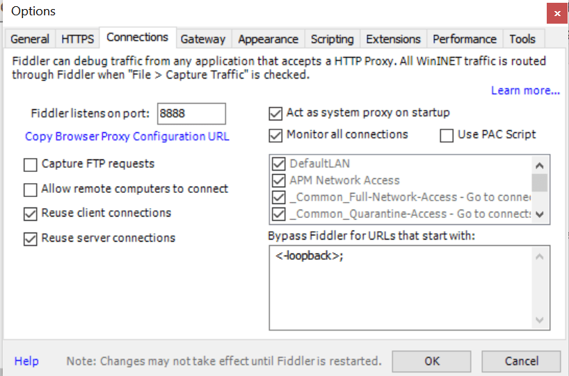
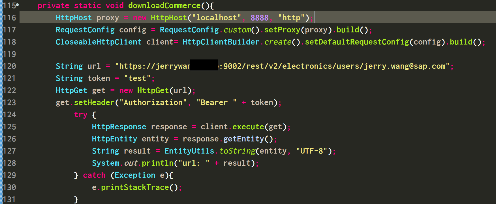
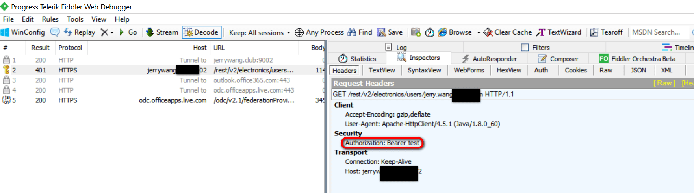
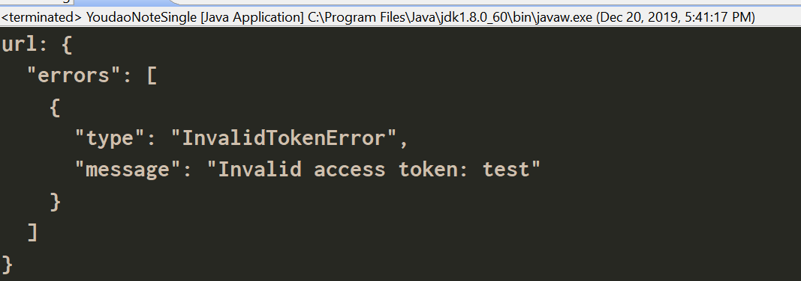
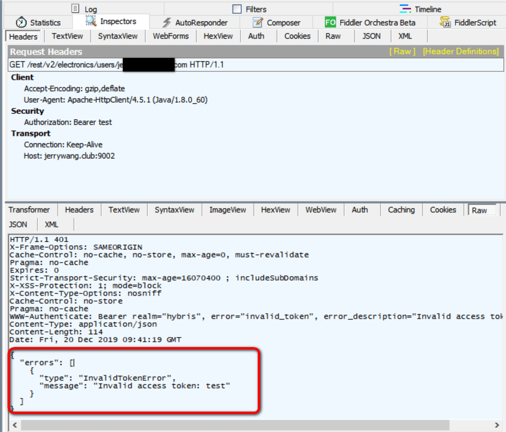

使用 Java的RestTemplate或者Apache的HTTPClient编程的时候，经常遇到需要跟踪Java代码发送的HTTP请求明细的情况。和javascript代码在浏览器里发送请求可以通过Chrome开发者工具方便地跟踪一样，对于Java代码发送的网络请求，我们也可以使用工具Fiddler来监控。

打开Fiddler，在connections面板里找到Fiddler监听的端口号8888：



如果是使用Apache的HTTPClient进行网络请求发送，代码如下：



使用HttpHost设置请求代理：

```Java
private static void downloadCommerce(){
    	//添加此代码 开始=====================
		HttpHost proxy = new HttpHost("localhost", 8888, "http");
		RequestConfig config = RequestConfig.custom().setProxy(proxy).build();
		CloseableHttpClient client= HttpClientBuilder.create().setDefaultRequestConfig(config).build();
		// 添加此代码 结束=====================
    
		String url = "https://jerrywang.com:9002/rest/v2/electronics/users/jerry.wang@sap.com";
		String token = "test";
	    HttpGet get = new HttpGet(url);
	    get.setHeader("Authorization", "Bearer " + token);
	        try {
	            HttpResponse response = client.execute(get);
	            HttpEntity entity = response.getEntity();
	            String result = EntityUtils.toString(entity, "UTF-8");
	            System.out.println("url: " + result);
	        } catch (Exception e){
	        	e.printStackTrace();
	        }
	}
```

执行Java应用，然后到Fiddler里，看到了监控到的HTTP请求各种明细，比如Java代码里硬编码的OAuth 2的认证token test：



Java代码收到的服务器端返回的错误消息：



这个错误消息在Fiddler里当然也是可以看到的：



在这种场景里，Fiddler扮演的就是类似Chrome开发者工具的角色。