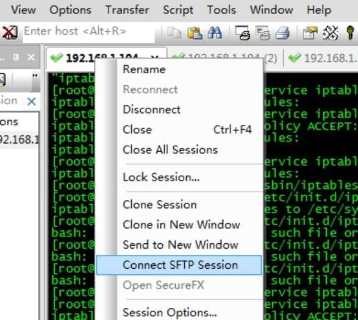
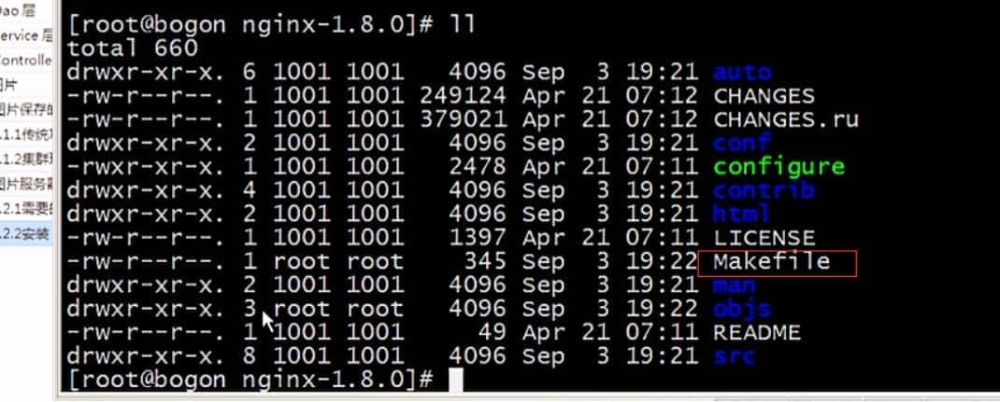
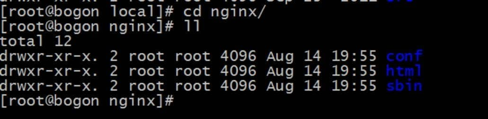
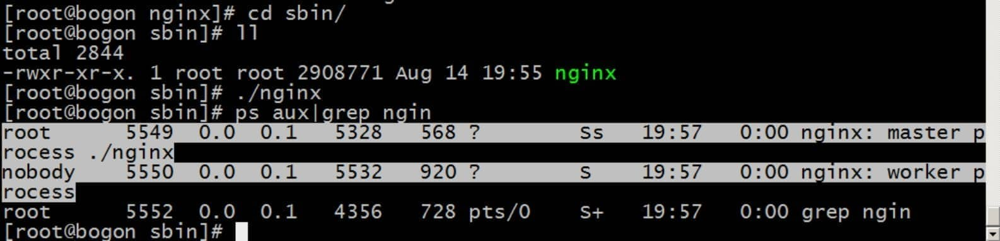
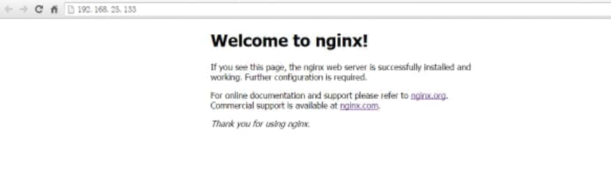
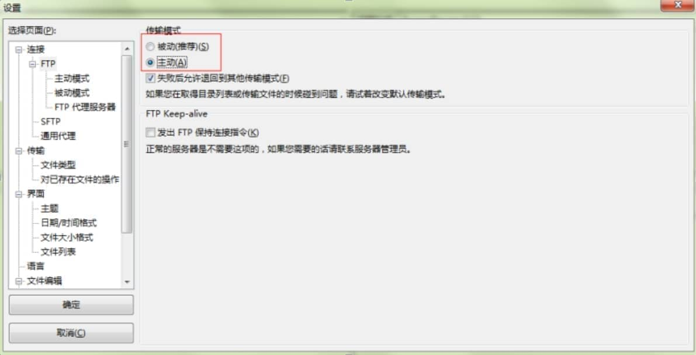
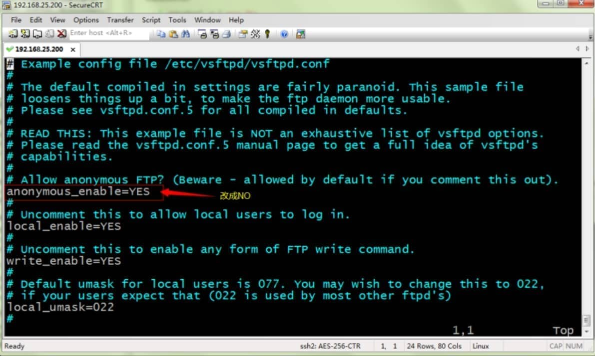
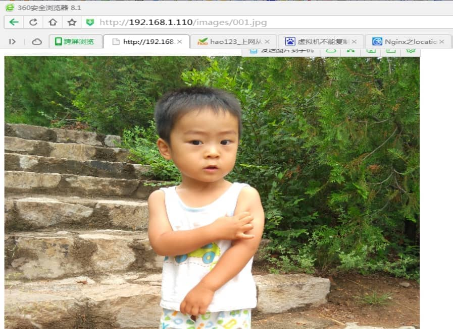

nginx+ftp搭建图片服务器

## **一、需要的组件**

图片服务器两个服务：

http：可以使用nginx做静态资源服务器。也可以使用apache。推荐使用nginx，效率更高。

### **Nginx（图片访问）：**

1、http服务

2、反向代理

3、负载均衡

### **ftp服务（图片上传）：**

使用linux做服务器，在linux中有个ftp组件vsftpd。

## **二、Nginx服务器搭建**

### **1.安装Nginx**

要求安装vmware虚拟机。

Linux：CentOS6.4（32）

Nginx：1.8.0

Vsftpd:需要在线安装。

虚拟机以及Linux安装很简单此处略。

Linux的局域网IP为：192.168.1.110

修改Linux的IP并立即生效的命令：

\#切换root管理员用户[root@localhost ~]# supassword #设置本机IP并立即生效   [root@localhost ~]# ifconfig eth0 192.168.1.110 netmask 255.255.255.0

#### 1.1、**nginx安装环境**(分为两种Linux系统环境中的安装)

nginx是C语言开发，建议在linux上运行，本教程使用Centos6.5作为安装环境。


**gcc**

安装nginx需要先将官网下载的源码进行编译，编译依赖 gcc 环境，如果没有gcc环境，需要安装

**centOs**系统安装gcc的命令：yum install gcc-c++ 

**Ubuntu**系统安装gcc的命令：apt-get install gcc


 **PCRE**

PCRE(Perl Compatible Regular Expressions)是一个Perl库，包括 perl 兼容的正则表达式库。nginx的http模块使用pcre来解析正则表达式，所以需要在linux上安装pcre库。

**centOs**系统安装：**yum install -y pcre pcre-devel**

**Ubuntu**系统安装：apt-get install libpcre3 libpcre3-dev

注：pcre-devel是使用pcre开发的一个二次开发库。nginx也需要此库。


**zlib**

zlib库提供了很多种压缩和解压缩的方式，nginx使用zlib对http包的内容进行gzip，所以需要在linux上安装zlib库。

**centOs**系统安装：**yum install -y zlib zlib-devel**

**Ubuntu**系统安装：apt-get install zlib1g zlib1g-dev

 

**openssl**

OpenSSL 是一个强大的安全套接字层密码库，囊括主要的密码算法、常用的密钥和证书封装管理功能及SSL协议，并提供丰富的应用程序供测试或其它目的使用。


nginx不仅支持http协议，还支持https（即在ssl协议上传输http），所以需要在linux安装openssl库。

**centOs**系统安装：**yum install -y openssl openssl-devel**

**Ubuntu**系统安装：sudo apt-get install openssl 
				 sudo apt-get install libssl-dev

nginx安装手册：<http://share.weiyun.com/cf9f67566a14ce65472509fb9fd34aea>


#### **1.2、把nginx安装包上传到服务器。**

 

在secureCRT打开sftp会话框，上传文件

使用put/get命令 或者直接拖拽文件


#### **1.3、解压缩(在安装包所在目录执行)**

```
[root@localhost ~]# tar -zxvf nginx-1.8.0.tar.gz
```


#### **1.4、配置makefile**

进入解压后的目录

```
[root@localhost ~]# cd nginx-1.8.0
```

执行下面的命令创建makefile（下面的prefix=/usr/local/nginx\ 表示的是nginx安装完成之后nginx所在的路径，若你想指定nginx所在的路径可以改变这里的值。若你想放在server文件夹中，则prefix=/server/nginx\）

```
./configure \
--prefix=/usr/local/nginx \
--pid-path=/var/run/nginx/nginx.pid \
--lock-path=/var/lock/nginx.lock \
--error-log-path=/var/log/nginx/error.log \
--http-log-path=/var/log/nginx/access.log \
--with-http_gzip_static_module \
--http-client-body-temp-path=/var/temp/nginx/client \
--http-proxy-temp-path=/var/temp/nginx/proxy \
--http-fastcgi-temp-path=/var/temp/nginx/fastcgi \
--http-uwsgi-temp-path=/var/temp/nginx/uwsgi \
--http-scgi-temp-path=/var/temp/nginx/scgi
```

**注意：上边将临时文件目录指定为/var/temp/nginx，需要在/var下创建temp及nginx目录**

```
[root@bogon nginx-1.8.0]# mkdir /var/temp/nginx -p
```



#### **1.5、编译安装**

编译：

```
[root@localhost nginx-1.8.0]# make
```

安装：

```
[root@localhost nginx-1.8.0]# make  install
```

安装成功以后进入安装目录（创建makedir时指定的”--prefix=/usr/local/nginx \“）

```
[root@localhost nginx-1.8.0]# cd /usr/local/nginx/
```

 


### **2、nginx运行**

#### **2.1、启动nginx**

```
[root@localhost nginx]# cd sbin
[root@localhost sbin]# ./nginx
```



#### **2.2、关闭**

```
[root@localhost sbin]# ./nginx -s stop
```

#### **2.3、重新加载配置文件**

```
[root@localhost sbin]# ./nginx -s reload
```

#### **2.4、关闭防火墙**

1）关闭

```
[root@localhost sbin]# service iptables stop
iptables: Flushing firewall rules:                         [  OK  ]
iptables: Setting chains to policy ACCEPT: filter          [  OK  ]
iptables: Unloading modules:                               [  OK  ]
```

2）也可以修改防火墙配置文件：

```
[root@localhost sbin]# vim /etc/sysconfig/iptables
```

//在倒数第二行加入80端口  

```
-A RH-Firewall-1-INPUT -m state --state NEW -m tcp -p tcp --dport 80 -j ACCEPT 
```

修改后需要重启防火墙：

```
[root@localhost sbin]# service iptables restart
```

3）另外一种解决办法

```
[root@localhost ]# /sbin/iptables -I INPUT -p tcp --dport 80 -j ACCEPT  
[root@localhost ]# /etc/init.d/iptables save  
[root@localhost ]# /etc/init.d/iptables restart 
```


#### **2.5、访问nginx服务**

 

### **3、关于图片服务器配置**

进入配置文件目录

```
cd /usr/local/nginx/conf/
```

nginx的默认配置文件nginx.config

```
#user  nobody;worker_processes  1;
#error_log  logs/error.log;#error_log  logs/error.log  notice;#error_log  logs/error.log  info;
#pid        logs/nginx.pid;

events {
    worker_connections  1024;
}


http {
    include       mime.types;
    default_type  application/octet-stream;
 
    #log_format  main  'remote_addr - remote_user [time_local] "request" '
    #                  'status body_bytes_sent "$http_referer" '
    #                  '"http_user_agent" "http_x_forwarded_for"';

    #access_log  logs/access.log  main;

    sendfile        on;
    #tcp_nopush     on;

    #keepalive_timeout  0;
    keepalive_timeout  65;

    #gzip  on;

    server {
        listen       80;
        server_name  localhost;

        #charset koi8-r;

        #access_log  logs/host.access.log  main;

        location / {
            root   html;
            index  index.html index.htm;
        }

        #error_page  404              /404.html;

        # redirect server error pages to the static page /50x.html
        #
        error_page   500 502 503 504  /50x.html;
        location = /50x.html {
            root   html;
        }

        # proxy the PHP scripts to Apache listening on 127.0.0.1:80
        #
        #location ~ .php$ {
        #    proxy_pass   http://127.0.0.1;
        #}

        # pass the PHP scripts to FastCGI server listening on 127.0.0.1:9000
        #
        #location ~ .php$ {
        #    root           html;
        #    fastcgi_pass   127.0.0.1:9000;
        #    fastcgi_index  index.php;
        #    fastcgi_param  SCRIPT_FILENAME  /scripts$fastcgi_script_name;
        #    include        fastcgi_params;
        #}

        # deny access to .htaccess files, if Apache's document root
        # concurs with nginx's one
        #
        #location ~ /.ht {
        #    deny  all;
        #}
    }

    # another virtual host using mix of IP-, name-, and port-based configuration
    #
    #server {
    #    listen       8000;
    #    listen       somename:8080;
    #    server_name  somename  alias  another.alias;
 
    #    location / {
    #        root   html;
    #        index  index.html index.htm;
    #    }
    #}

 
    # HTTPS server
    #
    #server {
    #    listen       443 ssl;
    #    server_name  localhost;
 
    #    ssl_certificate      cert.pem;
    #    ssl_certificate_key  cert.key;

    #    ssl_session_cache    shared:SSL:1m;
    #    ssl_session_timeout  5m;

    #    ssl_ciphers  HIGH:!aNULL:!MD5;
    #    ssl_prefer_server_ciphers  on;

    #    location / {
    #        root   html;
    #        index  index.html index.htm;
    #    }
    #}
}
```

配置图片服务器

方法一、在配置文件server{}中location /{} 修改配置：

```
默认请求
location / {
   root  /home/ftpuser/www;#定义服务器的默认网站根目录位置
   index index.html index.php index.htm;#定义首页索引文件的名称
}
```

其中：/home/ftpuser/www;为创建FTP服务账户ftpuser的根目录下的www目录

方法二、在http{}内配置新服务

```
server {
        listen       8080;
        server_name  localhost;
 
        #charset utf-8;

        #access_log  logs/host.access.log  main;

        #默认请求
        location / {
            root  /home/ftpuser/www;#定义服务器的默认网站根目录位置
            index index.html index.php index.htm;#定义首页索引文件的名称
           }
        }
```


## **因为需要开始端口号8080，所以要在防火墙中开启8080端口**

```
[root@localhost ]# /sbin/iptables -I INPUT -p tcp --dport 8080 -j ACCEPT  
[root@localhost ]# /etc/init.d/iptables save  
[root@localhost ]# /etc/init.d/iptables restart 
```


## **三、FTP服务的安装与启动**

### **1、安装vsftpd组件**

vsftpd组件为Linux的FTP服务组件，安装方式为在线安装。

```
[root@localhost ~]# yum -y install vsftpd
```

安装完后，有/etc/vsftpd/vsftpd.conf 文件，是vsftp的配置文件。


### **2、添加一个ftp用户**

此用户就是用来登录ftp服务器用的。

```
[root@localhost ~]# useradd ftpuser
```

这样一个用户建完，可以用这个登录，记得用普通登录不要用匿名了。登录后默认的路径为 /home/ftpuser.

为这个ftp账户添加密码

```
[root@localhost ~]# passwd ftpuser
```

输入两次密码后修改密码。


### **3、** **防火墙开启21端口**

因为ftp默认的端口为21，而centos默认是没有开启的，所以要修改iptables文件

```
[root@localhost ~]# vim /etc/sysconfig/iptables
```

在行上面有22 -j ACCEPT 下面另起一行输入跟那行差不多的，只是把22换成21，然后：wq保存。

还要运行下,重启iptables

```
[root@localhost ~]# service iptables restart
```


### **4、** **修改selinux**

外网是可以访问上去了，可是发现没法返回目录（使用ftp的主动模式，被动模式还是无法访问），也上传不了，因为selinux作怪了。

修改selinux：

执行以下命令查看状态：

```
[root@localhost ~]# getsebool -a | grep ftp  
allow_ftpd_anon_write --> off
allow_ftpd_full_access --> off
allow_ftpd_use_cifs --> off
allow_ftpd_use_nfs --> off
ftp_home_dir --> off
ftpd_connect_db --> off
ftpd_use_passive_mode --> off
httpd_enable_ftp_server --> off
tftp_anon_write --> off
```

执行上面命令，再返回的结果看到两行都是off，代表，没有开启外网的访问

```
[root@localhost ~]# setsebool -P allow_ftpd_full_access on
[root@localhost ~]# setsebool -P ftp_home_dir on
```

这样应该没问题了（如果，还是不行，看看是不是用了ftp客户端工具用了passive模式访问了，如提示Entering Passive mode，就代表是passive模式，默认是不行的，因为ftp passive模式被iptables挡住了，下面会讲怎么开启，如果懒得开的话，就看看你客户端ftp是否有port模式的选项，或者把passive模式的选项去掉。如果客户端还是不行，看看客户端上的主机的电脑是否开了防火墙，关吧）

FileZilla的主动、被动模式修改：

菜单：编辑→设置



### **5、**关闭匿名访问

修改/etc/vsftpd/vsftpd.conf文件：

 

重启ftp服务：

```
[root@localhost ~]# service vsftpd restart
```


### **6、** **开启被动模式**

默认是开启的，但是要指定一个端口范围，打开vsftpd.conf文件，在后面加上

```
pasv_min_port=30000pasv_max_port=30999
```

表示端口范围为30000~30999，这个可以随意改。改完重启一下vsftpd

由于指定这段端口范围，iptables也要相应的开启这个范围，所以像上面那样打开iptables文件。

也是在21上下面另起一行，更那行差不多，只是把21 改为30000:30999,然后:wq保存，重启下iptables。这样就搞定了。


### **7、**设置开机启动vsftpd ftp服务

```
[root@localhost ~]# chkconfig vsftpd on
```


## **四、部署验证**

在www下新建文件夹images，下面放一张图片001.jpg

测试访问：http://192.168.1.110/images/001.jpg




## **五、Java实现FTP上传**

上传文件测试代码：

```
package com.taotao.service.impl;

import java.io.File;import java.io.FileInputStream;import java.io.IOException;import java.net.SocketException;
import org.apache.commons.net.ftp.FTP;import org.apache.commons.net.ftp.FTPClient;import org.junit.Test;
import com.taotao.util.FtpUtil;

public class FTPTest {
	@Test
	public void testFtpClient() throws SocketException, IOException {
		FTPClient ftpClient = new FTPClient();
		try {
			// 连接FTP服务器
			ftpClient.connect("192.168.1.110", 21);
			
			// 登录FTP服务器
			ftpClient.login("ftpuser", "123");

			// 将文件转换为IO
			FileInputStream fileInputStream = new FileInputStream(new File("C:\Users\a\Pictures\16-040836_50.jpg"));

			// 指定上传远程目录
			ftpClient.changeWorkingDirectory("/home/ftpuser/www/images");// 绝对路径
			// ftpClient.changeWorkingDirectory("www/images");//相对路径

			// 设置上传文件类型
			ftpClient.setFileType(FTP.BINARY_FILE_TYPE);

			// 上传文件并指定远程文件名
			// ftpClient.storeFile("中文名.jpg", fileInputStream);//中文会出现乱码
			ftpClient.storeFile("a.jpg", fileInputStream);

		} catch (Exception e) {
			e.printStackTrace();
		} finally {

			// 退出登录
			ftpClient.logout();

			// 断开连接
			ftpClient.disconnect();
		}
	}


	@Test
	public void testFTPUtil() {
		try {
			FileInputStream fileInputStream = new FileInputStream(new File("C:\Users\a\Pictures\16-040836_50.jpg"));
			String filename=new String("中文名2.jpg".getBytes("utf-8"),"iso-8859-1");//解决中文文件名乱码
			FtpUtil.uploadFile("192.168.1.110", 21, "ftpuser", "123", "/home/ftpuser/www/images", "/2016/09/26",filename ,fileInputStream);

		} catch (Exception e) {
			e.printStackTrace();
		}
	}
}
```


其中FtpUtil类：

```
package com.taotao.util;

import java.io.File;import java.io.FileInputStream;import java.io.FileNotFoundException;
import java.io.FileOutputStream;import java.io.IOException;import java.io.InputStream;import java.io.OutputStream;
import org.apache.commons.net.ftp.FTP;import org.apache.commons.net.ftp.FTPClient;
import org.apache.commons.net.ftp.FTPFile;import org.apache.commons.net.ftp.FTPReply;

/**
- ftp上传下载工具类
- <p>Title: FtpUtil</p>
- <p>Description: </p>
- <p>Company: www.itcast.com</p> 
  - @author	入云龙
    @date	2015年7月29日下午8:11:51
- @version 1.0

 */public class FtpUtil {

	/** 
	 * Description: 向FTP服务器上传文件 
	 * @param host FTP服务器hostname 
	 * @param port FTP服务器端口 
	 * @param username FTP登录账号 
	 * @param password FTP登录密码 
	 * @param basePath FTP服务器基础目录,需要绝对路径 比如：/home/ftpuser/www/images
	 * @param filePath FTP服务器文件存放路径。例如分日期存放：/2015/01/01。文件的路径为basePath+filePath
	 * @param filename 上传到FTP服务器上的文件名 
	 * @param input 输入流 
	 * @return 成功返回true，否则返回false 
	 */  

	public static boolean uploadFile(String host, int port, String username, String password, String basePath,
			String filePath, String filename, InputStream input) {

		boolean result = false;
		FTPClient ftp = new FTPClient();

		try {
			int reply;
			ftp.connect(host, port);// 连接FTP服务器
			
			// 如果采用默认端口，可以使用ftp.connect(host)的方式直接连接FTP服务器
			ftp.login(username, password);// 登录
			reply = ftp.getReplyCode();
			if (!FTPReply.isPositiveCompletion(reply)) {
				ftp.disconnect();
				return result;
			}

			//切换到上传目录
			if (!ftp.changeWorkingDirectory(basePath+filePath)) {
			
				//如果目录不存在创建目录
				String[] dirs = filePath.split("/");
				String tempPath = basePath;
				for (String dir : dirs) {
					if (null == dir || "".equals(dir)) continue;
					tempPath += "/" + dir;
					
					if (!ftp.changeWorkingDirectory(tempPath)) {
						if (!ftp.makeDirectory(tempPath)) {
							return result;
						} else {
							ftp.changeWorkingDirectory(tempPath);
						}
					}
				}
			}

			//设置上传文件的类型为二进制类型
			ftp.setFileType(FTP.BINARY_FILE_TYPE);

			//上传文件
			if (!ftp.storeFile(filename, input)) {
				return result;
			}

			input.close();
			ftp.logout();
			result = true;
		} catch (IOException e) {
			e.printStackTrace();
		} finally {
			if (ftp.isConnected()) {
				try {
					ftp.disconnect();

				} catch (IOException ioe) {
				}
			}
		}
		return result;
	}

	
	/** 
	 * Description: 从FTP服务器下载文件 
	 * @param host FTP服务器hostname 
	 * @param port FTP服务器端口 
	 * @param username FTP登录账号 
	 * @param password FTP登录密码 
	 * @param remotePath FTP服务器上的相对路径 
	 * @param fileName 要下载的文件名 
	 * @param localPath 下载后保存到本地的路径 
	 * @return 
	 */  

	public static boolean downloadFile(String host, int port, String username, String password, String remotePath,
			String fileName, String localPath) {
			
		boolean result = false;
		FTPClient ftp = new FTPClient();

		try {
			int reply;
			ftp.connect(host, port);
			
			// 如果采用默认端口，可以使用ftp.connect(host)的方式直接连接FTP服务器
			ftp.login(username, password);// 登录
			reply = ftp.getReplyCode();

			if (!FTPReply.isPositiveCompletion(reply)) {
				ftp.disconnect();
				return result;
			}

			ftp.changeWorkingDirectory(remotePath);// 转移到FTP服务器目录
			FTPFile[] fs = ftp.listFiles();

			for (FTPFile ff : fs) {
				if (ff.getName().equals(fileName)) {
					File localFile = new File(localPath + "/" + ff.getName());

					OutputStream is = new FileOutputStream(localFile);
					ftp.retrieveFile(ff.getName(), is);
					is.close();
				}
			}

			ftp.logout();
			result = true;
		} catch (IOException e) {
			e.printStackTrace();
		} finally {
			if (ftp.isConnected()) {
				try {
					ftp.disconnect();
				} catch (IOException ioe) {
				}
			}
		}
		return result;
	}

	

	public static void main(String[] args) {
		try {  
	        FileInputStream in=new FileInputStream(new File("D:\temp\image\gaigeming.jpg"));  
	        boolean flag = uploadFile("192.168.25.133", 21, "ftpuser", "ftpuser", "/home/ftpuser/www/images","/2015/01/21", "gaigeming.jpg", in);  

	        System.out.println(flag);  
	    } catch (FileNotFoundException e) {  
	        e.printStackTrace();  
	    }  
	}
}
```

 

 