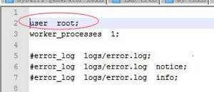

# **解决Nginx服务器中403 forbidden的错误**

nginx 的 403 Forbidden errors 表示你在请求一个资源文件但是nginx不允许你查看。
403 Forbidden 只是一个HTTP状态码，像404,200一样不是技术上的错误。

**哪些场景需要返回403状态码的场景？**
1.网站禁止特定的用户访问所有内容，例：网站屏蔽某个ip访问。
2.访问禁止目录浏览的目录，例：设置autoindex off后访问目录。
3.用户访问只能被内网访问的文件。
以上几种常见的需要返回 403 Forbidden 的场景。
由于服务器端的错误配置导致在不希望nginx返回403时返回403 Forbidden。

## 配置不当导致

**1.权限配置不正确这个是nginx出现403 forbidden最常见的原因。**
为了保证文件能正确执行，nginx既需要文件的读权限,又需要文件所有父目录的可执行权限。
例如，当访问/usr/local/nginx/html/image.jpg时，nginx既需要image.jpg文件的可读权限，也需要/,/usr,/usr/local,/usr/local/nginx,/usr/local/nginx/html的可以执行权限。
解决办法:设置所有父目录为755权限，设置文件为644权限可以避免权限不正确。

解决办法（亲测）：使用root用户，即超级用户，将存放图片的那个用户下的所有文件夹及文件都设置为可读可写可执行；

 

流程：

1、首先使用root用户通过SecureCRTPortable工具远程登录Linux服务器

2、接着通过命令到home目录下：cd /home/

3、通过权限控制命令将home目录下将存放图片的那个用户对应的文件夹的权限改为对所有人都rwx，即对所有人都可以读取、修改、执行，这样nginx才可以读取到该用户指定目录下的文件的信息。（只要修改了该文件夹对所有用户都可读可写可执行。那么该文件夹下面的所有子文件夹及文件都会被改为对所有用户可读可写可执行）；执行命令可以参照Linux学习资料中的记录（例如：chmod  a+rwx  aaa  表示为所有添加用户都添加aaa文件夹的读、写、执行权限，也就是说所有用户都可以对该文件夹下的文件读、写、执行，当然也包括了nginx）

**2.目录索引设置错误（index指令配置）网站根目录不包含index指令设置的文件。**
例如，运行PHP的网站，通常像这样配置index
index  index.html index.htm index.php;
当访问该网站的时，nginx 会按照 index.html，index.htm ，index.php 的先后顺序在根目录中查找文件。如果这三个文件都不存在，那么nginx就会返回403 Forbidden。
如果index中不定义 index.php ，nginx直接返回403 Forbidden而不会去检查index.php是否存在。
同样对于如果运行jsp, py时也需要添加index.jsp,index.py到目录索引指令index中。
解决办法:添加首页文件到index指令，常见的是index.php，index.jsp，index.jsp或者自定义首页文件。

 

 

**方法三：也是目前觉得最好用的方法（亲测可用）**

第一步：首先进到nginx的配置文件的目录，即：nginx/conf/nginx.conf

第二步：打开配置文件nginx.conf；将配置文件中最上面的user改为root用户，也就是说，使得nginx拥有root用户的访问权限。那么nginx就可以访问所有的文件了，也就包括图片文件。

 