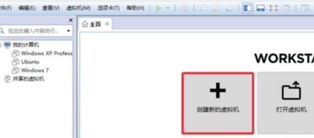
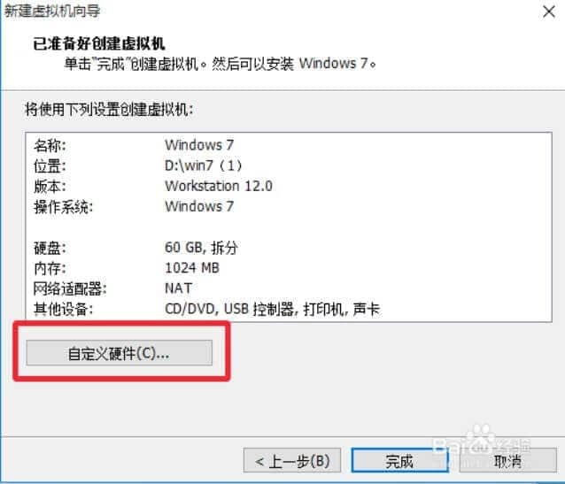
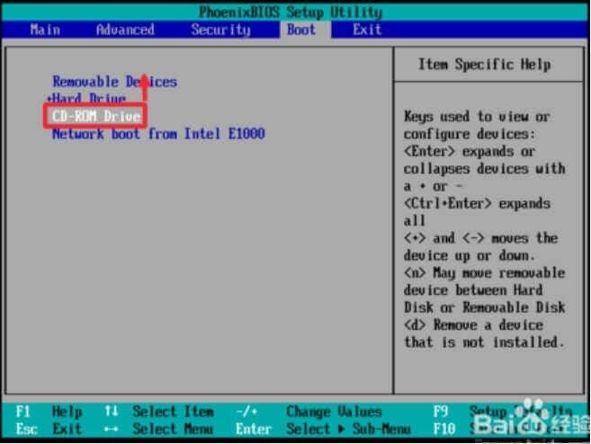
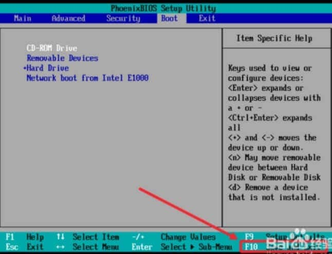
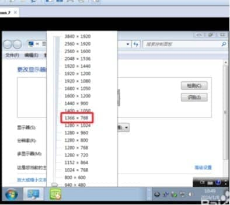
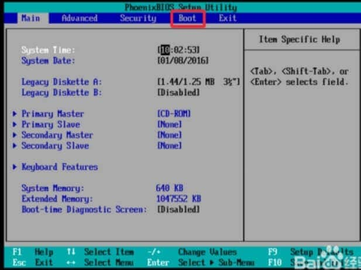
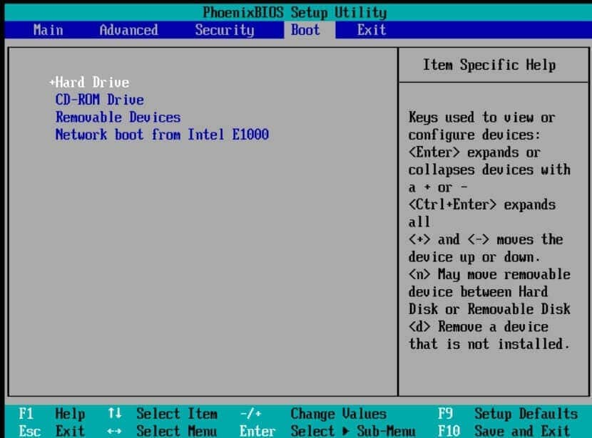

# [**VMware12版虚拟机怎么安装win7系统**](https://www.cnblogs.com/Yimi/p/5899060.html)

## **工具/原料**

 

VMware workstation 12

windows7镜像ios系统文件

 

## **建立一个新的虚拟机**

 

1、打开我们的虚拟机，然后在文件中选择新建一个虚拟机，或者在主页上选择新建一个虚拟机，都是一样的。

[

 

 

2、在这里我们简单行事，选择“典型”安装。

3、在这里点击浏览，将我们下载好的win7镜像系统添加进去，然后选择第三个“稍后安装操作系统”点击下一步继续操作。

 

4、选择我们所安装的系统的名称，上面的选择第一个，下面的选择win7就可以了。

5、然后我们新建一个文件夹，将它保存在我们的新建文件夹中，不要保存在系统盘。

6、设置硬盘大小，一般按照默认设置来，也可以加大一点，看个人的需求，下面的选择第二个，方便我们等会分区，然后点击下一步。

7、在这里我们选择自定义硬件。

 

8、在左边的硬件当中选择第三个“CD/DVD”然后右侧的连接中，选择“使用ios映像文件“点击”浏览“将我们下载好的ios镜像文件添加到这里面来。

8.1、点击下面的”高级“，选择第三个”IDE“点击确定。然后关闭硬件设置。

**END**

 

## **安装windows7系统**

1、建立好虚拟机之后，我们就要安装系统了，安装过程并没有那么复杂，按照提示操作就可以了。

2、右键点击我们刚才创建的虚拟机的名称，在电源中，选择”打开电源时进入固件“（进boot）

3、稍后我们就进入到BIOS设置界面，在这里我们使用键盘上来操作，使用方向键将光标移动到第四个选项”boot“上面来。

 

4、然后找到"CD-ROM drive"，使用”+“号键将它的位置调整到第一个上面来。

 

5、按F10保存我们的设置更改，然后弹出对话框我们选择”yes“回车确定。

 

6、进入到工具界面，我们选择第五个，直接分成4个区，这样非常简单，不用我们自己去分区。

 

7、选择”yes“回车确定，这两个对话框我们都选择”yes“。

8、然后再次回到系统工具箱，我们选择第一个，将系统安装在我们的分盘上，直接按”1“键就可以了，你也可以使用鼠标操作。

9、然后就是漫长的等待了，我们耐心等待安装即可，反正心急吃不了热豆腐，趁这个时间去喝杯茶，跑杯咖啡，或者浏览一会网页啥的都行，干等就没意思了。

10、安装程序正在启动服务。

11、正在准备windows。

12、当它返回打我们的工具界面时，我们不要有任何的操作，右下角有一个时间，我们等着就好。

 

13、稍后我们就能进入到我们的系统桌面了，系统安装也就到此完结了。

14、当然，我们刚安装完之后一般不是最佳分辨率，我们鼠标右键点击桌面，然后调整合适的分辨率，点击确定保存设置即可全屏。

15、进入我们所熟悉的win7界面。

16、**安装完成之后，先关掉虚拟机，然后再一次进入到boot，将系统的默认启动项改为硬盘启动，也就是将 +Hard Drive 放到第一位**

 

 