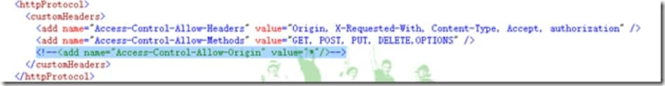

# [利用nginx 反向代理解决跨域问题](https://www.cnblogs.com/bninp/p/5694277.html)

  说到nginx，不得不说真的很强大，也带来很多便利用于解决一些头疼的难题。

  一般来说可以用来做：静态页面的服务器、静态文件缓存服务器、网站反向代理、负载均衡服务器等等，而且实现这一切，基本只需要改改那万能的配置文件即可。

之前的博文记录了作为负载均衡。这里先记录一下作为静态页面的服务器和反向代理跨域的使用。

结合之前 《[angularjs+webapi2 跨域Basic 认证授权](http://www.cnblogs.com/bninp/p/5512057.html)》的案例，对跨域的方式进行改造一下。

**一.静态页面服务器**

nginx.conf 的配置（其实默认的也是如此，所以作为静态服务器只需要将静态文件移动到nginx下的html文件夹里就可以了）

```shell
server {
      listen       8094; #监听端口
      server_name  localhost; #
      #charset koi8-r;
      #access_log  logs/host.access.log  main;

     location / {
          root   html;#文件根目录
          index  index.html index.htm;#默认起始页
      }
        }
```


然后打开浏览器 输入 localhost:8094 即可

[](http://images2015.cnblogs.com/blog/680116/201607/680116-20160722103543607-568091696.png)

就是这么简单

**二.反向代理服务器-》跨域**

之前我们跨域是借助了浏览器对 Access-Control-Allow-Origin 的支持。但有些浏览器是不支持的，所以这并非是最佳方案

现在我们来利用nginx 通过反向代理 满足浏览器的同源策略实现跨域

首先，我先注释掉之前的跨域设置

[](http://images2015.cnblogs.com/blog/680116/201607/680116-20160722103544966-1134184964.png)

[](http://images2015.cnblogs.com/blog/680116/201607/680116-20160722103546357-270128260.png)

然后访问一下index1.html

[](http://images2015.cnblogs.com/blog/680116/201607/680116-20160722103547951-627726748.png)

提示了跨域问题

然后我们回到nginx.conf 配置一个反向代理路径（新增红色部分）

```
server {
        listen       8094;
        server_name  localhost;

        #charset koi8-r;
        #access_log  logs/host.access.log  main;
       location / {
            root   html;
            index  index.html index.htm;
        }

      location /apis {
    	rewrite  ^.+apis/?(.*) /1 break;
    	include  uwsgi_params;
       	proxy_pass   http://localhost:1894;
       }
}
```

配置说明：配置一个/apis  重写到我们真正的api地址[http://localhost:1894](http://localhost:1894/)  形成一个代理的过程。

然后更改一下index1.html的api请求地址

[](http://images2015.cnblogs.com/blog/680116/201607/680116-20160722103549638-1847186263.png)

这样这个api的地址就跟当前页面index1.html处于同源位置了。就是我们配置的nginx监听地址 localhost:8094

然后我们再次在浏览器中访问 index1.html   可能请求到的知识缓存页面 请清除缓存或重启nginx

[](http://images2015.cnblogs.com/blog/680116/201607/680116-20160722103551294-1738563456.png)

没有了跨域问题。 这里因为我之前登陆过 并记录了 token 所以没有提示登录

小结：写得不是很细，当作笔记，如伤过客，诚挚抱歉。

 