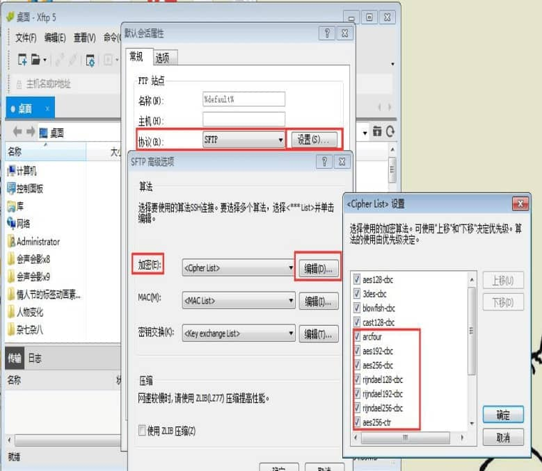
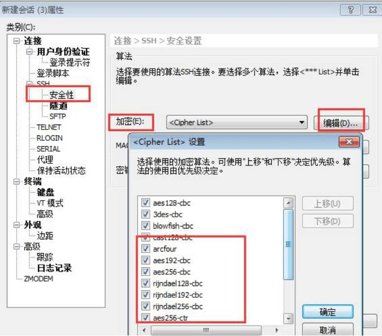

# 转：Xshell显示找不到匹配的outgoing encryption算法怎么办

由用户反应在使用xshell和xftp连接debian 7时出现找不到匹配的outgoing encryption算法的错误提示，本集小编整理了一份解决方法，大家可以试试看。

## 问题阐述：

在用xshell 4连接debian 7出现找不到匹配的outgoing encryption算法的错误提示

 

## 原因分析：

小编试着用[xshell 5](http://www.xshellcn.com/xshell.html)连接时发现没有出现问题，因此推断可能有两个原因：

1、升级过ssh的相关依赖组件(openssl)、或openssh的版本。

2、xshell的版本过低，没有内置或开启对应的加密算法。

 

## 解决方法：

1、针对openssh升级：

远端的ssh服务升级后，其对应的加密算法均作了升级、修改，而本地的缓存安全信息并无更新，从而导致无法正常登录。建议选cast-128-ctr、cast-256-ctr

 

图1：加密算法不匹配

升级openssh后，出现Xshell登陆时报错：找不到匹配的outgoing encryption算法（No matching outgoing encryption algorithm found），此时将版本还原即可。

**2、*****\*针对xshell的版本过低，没有内置或开启对应的加密算法，解决如下：\****

 

图2：勾选aes相关选项

1）对于xshell，点击：属性—类别—安全性—加密—编辑，将那些与aes相关的加密算法选上，就能基本上解决这个问题了。如果找不到这几个选项，说明你要升级Xshell了。

2）对于Xftp，点击：菜单文件—属性—设置—>编辑加密算法，将aes相关的选项勾上。不行同样也需要升级。

 