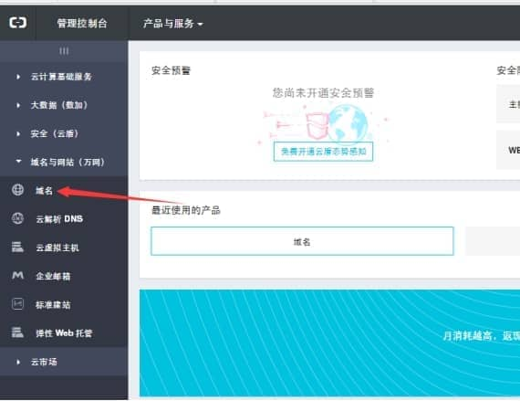
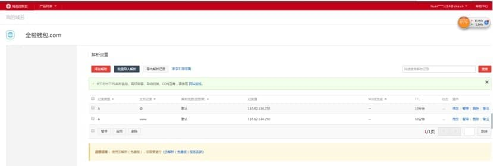

# **从域名到网站，只需四步，轻松访问**

第一步、注册域名(在万网购买域名)，并进行域名的备案（约 20 个工作日）

首先您需要先拥有一个域名，点击这里查看 ，

 

第二步、购买阿里云服务器，并为阿里云服务器安装镜像（即系统和tomcat和nginx等）

 

第三步、绑定域名，并设置域名解析

接下来还需要您在服务器上绑定您的域名（主机域名绑定），同时将域名指向您的网站（就是通过域名解析将域名与服务器 IP 地址绑定）：

 

首先是登录阿里云服务器，并进入到域名和万网选项中

 

 

点击域名解析

 

 

**1**、我要设置解析，下面就是添加域名的解析，必须是添加一条A记录，将公网ip绑定在该域名下就行了。

 

 

第四步、最后一步就是配置nginx，在默认的配置中，阿里云服务器的nginx是默认访问的是nginx服务器下的html文件夹下面的index.html文件的。参照nginx配置。

 