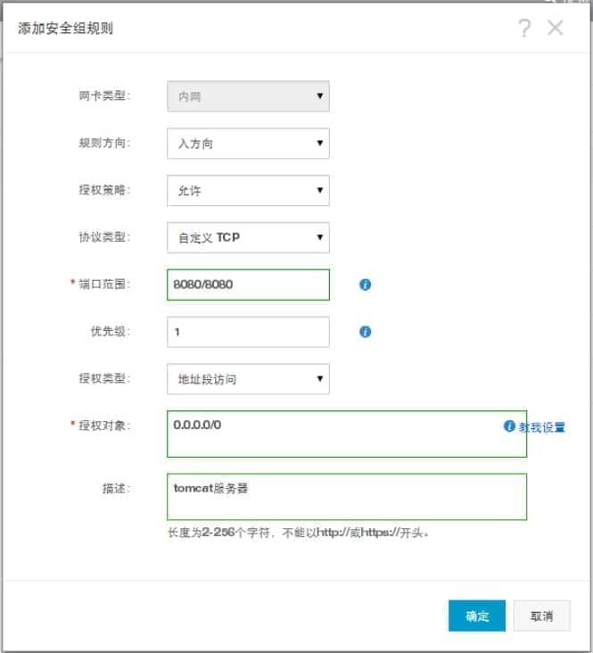

1、购买了一个阿里云服务器之后，首先安装一个带有java开发环境的镜像，安装完之后就可以将java项目部署到该阿里云服务器的tomcat上了；当我们运行tomcat服务器，会发现通过ip+8080端口访问不了该tomcat，那是因为阿里云服务器默认8080端口是不开放的，我们需要手动开放8080端口；在阿里云中开放某个端口是需要通过添加安全组规则来实现的，规则如下：

 

# **添加安全组规则**   

您可以添加安全组规则，允许或禁止安全组内的 ECS 实例对公网、内网或私网的访问：

· **VPC 网络**：只需要设置出方向和入方向的规则，不区分私网和公网。

· **经典网络**：需要分别设置公网和内网的出方向和入方向规则。

安全组规则的变更会自动应用到安全组内的 ECS 实例上。

 

## **前提条件**

您应该已经创建了一个安全组。参考 [创建安全组](https://help.aliyun.com/document_detail/25468.html)。

您已经知道自己的实例需要允许或禁止哪些公网、内网或私网的访问。

 

## **操作步骤**

1、登录 [云服务器 ECS 管理控制台](#/home)。

2、在左侧导航栏中，选择 **网络和安全** > **安全组**。

3、选择目标地域。

4、找到要配置授权规则的安全组，在 **操作** 列中，单击 **配置规则**。

5、在 **安全组规则** 页面上，单击 **添加安全组规则**。

 

| **协议** | SSH    | telnet | HTTP | HTTPS      | MS SQL |
| -------- | ------ | ------ | ---- | ---------- | ------ |
| **端口** | 22     | 23     | 80   | 443        | 1433   |
| **协议** | Oracle | MySQL  | RDP  | PostgreSQL | Redis  |
| **端口** | 1521   | 3306   | 3389 | 5432       | 6379   |

如果您不需要设置 ICMP、GRE 协议规则，或者您想使用以下协议的默认端口，都可以使用 **快速创建规则** 功能：

 

图中的参数配置说明，请参考第 6 步描述。

 

在弹出的对话框中，设置以下参数：

 

**网卡类型**：

如果是专有网络的安全组，不需要选择：

如果您的实例能访问公网，可以设置公网和私网的访问规则。

如果您的实例不能访问公网，只能设置私网的访问规则。

 

如果是经典网络的安全组，可以选择 **公网** 或 **内网**。

**规则方向**：

**出方向**：是指 ECS 实例访问内网或私网中其他 ECS 实例或者公网上的资源。

**入方向**：是指内网或私网中的其他 ECS 实例或公网上的资源访问 ECS 实例。

**授权策略**：选择 **允许** 或 **拒绝**。

这里的 **拒绝** 策略是直接丢弃数据包，不给任何回应信息。如果 2 个安全组规则其他都相同只有授权策略不同，则 **拒绝** 授权生效，**接受** 授权不生效。

**协议类型** 和 **端口范围**：端口范围的设置受选择的协议类型影响。下表是协议类型与端口范围的关系。

| **协议类型** | **端口范围**                                                 | **应用场景**                                                 |
| ------------ | ------------------------------------------------------------ | ------------------------------------------------------------ |
| 全部         | 显示为 -1/-1，表示不限制端口。                               | 可用于完全互相信任的应用场景。                               |
| 全部 ICMP    | 显示为 -1/-1，表示不限制端口。                               | 使用 ping 程序检测实例之间的通信状况。                       |
| 全部 GRE     | 显示为 -1/-1，表示不限制端口。                               | 用于 VPN 服务。                                              |
| 自定义 TCP   | 自定义端口范围，有效的端口值是 1−65535，端口范围的合法格式是 **开始端口**/**结束端口**。即使是一个端口，也需要采用合法格式设置端口范围，比如：80/80 表示端口 80。 | 可用于允许或拒绝一个或几个连续的端口。                       |
| 自定义 UDP   |                                                              |                                                              |
| SSH          | 显示为 22/22。默认为 22 端口。您可以在登录 ECS 实例后修改端口号，参考文档：[服务器默认远程端口修改](https://help.aliyun.com/document_detail/51644.html)。 | 用于 SSH 远程连接到 Linux 实例。                             |
| TELNET       | 显示为 23/23。                                               | 用于 Telnet 远程登录实例。                                   |
| HTTP         | 显示为 80/80。                                               | 实例作为网站或 Web 应用的服务器。可以参考 [安装并使用 Web 服务](https://help.aliyun.com/document_detail/58273.html)。 |
| HTTPS        | 显示为 443/443。                                             | 实例作为网站或 Web 应用的服务器，而且需要支持 HTTPS 协议。   |
| MS SQL       | 显示为 1433/1433。                                           | 实例作为 MS SQL 服务器。                                     |
| Oracle       | 显示为 1521/1521。                                           | 实例作为 Oracle SQL 服务器。                                 |
| MySQL        | 显示为 3306/3306。                                           | 实例作为 MySQL 服务器。                                      |
| RDP          | 显示为 3389/3389。默认为 3389 端口。您可以在登录 ECS 实例后修改端口号，参考文档：[服务器默认远程端口修改](https://help.aliyun.com/document_detail/51644.html)。 | 实例是 Windows 实例，需要远程桌面连接实例。                  |
| PostgreSQL   | 显示为 5432/5432。                                           | 实例作为 PostgreSQL 服务器。                                 |
| Redis        | 显示为 6379/6379。                                           | 实例作为 Redis 服务器。                                      |

端口 25 默认受限，无法通过安全组规则打开，但是您可以 [*申请解封端口 25*](https://help.aliyun.com/document_detail/56130.html)。其他常用端口信息，参考文档：*[*服务器常用端口介绍*](https://help.aliyun.com/document_detail/40724.html)*。

**授权类型** 和 **授权对象**：授权对象的设置受授权类型影响，以下是两者之间的关系。

| **授权类型** | **授权对象**                                                 |
| ------------ | ------------------------------------------------------------ |
| 地址段访问   | 应填写 IP 或者 CIDR 网段格式，如：12.1.1.1 或 13.1.1.1/25。仅支持 IPv4。如果填写 0.0.0.0/0 表示允许或拒绝所有 IP 地址的访问，设置时请务必谨慎。关于 CIDR 格式介绍，请参考 [ECS 实例子网划分和掩码表示方法](https://help.aliyun.com/document_detail/40612.html)。 |
| 安全组访问   | 只对内网有效。授权本账号或其他账号下某个安全组中的实例访问本安全组中的实例，实现内网互通。· **本账号授权**：选择同一账号下的其他安全组。· **跨账号授权**：填写目标安全组 ID，以及对方账号 ID。在 **账号管理** > **安全设置** 里可以查看账号 ID。因为安全组访问只对内网有效，所以，对 VPC 网络实例，这种方法仅适用于私有 IP 地址的授权，如果是公网 IP 地址，仍需要采用 **地址段访问** 授权。 |

**注意***：出于安全性的考虑，经典网络的内网入方向规则，授权类型优先选择* **安全组访问** *。如果选择* **地址段访问***，则只能授权单个 IP 地址，授权对象的格式只能是* *a.b.c.d/32**，仅支持 IPv4，子网掩码必须是* */32**。*

**优先级**：1−100，数值越小，优先级越高。更多优先级信息，参考 [ECS 安全组规则优先级说明](#priority)。

单击 **确定**，即成功地为指定安全组添加了一条安全组规则。

## **查看安全组规则是否生效**

 

## **假设您在实例里安装了 Web 服务，并在一个安全组里添加了一条安全组规则：公网入方向，允许所有 IP 地址访问实例的 TCP 80 端口。**

*安全组规则一般是立即生效，但是也可能有稍许延迟。*

 

### **Linux 实例**

如果是安全组中的一台 Linux 实例，按以下步骤查看安全组规则是否生效。

 

远程连接 ECS 实例。运行以下命令查看 TCP 80 是否被监听。netstat -an | grep 80

如果返回以下结果，说明 TCP 80 端口的 Web 服务启动。

tcp  0   0 0.0.0.0:80    0.0.0.0:*  LISTEN

在浏览器地址栏里输入 http://IP 地址。如果访问成功，说明规则已经生效。

 

### **Windows 实例**

如果是安全组中的一台 Windows 实例，按以下步骤查看安全组规则是否生效。

 

远程连接 ECS 实例。运行 **命令提示符**，输入以下命令查看 TCP 80 是否被监听。

netstat -aon | findstr :80 ，如果返回以下结果，说明 TCP 80 端口已开通。

TCP  0.0.0.0:80	 0.0.0.0:0   LISTENING  1172

在浏览器地址栏里输入 http://IP 地址。如果访问成功，说明规则已经生效。

 

## **ECS 安全组规则优先级说明**

安全组规则的优先级可以设为 1−100 的任一个数值，数值越小，优先级越高。

ECS 实例可以加入不同的安全组。无论是同一个安全组内或不同安全组之间，如果安全组规则互相矛盾，即协议类型、端口范围、授权类型、授权对象都相同，只有以下表格中列出的信息不同，最终生效的安全组规则见 **结果** 列。

| **对比组** | **安全组规则** | **优先级** | **授权策略** | **结果**                                                     |
| ---------- | -------------- | ---------- | ------------ | ------------------------------------------------------------ |
| i          | A              | 相同       | 允许         | B 生效，表示如果 2 个安全组规则其他都相同只有授权策略不同，则**拒绝** 授权生效，**接受** 授权不生效。 |
| B          | 拒绝           |            |              |                                                              |
| ii         | C              | 1          | 允许         | C 生效，表示优先级高的规则先生效。                           |
| D          | 2              | 拒绝       |              |                                                              |

   

 

# 自己的实践

 

 

2、**安全组所在位置：**

 